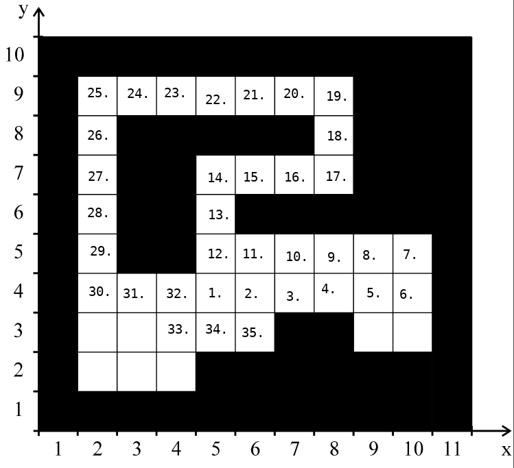

# 1

## 1.3

### b)

ggt(28, 68)

ggtIterativ1(): 7 Iterationen

  a   b 
 --  -- 
 28  68
 28  40
 28  12
 16  12
  4  12
  4   8
  4   4

ggtIterativ2(): 4 Iterationen

  a   b 
 --  -- 
 28  68
 28  12
  4  12
  4   0

ggtRekursiv(): 7 Aufrufe

  a   b 
 --  -- 
 28  68
 28  40
 28  12
 16  12
  4  12
  4   8
  4   4

Die beiden iterativen Lösungen haben einen geringeren Speicherbedarf als die rekursive Lösung, bei der die Variablen a und b jeweils in siebenfacher Ausführung bestehen.

# 2

## 2.3

### a)

  Parameter n   Anzahl Methodenaufrufe 
 ------------  ----------------------- 
  1               9 
  2              18 
  3              31 
  4              48 
  5              69 
  6              94 
  7             123 
  8             156 
  9             193 
 10             234 

### b)

  Parameter n   Anzahl Methodenaufrufe 
 ------------  ----------------------- 
   100              20304 
   200              80604 
  1000            2003004 
  2000            8006004 
 10000          200030004 
 20000          800060004 

Ja, bei einer Verdoppelung des Parameters `n` werden erhöht sich die Anzahl der Methodenaufrufe nahezu um Faktor vier.

### c)

 Parameter n   Methodenaufrufe   Laufzeit
------------  ----------------  ---------
          1                9        46
          2               18        92
          3               31       157
          4               48       244
          5               69       353
          6               94       482
          7              123       631
          8              156       796
          9              193       989
         10              234      1193

# 3

## 3.3

### a)

 `log n`  `ld n`  `n`  `n*log n`  `n^2`    `n^3`     `2^n`     `3^n`      `n!`
-------- ------- ---- ---------- ------ -------- --------- --------- ---------
   0.000   0.000    1      0.000      1 1.00e+00  2.00e+00  3.00e+00  1.00e+00
   0.693   1.000    2      1.386      4 8.00e+00  4.00e+00  9.00e+00  2.00e+00
   1.609   2.322    5      8.047     25 1.25e+02  3.20e+01  2.43e+02  1.20e+02
   2.303   3.322   10      23.03    100 1.00e+03  1.02e+03  5.90e+04  3.63e+06
   2.996   4.322   20      59.91    400 8.00e+03  1.05e+06  3.49e+09  2.43e+18
   3.912   5.643   50      195.6   2500 1.25e+05  1.13e+15  7.18e+23  3.04e+64
   4.605   6.644  100      460.5  10000 1.00e+06  1.27e+30  5.15e+47  9.33e+16

### b)

1. exponentiell `O(m^n)`
2. logarithmisch `O(ln n)`
3. polynominal `O(n^4)`
4. polynominal `O(n^3)`
5. Fakultät `O(n!)`
6. linear `O(n)`

### c)

- logarithmisch (2.)
- linear (6.)
- polynominal (4.)
- polynominal (3.)
- exponentiell (1.)
- Fakultät (5.)

### d)

1. 0.1s
2. 10s
3. 1.25s (Proportionalität berechnen!)

### e)

            log n
    lb(n) = -----
            log b

`log b` ist ein konstanter Faktor, da nicht von n abhängig, und somit für die Ordnung irrelevant.

### f)

1. O(n)
2. O(n)
3. O(n^3)

# 4

## 4.3

### a) und b)

Implementierung:

    public static int fiboRec1(int n) {
        // Rekursionsbasis
        if (n < 2) {
            return 1;
        } else {
            // Rekursionsvorschrift (n >= 2)
            return fiboRec1(n - 2) + fiboRec1(n - 1);
        }
    }

Testfall:

    @Test
    public void testFibonacciNumbmers() {
        int fib[] = { 1, 1, 2, 3, 5, 8, 13, 21, 34, 55 };
        for (int n = 0; n < fib.length; n++) {
            Assert.assertEquals(fib[n], Fibonacci.fiboRec1(n));
        }
    }

### c)

Lösung mit Cache (Map statt Array):

    private static Map<Integer, Integer> fibCache = new TreeMap<>();
    public static int fiboRec2(int n) {
        if (fibCache.containsKey(n)) {
            return fibCache.get(n);
        }
        int fib = 0;
        if (n < 2) {
            fib = 1;
        } else {
            fib = fiboRec2(n - 2) + fiboRec2(n - 1);
        }
        fibCache.put(n, fib);
        return fib;
    }

### d)

    public static int fiboIter(int n) {
        if (n < 2) {
            return 1;
        }
        int twoBack = 1;
        int oneBack = 1;
        int fib = 1;
        while (n >= 2) {
            fib = twoBack + oneBack;
            twoBack = oneBack;
            oneBack = fib;
            n--;
        }
        return fib;
    }

### e)

Methode   Laufzeit
-------- ---------
fiboRec1    641 ms
fiboRec2      1 ms
fiboIter      0 ms

# 5

## 5.3

### a)

n:  0   1   2   3
m:  4   2   2   1

    ack(0,4): 4 + 1 = 5

    ack(1,2) -> ack(0, ack(1,1))
        ack(1,1) -> ack(0, ack(1,0))
            ack(1,0) -> ack(0,1)
                ack(0,1) -> 2
            ack(1,0) -> 2
        ack(1,1) -> ack(0,2)
            ack(0,2) -> 3
        ack(1,1) -> 3
    ack(1,2) -> ack(0,3)
        ack(0,3) -> 4
    ack(1,2) -> 4

    ack(2,2) -> ack(1,ack(2,1))
        ack(2,1) -> ack(1,ack(1,1))
            ack(1,1) -> ack(0, ack(1,0))
                ack(1,0) -> ack(0,1)
                    ack(0,1) -> 2
                ack(1,0) -> 2
            ack(1,1) -> ack(0,2)
                ack(0,2) -> 3
            ack(1,1) -> 3
        ack(2,1) -> ack(1,3)
            ack(1,3) -> ack(0, ack(1,2))
                ack(1,2) -> 4 [siehe oben!]
            ack(1,3) -> ack(0,4)
                ack(0,4) -> 5
            ack(1,3) -> ack(0, ack(1,2))
                ack(1,2) -> 4 [siehe oben!]
            ack(1,3) -> ack(0,4)
                ack(0,4) -> 5
            ack(1,3) -> 5
        ack(2,1) -> 5
    ack(2,2) -> ack(1,5)
        ack(1,5) -> ack(0, ack(1,4))
            ack(1,4) -> TODO

    ack(3,1) -> 13

### b)

Der Call Stack hat eine maximale Tiefe von 5, die Ackermann-Funktion wird 27 mal aufgerufen.

### c)

Ein Funktionsaufruf verwendet für den rekursiven Aufruf seiner selbst einen weiteren rekursiven Aufruf als Parameter.

    public static int ack(int n, int m) {
        if (n == 0) {
            return m + 1;
        } else if (m == 0) {
            return ack(n - 1, 1);
        } else {
            return ack(n - 1, ack(n, m - 1));
        }
    }

# 6

## 6.3

