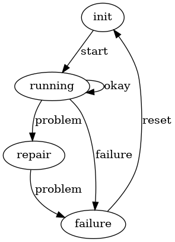
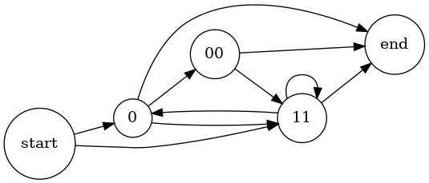
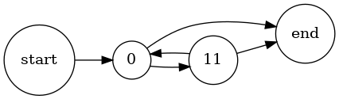

# 1 Automat ‒ Maschinensteuerung



# 2 Automat ‒ Garagentorsteuerung


# 3 Formale Grammatik

Beispiel der Typ-1-Grammatik:

    G = (N, T, P, s)
    N = {s, A, B}
    T = {a, b, c}
    P = {s → abc, s → aAbc, Ab → bA, Ac → Bbcc, bB → Bb, aB → aaA, aB → aa}

## b) Erzeugung des Wortes `aaabbbccc`:

    s → aAbc → abAc → abBbcc → aBbbcc → aaAbbcc → aabAbcc → aabbAcc → aabbBbccc → aabBbbccc → aaBbbbccc → aaabbbccc 

## c)

Weil die Ersetzung eines Nichtterminalsymbols (z.B. `A`) vom Kontext, d.h. von
den benachbarten Terminalsymbolen (z.B. `a`) abhängig ist. `A` von `b` gefolgt
wird durch etwas anderes ersetzt als `A` von `c` gefolgt.

# 4 Formale Grammatik

    G = (N, T, P, s)
    N = {s, A, B}
    T = {0, 1, 2}
    P = {s → A, A → ε, A → B, A → 0A0, A → 1A1, A → 2A2, B → 0, B → 1, B → 2}

## a)

1. `s → A → ε`
2. `s → A → B → 0`
3. `s → A → 0A0 → 0B0 → 010`
4. `s → A → 0A0 → 00A00 → 002A200 → 002B200 → 0021200`

## b)

Gegeben sei eine Grammatik bestehend aus den Nichtterminalsymbolen s, A und B;
aus den Terminalsymbolen 0, 1 und 2 und folgenden Regeln:

- aus s kann ein A werden,
- aus A kann
    - ein leeres Wort (ε),
    - ein B,
    - ein 0A0,
    - ein 1A1
    - oder ein 2A2 werden,
- aus B kann
    - eine 0,
    - eine 1
    - oder eine 2 werden.

## c)

Die Grammatik ist vom Typ 1, da sie kontextsensitiv ist.

# 5 EBNF

a. `11`: ja
b. `01110`: ja
c. `01111`: nein
d. `01011010`: nein
e. `0111000`: ja
f. `1100`: nein
g. `0011`: nein
h. `01001111`: nein

# 6 Syntaxdiagramme

## c)



# 7 Wortproblem mit Hilfe eines DEA lösen

Implementierung:

```java
public static boolean isWordLanguage(final String str) {
    String state = "z0";
    for (char c : str.toCharArray()) {
        switch (c) {
        case '0':
            switch (state) {
            case "z0":
                state = "z1";
                break;
            case "z2":
                state = "z4";
                break;
            default:
                return false;
            }
            break;
        case '1':
            switch (state) {
            case "z1":
                state = "z2";
                break;
            case "z2":
                state = "z3";
                break;
            case "z3":
                state = "z2";
                break;
            case "z4":
                state = "z2";
                break;
            default:
                return false;
            }
            break;
        default:
            return false;
        }
    }
    return "z4".equals(state) || "z1".equals(state);
}
```

Testfall:

```java
public class DeterministicFiniteAutomatonTest {

    private Map<String, Boolean> testValues;

    @Before
    public void initTestValues() {
        testValues = new HashMap<>();
        testValues.put("0", true);
        testValues.put("010", true);
        testValues.put("01110", true);
        testValues.put("0111010", true);
        testValues.put("0101110", true);
        testValues.put("0101010", true);
        testValues.put("1010", false); // doesn't start with a 0
        testValues.put("0110", false); // even number of 1s
        testValues.put("010010", false); // 0 is not alone
        testValues.put("0101", false); // doesn't end with a 0
    }

    @Test
    public void test() {
        for (String testValue : testValues.keySet()) {
            Assert.assertEquals(testValues.get(testValue),
                DeterministicFiniteAutomaton.isWordLanguage(testValue));
        }
    }
}
```

# 8 Formale Sprache definieren

## a)



## b)

    <Sprache>::=0<Körper>
    <Körper>::={11[0]}

## c)

    0(11(0)?)*
