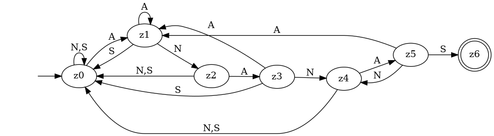
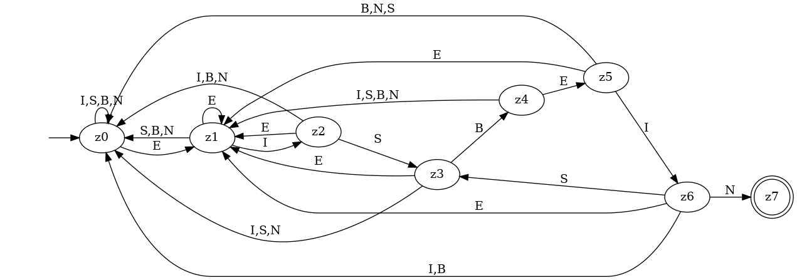
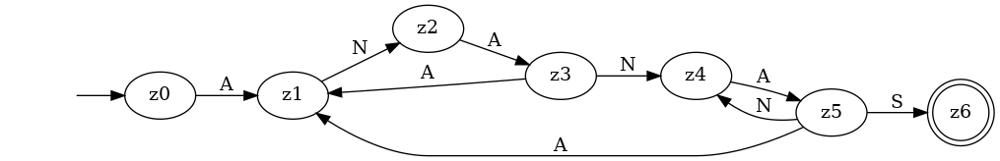

# 1 Einfache Suche

## a)

Jedes Pattern, das nicht mit `a` beginnt, führt zu einer minimalen Anzahl
Zeichenvergleiche:

`n-m+1 = 100'000-10+1 = 99'991` Vergleiche

## b)

Jedes Pattern, das aus neun `a`s und einem anderen Zeichen besteht, führt zu
einer maximalen Anzahl Zeichenvergleichen:

`m*(n-m+1) = 10*(100'000-10+1) = 10*99'991 = 999'910` Vergleiche

## c)

Im besten Fall sind es `n-m+1`, im schlechtesten Fall `m*(n-m+1)` Vergleiche.

    m       n  Vergleiche (best)  Vergleiche (worst)
 ---- ------- ------------------ -------------------
    2       8                  7                  14 
    4      16                 13                  52
    8      32                 25                 200
   16      64                 49                 784 

Im besten Fall führ eine Verdoppelung von m _und_ n zu einer Verdoppelung der
Anzahl Vergleiche. Im schlechtesten Fall führt eine Verdoppelung von m _und_ n
zu einer Vervierfachung der Anzahl Vergleiche.

Die einfache Suche hat die Ordnung `O(m*(n-m))`

# 2 Optimierter Suchautomat

## a)

Im Gegensatz zur einfachen Suche muss beim optimierten Suchautomat beim einem
gescheiterten Vergleich nicht zwangsläufig das ganze Muster noch einmal von
vorne verglichen werden. Das „fehlerhafte“ Zeichen bzw. die „fehlerhafte“
Zeichensequenz könnte nämlich der Anfang des Suchmusters sein.

## b)



## c)



## d)

Die beiden erstellten Suchautomaten arbeiten mit einem Alphabet von drei bzw.
fünf verschiedenen Zeichen, während binäre Patterns mit einem Alphabet von zwei
Zeichen (`1` und `0`) auskommen. Das erfordert mehr Fallunterscheidungen.

## e)

Die Methode `stateSearchANANAS`:

```java
public static int stateSearchANANAS(final String a) {
    int i = 0;
    String state = "";
    char[] c = a.toCharArray();
    do {
        switch (state) {
        case "":
            if (c[i] == 'A') {
                state = "A";
            } else {
                state = "";
            }
            break;
        case "A":
            if (c[i] == 'N') {
                state = "AN";
            } else if (c[i] == 'A') {
                state = "A";
            } else {
                state = "";
            }
            break;
        case "AN":
            if (c[i] == 'A') {
                state = "ANA";
            } else {
                state = "";
            }
            break;
        case "ANA":
            if (c[i] == 'N') {
                state = "ANAN";
            } else if (c[i] == 'A') {
                state = "A";
            } else {
                state = "";
            }
            break;
        case "ANAN":
            if (c[i] == 'A') {
                state = "ANANA";
            } else {
                state = "";
            }
            break;
        case "ANANA":
            if (c[i] == 'S') {
                state = "ANANAS";
            } else if (c[i] == 'N') {
                state = "ANAN";
            } else if (c[i] == 'A') {
                state = "A";
            }
            break;
        }
        i++;
    } while (!state.equals("ANANAS") && i < a.length());
    if (state.equals("ANANAS")) {
        return i - "ANANAS".length();
    }
    return -1;
}
```

Der Testfall `StateSearchTest`:

```java
private Map<String, Integer> searches;

@Before
public void initSearches() {
    searches = new HashMap<>();
    searches.put("ANANAS", 0);
    searches.put("ANANANAS", 2);
    searches.put("ANANANANAS", 4);
    searches.put("I don't like ANANAS.", 13);
    searches.put("ANANAs", -1);
}

@Test
public void testStateSearchANANAS() {
    for (String haystack : searches.keySet()) {
        int expexted = searches.get(haystack);
        int actual = StateSearch.stateSearchANANAS(haystack);
        Assert.assertEquals(expexted, actual);
    }
}
```

# 3 Musterautomat und KMP-Algorithmus

## a)

Teilwort  Zustand  Rand  Länge  Folgezustand
--------- -------- ----- ------ -------------
E         z1       -     0      z0
EI        z2       -     0      z0
EIS       z3       -     0      z0
EISB      z4       -     0      z0
EISBE     z5       E     1      E -> z1
EISBEI    z6       EI    2      S -> z3
EISBEIN   z7       -     0      -

## b)


## c)

Teilwort  Zustand  Rand  Länge  Folgezustand
--------- -------- ----- ------ -------------
A         z1       -     0      z0
AN        z2       -     0      z0
ANA       z3       A     1      A -> z1
ANAN      z4       AN    2      z0
ANANA     z5       ANA   3      A -> z1, N -> z4
ANANAS    z6       -     0      -



## e/f)

Die Methode `initNext(String pattern)` gibt die Randlängen zurück:

- "EISBEIN": `[-1, 0, 0, 0, 0, 1, 2]`
- "ANANAS": `[-1, 0, 0, 1, 2, 3]`

# 4 Quicksearch

## a)

Das `shift`-Array ergibt sich aus dem Alphabet. Dieses enthält sämtliche im
"haystack" (möglicherweise) vorkommenden Zeichen. Die Zahlenwerte im
`shift`-Array liegen im Bereich 1 (min.) und Länge des Musters plus 1 (max.).

## b)

- Alphabet: `A={a,b,c,d,e,f,g,h,i}`
- Muster: `"gaga"`
- `shift`-Array: `[a=1,b=5,c=5,d=5,e=5,e=5,f=5,g=2,h=5,i=5]`

## c)

- extrem schnell
    - Alphabet: `A={a,b,c,x,y,z}`
    - Zeichenkette: `"abcabcxyz"`
    - Muster: `"xyz"`
    - `shift`-Array: `[a=4,b=4,c=4,x=3,y=2;z=1]`
    - Anzahl Vergleiche: 6
- extrem langsam
    - Alphabet: `A={a,b}`
    - Zeichenkette: `"aaaaaaaaaaaaaaaaaaaaaaaab"`
    - Muster: `"ab"`
    - `shift`-Array: `[a=2,b=1]`
    - Zeichenvergleiche: 26 (Länge der Zeichenkette)

# 5 Quicksearch und Optimal-Mismatch

## a)

Implementierung:

```java
public static int quickSearch(String a, String p) {
    int n = a.length();
    int m = p.length();
    int range = 256; // ASCII range
    int[] shift = new int[range];

    // init shift array
    for (int i = 0; i < range; i++) {
        shift[i] = m + 1;
    }

    // overwrite fields according to pattern
    for (int i = 0; i < m; i++) {
        shift[p.charAt(i)] = m - i;
    }

    // search
    int i = 0;
    int j = 0;
    do {
        if (a.charAt(i + j) == p.charAt(j)) {
            j++;
        } else {
            if (i + m < n) {
                i += shift[a.charAt(i + m)];
                j = 0;
            } else {
                break;
            }
        }
    } while (j < m && i + m <= n);

    if (j == m) {
        return i; // pattern found, starting at i
    } else {
        return -1; // pattern not found
    }
}
```

Testfall:

```java
public class QuickSearchTest {
    private Map<Search, Integer> searches;

    @Before
    public void initSearches() {
        searches = new HashMap<>();
        searches.put(new Search("ananas", "ananas"), 0);
        searches.put(new Search("anananas", "ananas"), 2);
        searches.put(new Search("ananAs", "ananas"), -1);
        searches.put(new Search("dasisteinTest", "Test"), 9);
    }

    @Test
    public void testQuickSearch() {
        for (Search search : searches.keySet()) {
            int expected = searches.get(search);
            int actual = QuickSearch.quickSearch(search.haystack,
                search.pattern);
            Assert.assertEquals(expected, actual);
        }
    }
}

class Search {
    Search(String haystack, String pattern) {
        this.haystack = haystack;
        this.pattern = pattern;
    }

    String haystack;
    String pattern;

    public int hashCode() {
        return Objects.hash(haystack, pattern);
    }
}
```

## b/c/d)

Für das Optimal-Missmatch-Verfahren bräuchte ich entweder einen langen Text
(mehrere Millionen Zeichen) in einer natürlichen Sprache, oder einen langen
Zufallstext, bei dem die Zeichenwahrscheinlichkeit nicht gleichmässig verteilt
ist. Ansonsten ergibt es keinen Sinn, Messungen durchzuführen.

# 6 Übersicht Suchalgorithmen

Algorithmus              Zeitkomplexität (best, worst)
------------------------ ------------------------------
Einfache Suche           `O(n*m)`
Optimierter Suchautomat  `O(n)`
KMP-Algorithmus          `O(m+n)`
Quicksearch              `O(n/m)` `O(n*m)`
Optimal-Mismatch         `O(n/m)` `O(n*m)`

