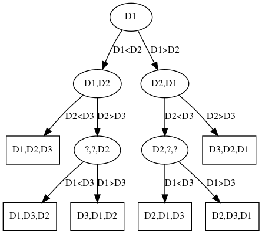

# 1 Grundlegende Zusammenhänge

## a)

Man könnte die Dreiecke nach Flächeninhalt oder Umfang sortieren. Ich schlage
den Flächeninhalt als natürliche Ordnung vor.

## b)

Die Klasse `Triangle` implementiert das Interface `Comparable` und somit die
Methode `compareTo(Triangle o)`. Der Parameter ist ein Dreieck, das für den
Vergleich hinzugezogen werden soll. Der Rückgabewert ist eine Zahl, für die
gilt:

- `>0`: das aktuelle Dreieck ist _grösser_ als der Parameter
- `=0`: beide Dreiecke sind gleich gross
- `<0`: das aktuelle Dreieck ist _kleiner_ als der Parameter

## c)

`hashCode()` sollte auch mit `equals()` korrespondieren. Gleiche Objekte
_müssen_ den gleichen `hashCode` haben. Unterschiedliche Objekte _sollten_ einen
unterschiedlichen `hashCode` haben. `equals()` und `hashCode()` überschreibt man
von der Klasse `Object`.

## d)

Eine spezielle Ordnung kann mit einem `Comparator` und der Methode
`compareTo(Triangle a, Triangle b)` implementiert werden. (Dazu braucht es kein
UML-Klassendiagramm.)

## e)

- `Arrays.sort(Object[])` für die natürliche Ordnung
- `Arrays.sort(Object[], Comparator<? super T>)` für die spezielle Ordnung

Aus der JavaDoc:

    Implementation note: This implementation is a stable, adaptive, iterative
    mergesort...

`sort()` arbeitet _stabil_.

## f)

Nein.

# 2 Entscheidungsbaum

## a)



Siehe Abbildung \ref{entscheidungsbaum}.

## b)

Anzahl Blätter: `B = n! = 3! = 6`

Höhe: `h >= log2(6)+1 = 2.58 + 1 = 3.58`

Der Baum hat die Höhe `4 >= 3.58`. Die Formel stimmt für diesen Baum.

## c)

Es sind mindestens drei Vergleiche notwendig, um _jede_ Ausgangssituation
differenzieren zu können.

# 3 Aus instabil mach stabil

## a)

Mehrfach auftretende Werte müssten in einem Vorlauf indiziert werden. Nach der
Abarbeitung dieses Algorithmus müssten dann die indizierten Werte noch einmal
nachsortiert werden.

## b)

Im schlimmsten Fall die doppelte des Ausgangsalgorithmus. Da aber 2 ein
konstanter Faktor ist, wäre der stabile Algorithmus die gleicher Ordnung wie der
instabile.

# 4 Direktes Einfügen

Die Sortieralgorithmen der Aufgaben 4-6 verwenden folgende `swap`-Methode:

```java
private static <T> void swap(T items[], int i, int j) {
    T tmp = items[j];
    items[j] = items[i];
    items[i] = tmp;
}
```

Die Methode `isSorted` überprüft, ob ein Array sortiert ist:

```java
public static <T> boolean isSorted(List<Comparable<T>> items, boolean asc) {
    for (int n = 0; n < items.size() - 1; n++) {
        Comparable<T> current = items.get(n);
        Comparable<T> next = items.get(n + 1);
        int cmp = current.compareTo((T) next);
        if (asc && cmp > 0) {
            return false;
        } else if (!asc && cmp < 0) {
            return false;
        }
    }
    return true;
}
```

## a)

```java
public static <T> void insertionSort(Comparable<T> data[]) {
    for (int s = 1; s < data.length; s++) {
        for (int i = s; i > 0 && data[i].compareTo((T) data[i - 1]) < 0; i--) {
            swap(data, i, i - 1);
        }
    }
}
```

# 5 Direktes Auswählen

## c)

```java
public static <T> void selectionSort(Comparable<T> data[]) {
    for (int s = 0; s < data.length; s++) {
        Comparable<T> smallest = data[s];
        int smallestIndex = s;
        for (int i = s; i < data.length; i++) {
            if (data[i].compareTo((T) smallest) < 0) {
                smallest = data[i];
                smallestIndex = i;
            }
        }
        swap(data, s, smallestIndex);
    }
}
```

# 6 Direktes Austauschen

## a)

```java
public static <T> void bubbleSort(Comparable<T> data[]) {
    for (int i = 0; i < data.length; i++) {
        for (int j = i + 1; j < data.length; j++) {
            if (data[i].compareTo((T) data[j]) > 0) {
                swap(data, i, j);
            }
        }
    }
}
```
