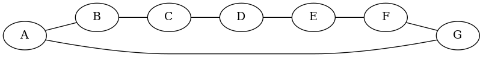

# 1 Begriffe und Eigenschaften

## a)

Siehe Abbildung 1.

## b)

Siehe Abbildung 2.

## c)

Siehe Abbildung 3.

## d)

    |E| = |V| - 1

## e)

Siehe Abbildung 4.

## f)

Siehe Abbildung 5.

## g)

Siehe Abbildung 6.

# 2 Besetzung eines Graphen

## a)

Siehe Abbildung 7 (dünn besetzter Graph) und Abbildung 8 (dicht besetzter
Graph).

## b)

Beim dünn besetzten Graph gilt `|E| < |V|^2`, beim dicht besetzten Graph `|E| ~=
|V|^2`.

## c)

In meinem "dünnen" Beispiel sind es 7 Knoten und 6 Kanten. Im "dichten"
Beispiel sind es 7 Knoten und 21 Kanten. `|V|^2` wäre hier also zu gross, obwohl
jeder Knoten mit jedem verbunden ist.

## d)

Bei einem ungerichteten Graph ist es die Summe von `(|E|-1)+(|E|-2)+...+1`; bei
einem gerichteten Graph doppelt so viel.

Im Minimum sind es `0` Kanten.

## e)

Für dicht besetzte Graphen ist eine Adjazenzmatrix sinnvoll, da diese
symmetrisch ist und man gut die Hälfte des Speicherplatzes einsparen kann.

Bei dünn besetzten Graphen sind Adjazenzlisten sinnvoll.

# 3 Eisenbahnnetz

## a)

ungerichtet

## b)

gewichtet

## c)

enthält Zyklen

## d)

zusammenhängend

## e)

13 Knoten, 14 Kanten

## f)

Der Graph ist eher dünn besetzt.

# 4 Adjazenzmatrix

## a) Implementierung (vereinfacht)

[Github](https://github.com/patrickbucher/ad_exercises/blob/master/src/main/java/ch/hslu/ad/sw13/ex04/RailwayNet.java)

## b) Testfall

[Github](https://github.com/patrickbucher/ad_exercises/blob/master/src/test/java/ch/hslu/ad/sw13/ex04/RailwayNetTest.java)

# 5 Adjazenzlisten

TODO

# 6 Breitensuche

TODO

# 7 Tiefensuche

TODO

# 8 Algorithmus von Dijkstra

TODO

# 9 Optional: Eisenbaznnetz II

TODO
