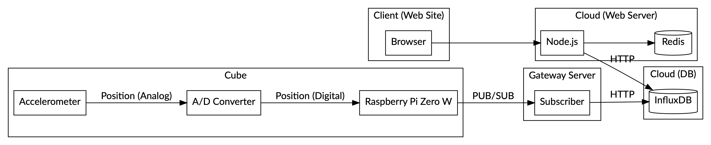
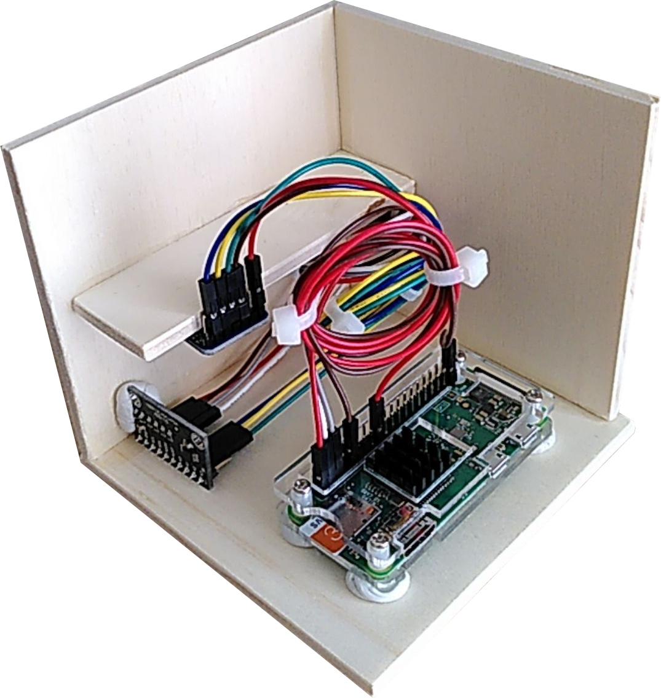
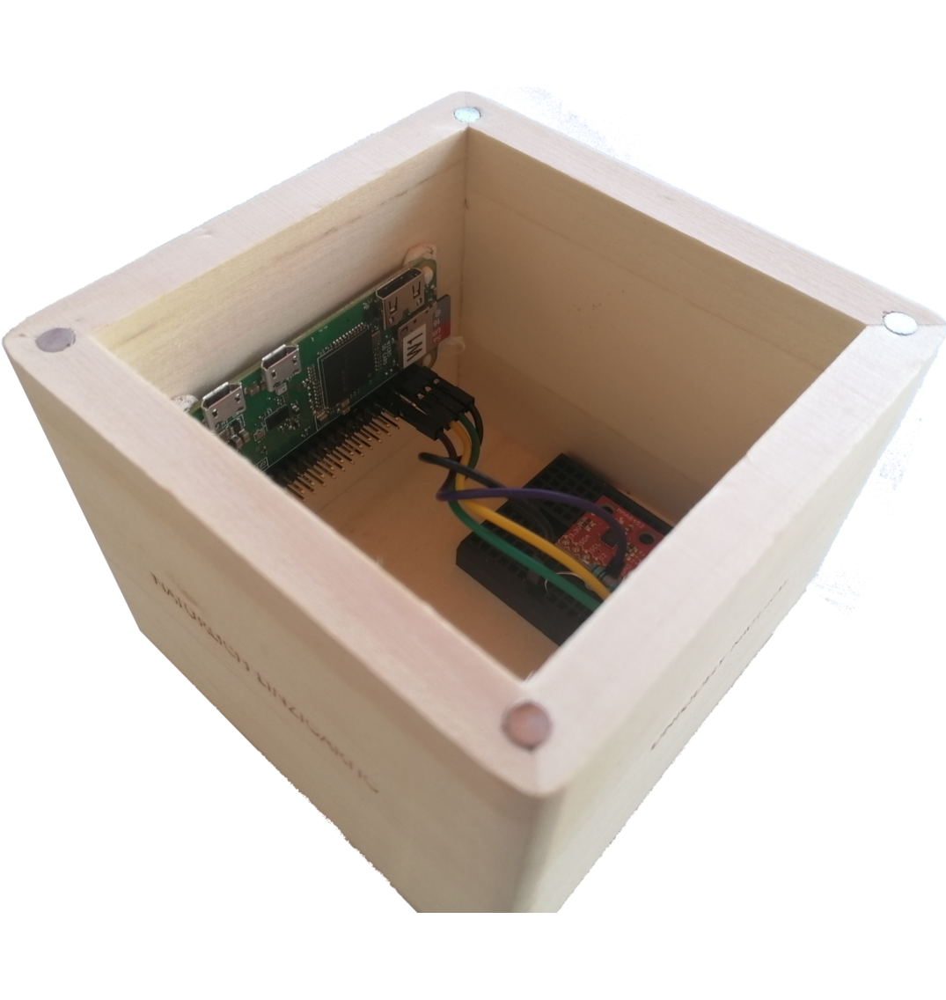
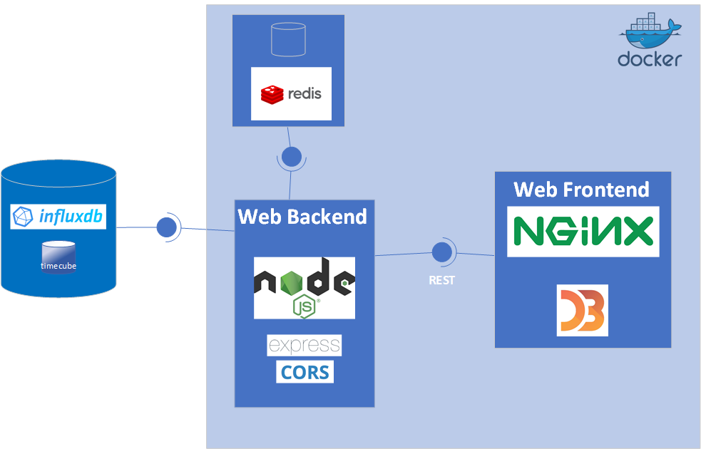
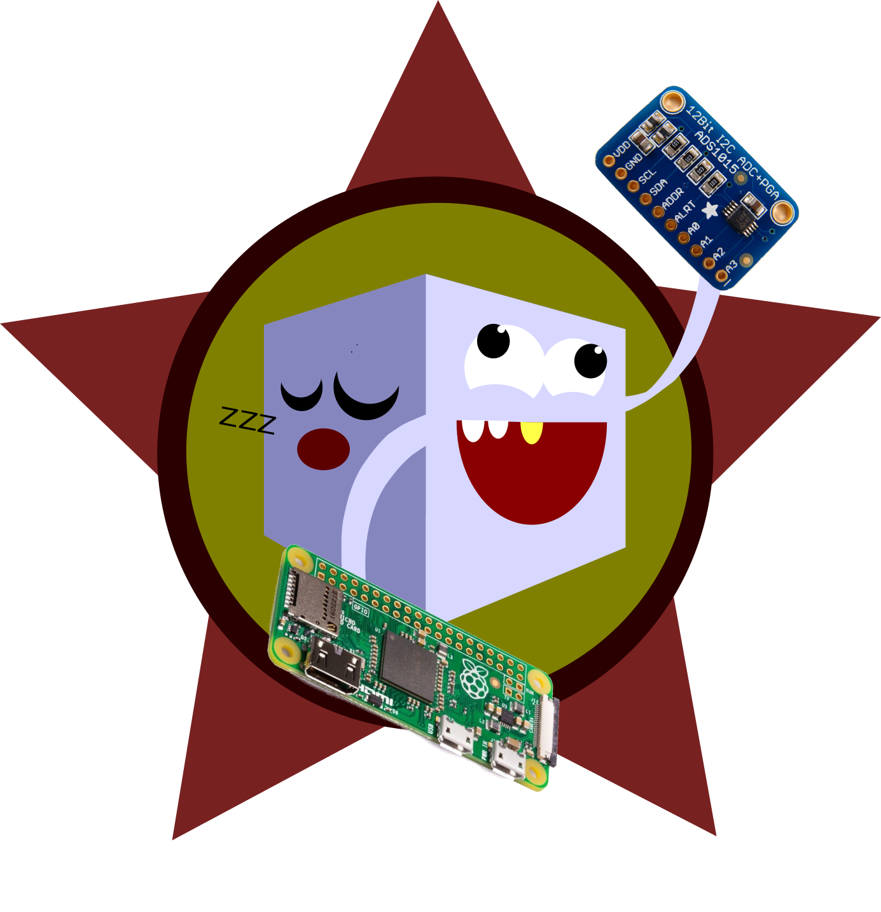

# Agenda

1. Problem
1. Idea
1. Overview
1. Prototypes
1. Side Detection
1. Gateway
1. Storage
1. Web Application
1. Conclusion
1. Live Demo

# Problem

- Track activities
- Need to track time
- Efficiency control
- Instrument for retrospectives
- Most applications require context switch (PC, smartphone)

# Idea

- Track time with a cube
- Detect position of cube
- Persist data
- Display on a web application with options to filter
- Map cube's sites to projects/activities

->Improve everyones efficiency and give back the control of their time.

# Overview

# Prototype I

{height=80%}

# Prototype II

{height=80%}

# Side Detection

## Approach

- Voltage per Axis (X, Y, Z)
- Threshold per Axis (low, med, high)
- Combination of Thresholds: Side

## Prototype I

- Accelerometer: Adafruit ADXL 335
- A/D Converter: ADS 1115

## Prototype II

- Accelerometer: MMA 8452
- No separate A/D converter needed (I²C)

# Gateway

- Data Transmission with ZeroMQ protocol
    - support different platforms and languages
    - supports different patterns (pub-sub, push-pull, client-server)
    - no broker required
    - High speed
- pub/sub was used (possibility to use multiple backends)
- mock cube (random values)

# Storage

- Subscriber writes data into cloud storage

- Influx 2.0 (cloud)
    - latest version (cutting edge)
    - Cloud hosting
    - Time series
- Simple data structure: topic ("timecube"), identifier (UUID), side (1..6)
- Sends data every second

# Web Application

{height=80%}

# Web Application

- Runs in Docker
    - Backend: Node.js/Express.js
    - Redis: store side descriptions
    - Frontend: Web Server (nginx), Vanilla JS and D3.js
- Web app collects data from InfluxDB 2 (cloud)
    - query by UUID (text field, to be improved with login...)
- Read-only InfluxDB, read-write redis (config)
- Filter data on selected cubes (UUID), from/to

# Conclusion

## Achivements

- 2x functioning prototypes
- Database requests and displaying of data
- Lots of testing with cutting-edge technologies
- Extensible (sensors, subscriber applications, reporting)

## Further ideas

- More Chart-View for better UX
- Performance optimisation
- Authentication
- Configure UUID by account
- Integration with _«WellBean»_

# Live Demo

{height=80%}
