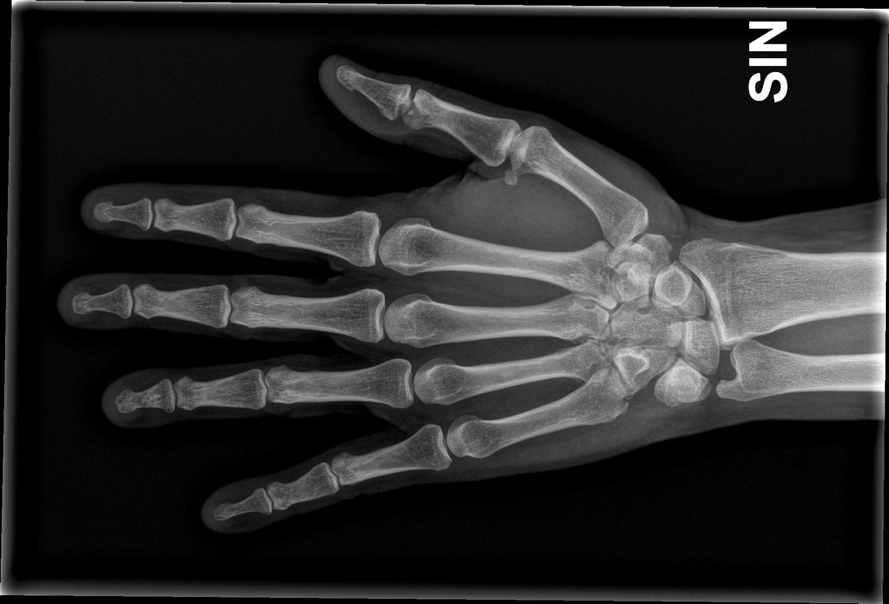
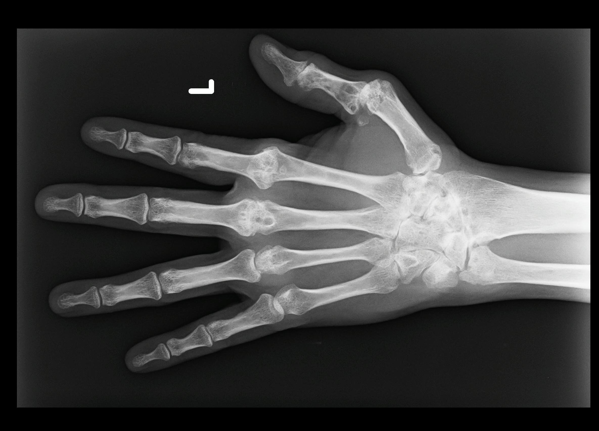
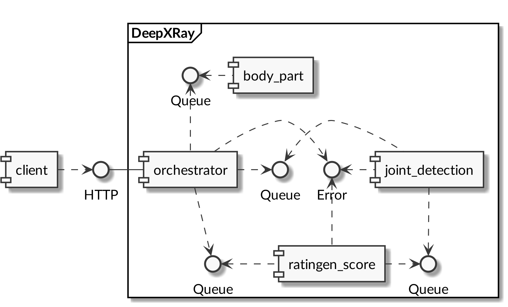
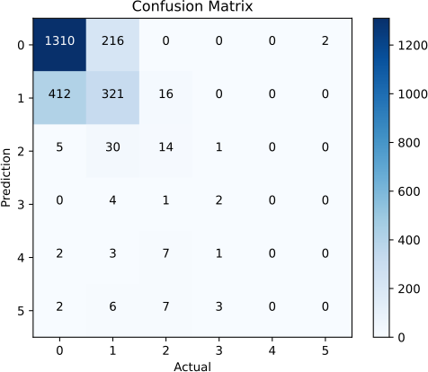

# Arbeit

**Titel**: «DeepXRay»

**Auftraggeber**: Dr. Tobias Reinhard (Seantis GmbH)

**Betreuer**: Daniel Pfäffli (HSLU ‒ Informatik)

**Experte**: Jeremy Callner (APG|SGA)

**Student**: Patrick Bucher

- Student der Informatik im 8. Semester
- seit Februar 2020 als Full Stack Python Developer bei Seantis GmbH

# Ablauf

- **Pitching-Video**
- **Rückblick**
    - _Domäne_: Rheumatoide Arthritis, Scoring
    - _Machine-Learning-Modelle_: `body_part`, `joint_detection`, `ratingen_score`
    - _Architektur_: Orchestrator, Modellkomponenten, Messaging
- **Live-Demo**
- **Schwerpunkte**
    - _Umsetzung_: Orchestrierung
    - _Evaluation_: Metriken und Ergebnisse
    - _Skalierbarkeit_: Benchmarks
- **Fazit**
- **Ausblick**
- **Fragen & Antworten**

# Rheumatoide Arthritis

{height=80%}

# Rheumatoide Arthritis

{height=80%}

# Machine-Learning-Modelle

## `body_part`

- Input: Röntgenbild
- Output: erkanntes Körperteil, Wahrscheinlichkeit

## `joint_detection`

- Input: Röntgenbild, Gelenkbezeichnung
- Output: Bildausschnitt (Gelenk)

## `ratingen_score`

- Input: Bildausschnitt (Gelenk)
- Output: Wahrscheinlichkeit pro Score (Klassen 0..5)

# Architektur

{height=80%}

# Live-Demo

_[diese Folie wurde absichtlich leer gelassen]_

# Orchestrierung

**Ziel:** Parallele Abarbeitung ermöglichen

**Modellkomponenten:** Parallelisierung über mehrere Instanzen und Messaging

**Orchestrator:** Parallelisierung innerhalb des Prozesses

- Paradigma: _Communicating Sequential Processes_
- Go: Goroutines, Channels (internes Messaging)
- Architektur in `orchestrator` nachgebaut
- Request per _Correlation Identifier_ zu Channel zugeordnet

_**Don't share state.**_

# Evaluation: Testdaten

- 1619 Röntgenbilder
- 290 linke Hände
- 247 verarbeitet
- ca. 15% nicht als linke Hände erkannt
- sehr wenige hohe Scores dabei

# Evaluation: Confusion Matrix

{height=80%}

# Evaluation: Allgemeine Metriken

Global Accuracy: $0.70$ (exakt) bzw. $0.94$ (soft)

| **Metrik**             | **Ergebnis**                                           |
|------------------------|--------------------------------------------------------|
| Class Accuracy (exakt) | $0: 0.86, 1: 0.43, 2: 0.28, 3: 0.29, 4: 0.00, 5: 0.00$ |
| Class Accuracy (soft)  | $0: 0.99, 1: 0.98, 2: 0.69, 3: 0.57, 4: nan, 5: 0.00$  |
| Precision (exakt)      | $0: 0.86, 1: 0.43, 2: 0.28, 3: 0.29, 4: 0.00, 5: 0.00$ |
| Precision (soft)       | $0: 1.00, 1: 1.00, 2: 0.86, 3: 0.50, 4: 0.00, 5: 0.00$ |
| Recall (exakt)         | $0: 0.76, 1: 0.55, 2: 0.31, 3: 0.29, 4: nan, 5: 0.00$  |
| Recall (soft)          | $0: 0.99, 1: 0.98, 2: 0.69, 3: 0.57, 4: nan, 5: 0.00$  |
| F1-Score (exakt)       | $0: 0.80, 1: 0.48, 2: 0.29, 3: 0.29, 4: nan, 5: nan$   |
| F1-Score (soft)        | $0: 1.00, 1: 0.99, 2: 0.77, 3: 0.53, 4: nan, 5: nan$   |

**Fazit**: nur tiefe Klassen aussagekräftig; soft besser als exakt (plausibel)

# Evaluation: Cohen's Kappa

- $-1$: Rater total uneinig
- $±0$: Rater einig im Zufallsbereich
- $+1$: Rater total einig

| **Metrik**                      | **Ergebnis** | **Vertrauensintervall (95%)** |
|---------------------------------|--------------|-------------------------------|
| Cohen's Kappa (exakt)           | $0.324$      | $[0.283, 0.365]$              |
| Cohen's Kappa (soft)            | $0.957$      | $[0.945, 0.970]$              |
| Cohen's Quadratic Kappa (exakt) | $0.449$      | $[0.443, 0.454]$              |
| Cohen's Quadratic Kappa (soft)  | $0.797$      | $[0.794, 0.801]$              |

**Fazit**: signifikant besser als Zufall; für klinischen Einsatz ungenügend

# Benchmarks: Setup

## Rechner

- Lenovo T495: Laptop für Arbeit (Arch Linux)
    - CPU: AMD Ryzen 7 PRO 3700U, 8 Cores, 1400-2300 MHz, Memory: 24 GB
- Exoscale Huge: Server-VM bei Exoscale (Ubuntu 20.04)
    - CPU: Intel Xeon (Skylake), 8 Cores 2400-4800 MHz, Memory: 32 GB
- Exoscale Mega: Server-VM bei Exoscale (Ubuntu 20.04)
    - CPU: Intel Xeon (Skylake), 12 Cores 2400-4800 MHz, Memory: 64 GB

## Ausführung

- 10 Vorgänge hintereinander ausführen
- immer das gleiche Bild (einigermassen repräsentativ)
- Benchmark-Engine von Go berechnet durchschnittliche Laufzeit

Flaschenhals: `joint_detection`

# Benchmarks: Ergebnisse

| **Rechner**   | **`joint_detection`-Instanzen** | **Zeit pro Bild** |
|---------------|--------------------------------:|------------------:|
| Lenovo T495   |                               1 |     34.5 Sekunden |
| "             |                               5 |     13.2 Sekunden |
| "             |                               8 |     13.9 Sekunden |
| "             |                              10 |     12.2 Sekunden |
| Exoscale Huge |                               1 |     29.4 Sekunden |
| "             |                               5 |      8.7 Sekunden |
| "             |                               8 |      8.6 Sekunden |
| "             |                              10 |      7.1 Sekunden |
| Exoscale Mega |                               1 |     24.4 Sekunden |
| "             |                               5 |      6.7 Sekunden |
| "             |                               8 |      6.7 Sekunden |
| "             |                              10 |      4.9 Sekunden |

# Benchmark: Vergleich

## Interpretation

- eine Instanz von `joint_detection`: sequenzielle Abarbeitung
- fünf Instanzen von `joint_detection`: zwei Zyklen, je fünf Gelenke
    - um Faktor 2.6 (Laptop) bzw. 3.4/3.6 (Server) schneller
- acht Instanzen von `joint_detection`: zwei Zyklen, acht bzw. zwei Gelenke
    - keine signifikante Verbesserung
- zehn Instanzen von `joint_detection`: ein Zyklus mit zehn Gelenken
    - um Faktor 2.8 (Laptop) bzw. 4.1/5.0 (Server) schneller

# Benchmark: Laptop-Ergebnisse mit Vorsicht zu geniessen

)](pics/dotgo.png){height=80%}

# Benchmark: Fazit

**Lässt sich das System skalieren?**

- Das System skaliert in einem bestimmten Rahmen.
- Die Performance hängt von mehreren Faktoren ab:
    1. Anzahl der `joint_detection`-Instanzen (einfach skalierbar bis 10)
    2. Geschwindigkeit der CPUs (schwer skalierbar)
    2. Anzahl der CPUs (leichter skalierbar)
- Speedup nicht linear: Overhead
- Verhalten unter Last _nicht_ betrachtet!

# Fazit

**Was wurde erreicht?**

- Bestehende Modelle wurden zu einem Gesamtsystem kombiniert.
- Ein lauffähiger, portierbarer Prototyp wurde erstellt.
- Das System ist skalierbar, jedoch für den Produktiveinsatz etwas langsam.
- Die Evaluation lässt keine verbindliche Aussagen zur Qualität zu.

**Die Arbeit war sehr lehrreich!**

# Ausblick

## Modelle

- `body_part`: auf Keras migrieren, neu trainieren (viele _false negatives_)
    - evtl. nur Körperteile, die für Rau-Score relevant sind
- `joint_detection`: auf Keras und Inception V3 migrieren, neu trainieren
- `ratingen_score`: relativ aktuell
- Zielkonflikt: evaluieren oder trainieren?
    - Trainingsdaten dürfen nicht für Evaluation verwendet werden.
    - Weiterentwicklung benötigt weitere Daten.
    - Idee: linke Hände manuell aus Bildern extrahieren.

## Erweiterung, Integration, Experiment

- Rau-Score: Extraktion und Scoring weiterer Gelenke (Füsse, Handgelenk)
- Integration: Container, CI, … eher später
- `orchestrator` in Erlang umsetzen (_Actor Model_)

# Fragen & Antworten

_[diese Folie wurde absichtlich leer gelassen]_
