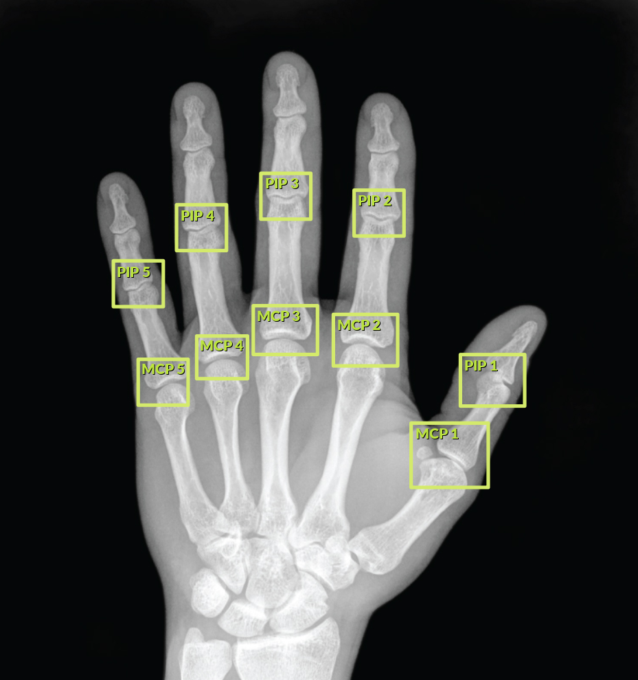
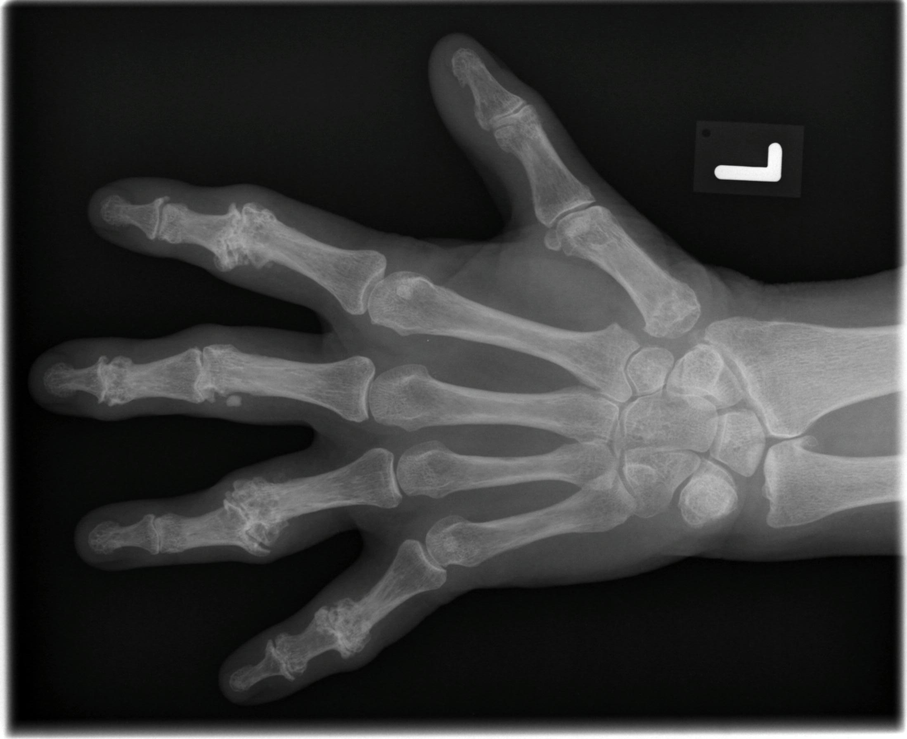
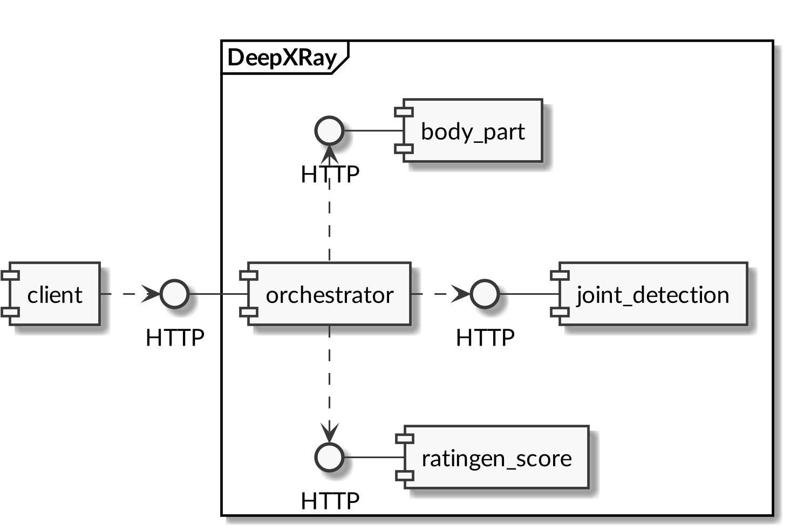
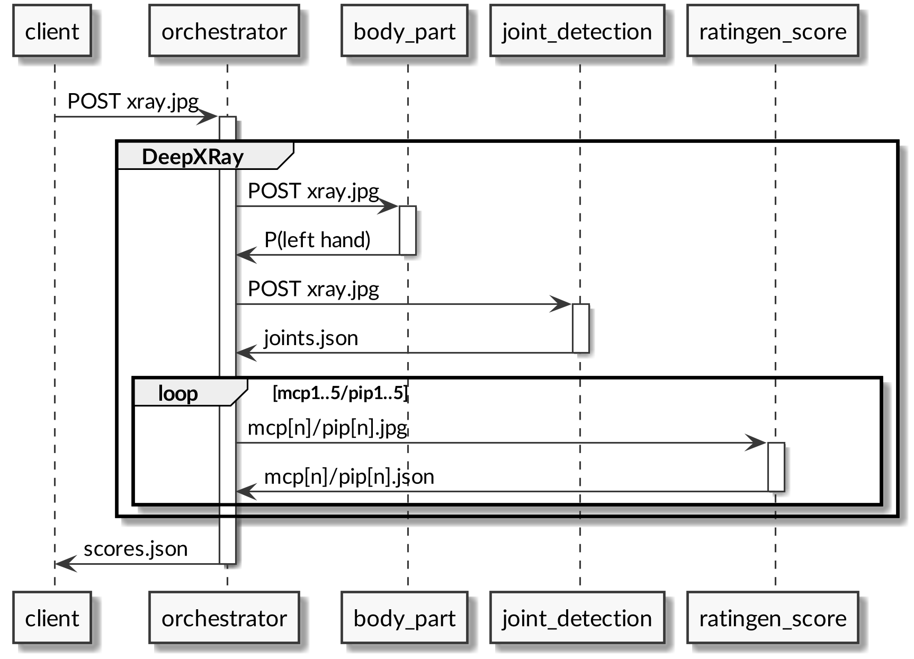
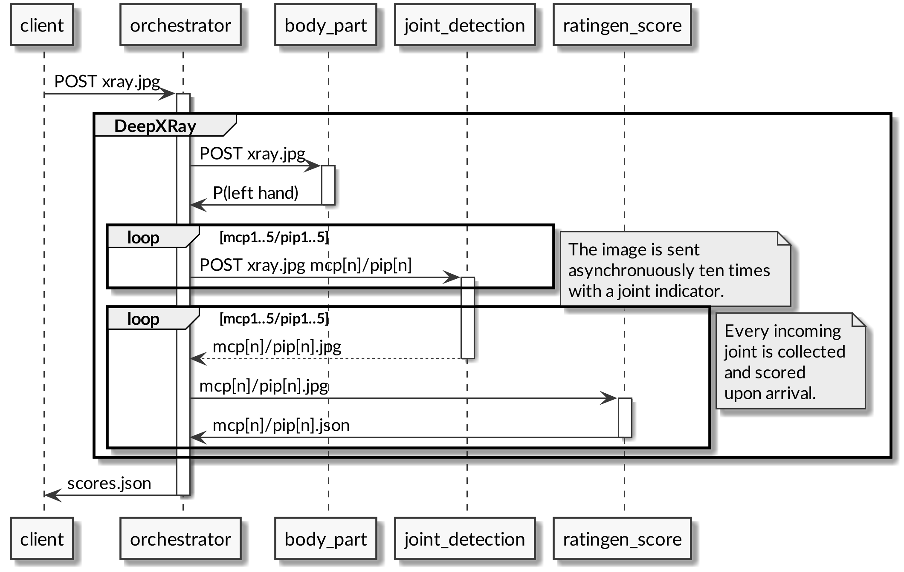
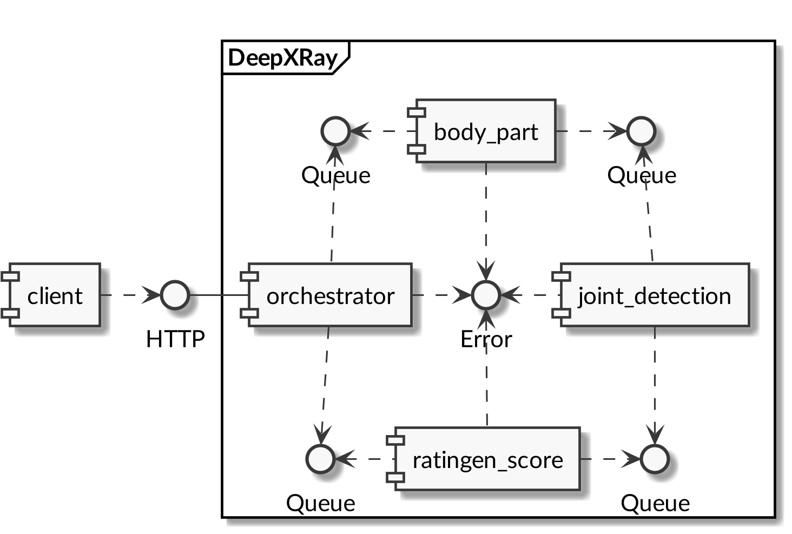
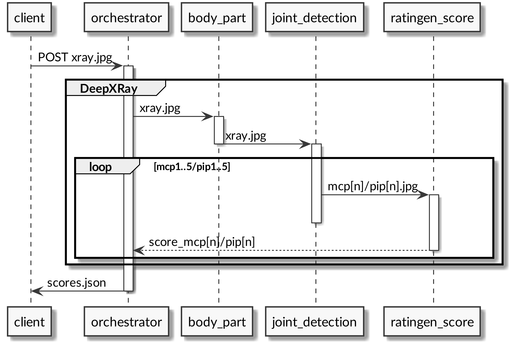
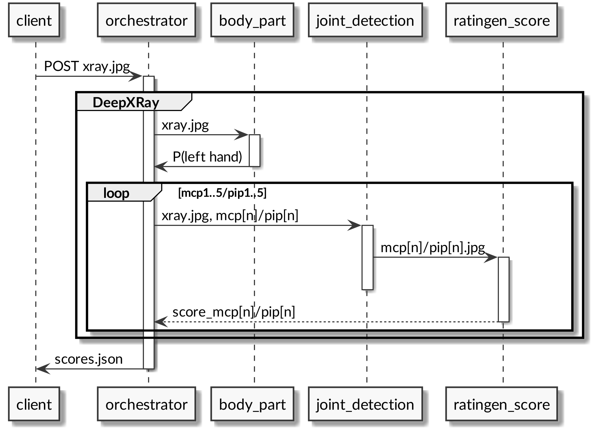

# Arbeit

**Titel**: «DeepXRay»

**Auftraggeber**: Dr. Tobias Reinhard (seantis GmbH)

**Betreuer**: Daniel Pfäffli (HSLU ‒ Informatik)

**Experte**: Jeremy Callner (APG|SGA)

**Student**: Patrick Bucher

- Student der Informatik im 8. Semester
- seit Februar 2020 als Full Stack Python Developer bei seantis GmbH

# Ablauf

**Domäne**: _Worum geht es?_

**Zielsetzung**: _Was soll erreicht werden?_

**Modelle**: _Was war gegeben?_

**Architektur**: _Wie lässt sich das kombinieren?_

**Prototyp**: _Kann das überhaupt funktionieren?_

**Evaluation**: _Wie kann das geprüft werden?_

**Diskussion, Fragen & Antworten**

# Domäne (1): Rheumatoide Arthritis

Die _rheumatoide Arthritis_ ist eine Autoimmunerkrankung.

Chronische Entzündungen schädigen das Gelenkgewebe irreparabel.

- unheilbar, jedoch therapierbar
- Zweck der Untersuchung: Krankheitsverläufe mitverfolgen
- Überprüfung von Therapiemassnahmen, Medikamenten

# Domäne (2): Untersuchte Gelenke

{height=80%}

# Domäne (3): Beispiele für Rheumatoide Arthritis (1)

{height=80%}

# Domäne (4): Beispiele für Rheumatoide Arthritis (2)

{height=80%}

# Domäne (5): Beispiele für Rheumatoide Arthritis (3)

{height=80%}

# Domäne (6): Scoring

Manuelles Scoring durch medizinisches Fachpersonal:

- _Ratingen_-Score (pro Gelenk), Skala von 0-100% Schädigung
    - Thema der Arbeit
- _Rau_-Score (betrachtet verschiedene Körperteile und Gelenke)
    - für vorliegende Arbeit nicht weiter relevant

# Zielsetzung

Industrialisierung: bestehende Modelle zu funktionierender Software kombinieren

- Lauffähiger Prototyp basierend auf bestehenden Modellen
    - Anbieten einer API
    - Load Balancing, Parallelisierung, Messaging
    - Evaluation der Performance
    - Austauschbarkeit von Modellen
- Ausblick
    - Einheitliche Implementierung in aktueller Version
    - Einheitliche Modellformate
    - Integration in Produktivumgebung

Machine Learning? Software Engineering! …und etwas Machine Learning.

# Modelle

## `body_part`

Erkennt Körperteil auf dem Röntgenbild mit Wahrscheinlichkeit.

## `joint_detection`

Zehn Modelle, jedes Modell extrahiert ein Gelenk aus dem Bild (MCP 1-5, PIP 1-5).

## `ratingen_score`

Stellt Schädigung des Gelenks fest, sechs Kategorien (0-5).

# Architektur (1): Integrationsarten

## Anforderung

API (Web-Service) zur Verfügung stellen

## Integrationsarten (_Enterprise Integration Patterns_)

- File Transfer
- Shared Database
- Remote Procedure Call
- Messaging
- (HTTP, REST)

# Architektur (2): Variante 1, HTTP (synchron)

{height=80%}

# Architektur (3): Datenfluss Variante 1

{height=80%}

# Architektur (4): Variante 2, HTTP (synchron/asynchron)

{height=80%}

# Architektur (5): Datenfluss Variante 2

{height=80%}

# Architektur (6): Variante 3, Messaging

{height=80%}

# Architektur (7): Datenfluss Variante 3

{height=80%}

# Architektur (8): Variante 4, Hybrid

{height=80%}

# Architektur (9): Datenfluss Variante 4

{height=80%}

# Prototyp (1): Idee

**Ziel**: Architekturvorschlag evaluieren

**Mittel**: Text-Repräsentation von Bildern

    HAND_LEFT(mcp1=15, mcp2=0, mcp3=15, mcp4=10, mcp5=0,
              pip1=35, pip2=45, pip3=70, pip4=50, pip5=30)

# Prototyp (2): Demo

_[Live-Demo]_

# Prototyp (3): Bewertung

**Der Prototyp funktioniert.**

Der Client wird bedient ‒ auch bei fehlenden Gelenken.

Die Modelle können parallel ausgeführt werden.

## Herausforderungen

- Integrationscode (`orchestrator`) modular aufbauen.
- Integration der verschiedenen Komponenten durchführen.

# Evaluation

## Output

Klassifikation? Ranking? Intervall? Mischung!

## Metriken

- Anteil korrekter Predictions (global)
- Anteil korrekter Predictions (pro Klasse)
- Almost Correct (±1 Klasse ist «korrekt»)
- Cohen's Kappa: Übereinstimmung Mensch/Maschine
- Cohen's Squared Kappa: berücksichtigt Ungleichverteilung
- Inter Class Correlation: Mensch/Maschine vs. Mensch/Mensch

# Diskussion, Fragen & Antworten

_[diese Folie wurde absichtlich leer gelassen]_
