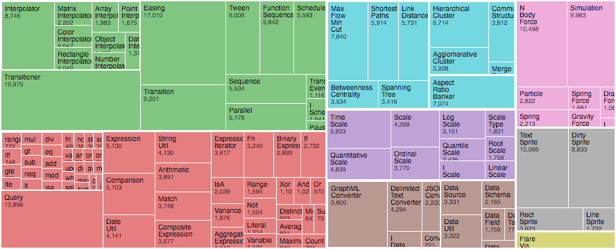

# Idea

A source code folder is a hierarchical file system structure that contains

1. other folders (projects, modules, sub-modules, etc.), and
2. files (containing source code in different languages).

One possible organization of source code folders is to create a folder for
every SCM server in the home directory, e.g. `github.com` and
`gitlab.enterpriselab.ch`, into the home directory. Within that directory,
there is one folder for every group or project, containing multiple
repositories. 

This are some examples from one of the author's laptop:

    /home/paedu/github.com/patrickbucher/reversi
    /home/paedu/github.com/patrickbucher/davi
    /home/paedu/github.com/skiapoden/kurtoid
    /home/paedu/gitlab.enterpriselab.ch/iotcourse-h19/arduino-examples
    /home/paedu/gitlab.enterpriselab.ch/iotcourse-h19/makefile-examples

The structure is always the same:

    /home/[user]/[scm-server]/[group]/[repository]

A repository folder contains other folders. This is an example from the
repository `px` (a command line client written in the Go programming language):

    Makefile

    cmd/px.go

    scripts/ci-pipeline.sh
    scripts/ci-px-login-logout-test.sh
    scripts/envvars.sh

    tokenstore/tokenpair.go
    tokenstore/tokenresponse.go
    tokenstore/tokenstore.go
    tokenstore/tokenstore_test.go

The folder not only contains code written in the Go programming language, but
also shell scripts, a `Makefile`, and some documentation written in Markdown.

Using the [`gocloc`](https://github.com/hhatto/gocloc) utility, the number of
lines of code by programming/markup language can be displayed as follows:

    $ gocloc ~/gitlab.peax.ch/px
    ---------------------------------------------------------------------------
    Language                 files          blank        comment           code
    ---------------------------------------------------------------------------
    Go                          10            112              9           1053
    BASH                         8             25            157              8
    Markdown                     1             34             57              1
    Makefile                     1              8             23              0
    ---------------------------------------------------------------------------
    TOTAL                       20            179            246           1062
    ---------------------------------------------------------------------------

The idea of this project is to visualize this data in order to gain more
insight:

1. How big are those source folders and files in comparison?
2. How much code do I write in which programming language?
3. How dense is the code?

# Data

The `gocloc` utility comes with some command line flags that are very useful
for the problem at hand:

- `--by-file`: report results for every encountered source file
- `--output-type=json`: output the report as a JSON data structure

Piped into [`jq`](https://stedolan.github.io/jq/), a JSON file called
`sclocstats.json` (short for «source lines of code statistics» for a source
folder is created within seconds:

```bash
$ gocloc ~/github.com --by-file --output-type=json | jq > slocstats.json
```

The (shortened) data structure looks as follows (`slocstats.json`):

```json
{
  "files": [
    {
      "code": 314,
      "comment": 0,
      "blank": 30,
      "name": "patrickbucher/reveal-the-pain/frontend/src/script.js",
      "Lang": "JavaScript"
    },
    {
      "code": 69,
      "comment": 0,
      "blank": 14,
      "name": "patrickbucher/reveal-the-pain/frontend/src/style.css",
      "Lang": "CSS"
    },
    {
      "code": 98,
      "comment": 5,
      "blank": 22,
      "name": "patrickbucher/prog/monty_hall/monty_hall.c",
      "Lang": "C"
    }
  ],
  "total": {
    "files": 287,
    "code": 7336,
    "comment": 86382,
    "blank": 3938
  }
}
```

# Visualization: Navigable Tree Map

The main visualization is a navigable tree map, representing folders and files.



The following visual variables should be represented in that tree map:

- Size: SLOC (Source Lines of Code)
- Color: Programming Language (Color Code)
- Alpha Channel: Density

The _Density_ is calculated as follows:

$$ density = \frac{code}{code+comments+blank lines} $$

The following visualization ideas are to be further refined:

- Overall Statistics: Donut/Bar Chart with SLOC (y Axis) per Programming Language (x Axis)
- Scatter Plot: Individual Files as Dots
    - Size: Relative to SLOC
    - x Axis: Programming Language
    - y Axis: Project Folder
