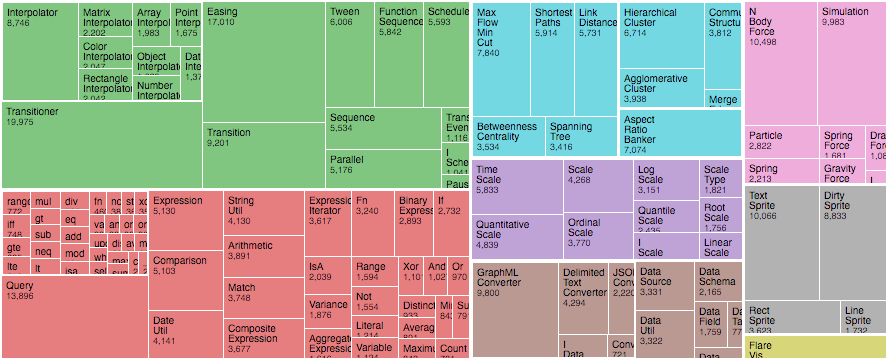

# Problem

Many source folders:

    github.com/patrickbucher/wipro
    github.com/patrickbucher/davi
    github.com/skiapoden/kurtoid
    gitlab.enterpriselab.ch/iot/group02
    gitlab.enterpriselab.ch/iot/team03
    gitlab.peax.ch/peax3/px

# Question

What's in there?

- How big are those source folders and files in comparison?
- How much code do I write in which programming language?
- How dense is the code?

# Data Extraction I

[`gocloc`](https://github.com/hhatto/gocloc) reports statistics on folders and files:

    $ gocloc ~/gitlab.peax.ch/px
    -----------------------------------------------------------------
    Language       files          blank        comment           code
    -----------------------------------------------------------------
    Go                10            112              9           1053
    BASH               8             25            157              8
    Markdown           1             34             57              1
    Makefile           1              8             23              0
    -----------------------------------------------------------------
    TOTAL             20            179            246           1062
    -----------------------------------------------------------------

# Data Extraction II

`gocloc` can also create JSON output:

```json
{
  "files": [
    {
      "code": 314, "comment": 0, "blank": 30,
      "name": ".../src/script.js", "Lang": "JavaScript"
    },
  /* thousands of lines omitted ... */
  ],
  "total": {
    "files": 287, "code": 7336, "comment": 86382, "blank": 3938
  }
}
```

# Visualization: Navigable Tree Map



# Visual Variables

- Size: SLOC (Source Lines of Code)
- Color: Programming Language (Color Code)
- Alpha Channel: Density

$$ density = \frac{code}{code+comments+blank lines} $$

# Additional Ideas

To be refined:

- Overall Statistics: Donut/Bar Chart with SLOC (y Axis) per Programming Language (x Axis)
- Scatter Plot: Individual Files as Dots
    - Size: Relative to SLOC
    - x Axis: Programming Language
    - y Axis: Project Folder
