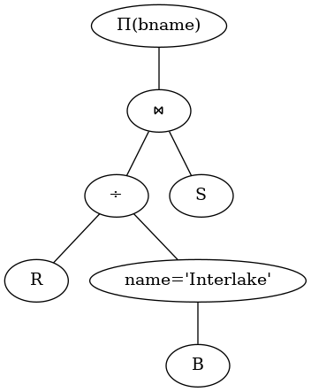

# Übung R3: Relationale Algebra

Gruppe 8: Lukas Arnold, Patrick Bucher, Christopher James Christensen, Jonas Kaiser, Melvin Werthmüller

## Aufgabe 1

$A \div B_1 = \{s_1, s_2, s_3, s_4\}$

$A \div B_2 = \{s_1, s_4\}$

$A \div B_3 = \{s1\}$

## Aufgabe 2

### a)

$\Pi_{\text{sname}}(S \bowtie \Pi_{\text{sid}} (R \bowtie \Pi_{\text{bid}} (\sigma_{\text{color}=\text{red}}(B))))$

### b)

$\Pi_{\text{color}}(B \bowtie \Pi_{\text{bid}} (R \bowtie \Pi_{\text{sid}}(\sigma_{\text{sname}=\text{Lubber}}(S))))$

### c)

$\Pi_{\text{sname}}(\Pi_{\text{sid}}(R) \bowtie S)$

## Aufgabe 3

### a)

$\Pi_{\text{sname}}(S \bowtie \Pi_{\text{sid}}(R \bowtie \Pi_{\text{bid}}(\sigma_{\text{color}=\text{red} \lor \text{color}=\text{green}}(B))))$

### b)

$\Pi_{\text{sid}}(S \bowtie \rho_{\text{redBoat}} \leftarrow \Pi_{\text{bid}}(B) \bowtie \rho_\text{greenBoat} \leftarrow \Pi_{\text{bid}}(B) \sigma_{\text{redBoat.color} = \text{red} \land \text{greenBoat.color} = \text{green}})$

### c)

$\Pi_{\text{sname}}(S \bowtie \Pi_{\text{sid}}\sigma_{\text{count(sid)}>=2}(R))$

## Aufgabe 4

### a)

$\Pi_{\text{sid}}(\sigma_{\text{age}>20}(S)) ∖ \Pi_{\text{sid}}(R \bowtie \sigma_{\text{color}=\text{red}}(B))$

### b)

$\Pi_{\text{sname}}(S \bowtie \Pi_{\text{sid}}(R \div \Pi_{\text{bid}}(B)))$

### c)

$\Pi_{\text{sname}}(S \bowtie \Pi_{\text{sid}}(R \div \Pi_{\text{bid}}(\sigma_{\text{bname}=\text{Interlake}}(B))))$

## Aufgabe 5

Siehe Abbildungen 1 bis 9.

