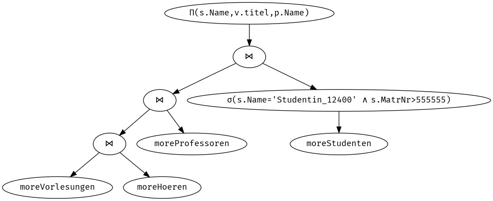

# Übung AO: Anfrageoptimierung

Gruppe 8: Lukas Arnold, Patrick Bucher, Christopher James Christensen, Jonas Kaiser, Melvin Werthmüller

## 1. Selbststudium

### Frage 1

Welche der Schichten der Datenbankarchitektur sind für die Anfrageoptimierung relevant, und weshalb?

1. Anfrageübersetzung/Zugriffsoptimierung: Optimierung der Anfragen
    - Optimierte Anfragen benötigen weniger Rechenzeit und Speicherzugriffe.
2. Transaktionen- und Cursorverwaltung: Scheduling von Transaktionen
    - Transaktionen, die auf gleiche Datenbestände zugreifen/sperren können hintereinander ausgeführt werden.
    - Transaktionen, die auf andere Datenbestände zugreifen/sperren können parallel ausgeführt werden.
    - Dadurch wird das System besser ausgelastet und bleibt _responsive_.
3. Zugriffspfad- und Satzverwaltung: Sinnvolle Verteilung
    - Datensätze, die oft gemeinsam abgefragt werden, können so abgelegt werden, dass weniger Zugriffe nötig werden.
4. Pufferverarbeitung mit Einbringstrategie: Caching
    - Häufig gelesene Datensätze können in einem schnelleren Zwischenspeicher gehalten werden.
    - Selten gelesene Datensätze können auf einem günstigeren, persistenten Speicher gehalten werden.
5. Dateiverwaltung: Dateisystem
    - Moderne Dateisysteme optimieren sich selber (_copy on write_-Mechanismen, sinnvolle Fragmentierung)
6. Speichermedium: Hardware
    - Schnelle und teure SSDs beschleunigen den Zugriff.
    - Günstige und langsamere HDs genügen für Daten, auf die seltener zugegriffen wird.

### Frage 2

Wie wirkt sich ein Index auf die Leistung des Nested Join (verschachtelter Verbund) aus?

- Bei einem Nested Join wird das karthesische Produkt von zwei Tabellen `A` und `B` gebildet.
- In einer äusseren Schleife werden die Datensätze der Tabelle `A`, in einer inneren Schleife die Datensätze der Tabelle `B` durchiteriert.
- Dabei wird jeweils ein gemeinsames Merkmal `M` verglichen: `A.M = B.M`.
- Ist das Merkmal `M` indiziert, erfolgt der Zugriff darauf nicht sequenziell sondern über eine Baumstruktur, was wesentlich schneller ist.
    - Statt `n*m` Vergleiche finden dadurch nur noch `n*log(m)` Vergleiche statt.
    - Siehe auch Frage 3.

### Frage 3

Was ist ein B-Baum, und wozu dient er im Zusammenhang mit der Anfrageoptimierung? 

- Ein B-Baum ist ein Mehrwegbaum, der Daten nach Schlüsseln sortiert speichert und vollständig balanciert ist.
- Mithilfe eines B-Baums lassen sich Einträge mit logarithmischen Aufwand `O(log n)` finden, was schneller als eine lineare Suche `O(n)` ist.

### Frage 4

Warum ist eine Query, welche mit Map-Reduce parallelisiert wird, schneller, als wenn sie sequenziell bearbeitet wird?

- Mithilfe von Map-Reduce kann eine Abfrage auf mehrere Nodes verteilt werden (Map).
- Die einzelnen Teilergebnisse werden anschliessend zu einem Gesamtergebnis kombiniert (Reduce).
- Da mehrere Nodes gleichzeitig am gleichen Problem arbeiten, ist dies schneller, als wenn ein einziger Node das gleiche Problem lösen müsste.

## 3. Interaktion mit der Datenbank

Selektieren Sie eine STudentin über die Matrikelnummer:

```sql
select * from moreStudenten where MatrNr = 1012345;
```

Wie lange dauert diese Anfrage?

 - `1 row in set (0.00 sec)`

Selektieren Sie die gleiche Studentin über den Namen.

```sql
select * from moreStudenten where Name = 'Studentin_12345';
```

Wie lange dauert diese Anfrage?

 - `1 row in set (0.25 sec)`
 
Erklären Sie sich diesen Unterschied?

- Die Spalte `MatrNr` ist der Primärschlüssel der Tabelle und somit indiziert.
- Die Spalte `Name` hingegen ist nicht indiziert.

## 4. Query Execution Plan

```sql
explain select * from moreStudenten where MatrNr = 1012345;
```

    +------+-------------+---------------+-------+---------------+---------+---------+-------+------+-------+
    | id   | select_type | table         | type  | possible_keys | key     | key_len | ref   | rows | Extra |
    +------+-------------+---------------+-------+---------------+---------+---------+-------+------+-------+
    |    1 | SIMPLE      | moreStudenten | const | PRIMARY       | PRIMARY | 4       | const |    1 |       |
    +------+-------------+---------------+-------+---------------+---------+---------+-------+------+-------+

```sql
explain select * from moreStudenten where Name = 'Studentin_12345';
```

    +------+-------------+---------------+------+---------------+------+---------+------+--------+-------------+
    | id   | select_type | table         | type | possible_keys | key  | key_len | ref  | rows   | Extra       |
    +------+-------------+---------------+------+---------------+------+---------+------+--------+-------------+
    |    1 | SIMPLE      | moreStudenten | ALL  | NULL          | NULL | NULL    | NULL | 996887 | Using where |
    +------+-------------+---------------+------+---------------+------+---------+------+--------+-------------+

Wie sieht der Execution Plan für die beiden Anfragen aus? Vergleichen Sie.

1. `MatrNr`
    - `type = const`
    - `possible_keys = PRIMARY`
    - `key = PRIMARY`
    - `key_len = 4`
    - `ref = const`
    - `rows = 1`
    - `Extra =`
2. `Name`
    - `type = ALL`
    - `possible_keys = NULL`
    - `key = NULL`
    - `key_len = NULL`
    - `ref = NULL`
    - `rows = 996887`
    - `Extra = Using where`

Welche Felder geben Ihen hier Informationen zur Query-Performance? Wo sehen Sie Unterschiede?

- `key`: Das erste Query verwendet einen Primärschlüssel, das zweite Query keien.
- `rows`: Das erste Query braucht nur eine zu prüfen, das zweite hingegen $996887$.

## 5. Logische Optimierung

Führen Sie folgende Query aus:

```sql
select s.Name, v.titel, p.Name from
(select * from moreStudenten where MatrNr > 555555) s
join moreHoeren h on (s.MatrNr = h.MatrNr)
join moreVorlesungen v on (h.VorlNr = v.VorlNr)
join moreProfessoren p on (p.PersNr = v.gelesenVon)
where s.Name = 'Studentin_12400';
```

Wie lange dauert die Anfrage?

- `99 rows in set (9.78 sec)`

Die sieht der Explain Plan für die Anfrage aus?

    +------+-------------+---------------+--------+---------------+---------+---------+---------------------------+----------+-------------+
    | id   | select_type | table         | type   | possible_keys | key     | key_len | ref                       | rows     | Extra       |
    +------+-------------+---------------+--------+---------------+---------+---------+---------------------------+----------+-------------+
    |    1 | SIMPLE      | h             | ALL    | NULL          | NULL    | NULL    | NULL                      | 10643092 | Using where |
    |    1 | SIMPLE      | v             | eq_ref | PRIMARY       | PRIMARY | 4       | moreUniData2.h.VorlNr     |        1 | Using where |
    |    1 | SIMPLE      | moreStudenten | eq_ref | PRIMARY       | PRIMARY | 4       | moreUniData2.h.MatrNr     |        1 | Using where |
    |    1 | SIMPLE      | p             | eq_ref | PRIMARY       | PRIMARY | 4       | moreUniData2.v.gelesenVon |        1 |             |
    +------+-------------+---------------+--------+---------------+---------+---------+---------------------------+----------+-------------+

Wie sieht der Anfragebaum für diese Anfrage aus?


- Siehe Abbildung 1!

Wie sieht der optimierte Anfragebaum aus?

- Siehe Abbildung 2!



Wie sieht das SQL der optimierten Query aus?

```sql
select s.Name, v.titel, p.Name from
(select * from moreStudenten where MatrNr > 555555 and Name = 'Studentin_12400') s
join moreHoeren h on (s.MatrNr = h.MatrNr)
join moreVorlesungen v on (h.VorlNr = v.VorlNr)
join moreProfessoren p on (p.PersNr = v.gelesenVon)
```

Wie lange dauert die logisch optimierte Anfrage?

- `99 rows in set (9.45 sec)` (ungefähr gleich lange)

Wie sieht der Explain Plan für die logisch optimierte Anfrage aus?

    +------+-------------+---------------+--------+---------------+---------+---------+---------------------------+----------+-------------+
    | id   | select_type | table         | type   | possible_keys | key     | key_len | ref                       | rows     | Extra       |
    +------+-------------+---------------+--------+---------------+---------+---------+---------------------------+----------+-------------+
    |    1 | SIMPLE      | h             | ALL    | NULL          | NULL    | NULL    | NULL                      | 10643092 | Using where |
    |    1 | SIMPLE      | v             | eq_ref | PRIMARY       | PRIMARY | 4       | moreUniData2.h.VorlNr     |        1 | Using where |
    |    1 | SIMPLE      | moreStudenten | eq_ref | PRIMARY       | PRIMARY | 4       | moreUniData2.h.MatrNr     |        1 | Using where |
    |    1 | SIMPLE      | p             | eq_ref | PRIMARY       | PRIMARY | 4       | moreUniData2.v.gelesenVon |        1 |             |
    +------+-------------+---------------+--------+---------------+---------+---------+---------------------------+----------+-------------+

- Genau gleich! Die Optimierung scheint nichts gebracht zu haben.

## 6. Erstellung von Indexen

Erstellen Sie einen Primärschlüssel auf die Tabelle `moreHoeren` (mit `ALTER TABLE`).

```sql
alter table moreHoeren add constraint primary key (MatrNr, VorlNr);
```

Wie lange dauert die Erstellung des Indexes?

- `Query OK, 0 rows affected (31.26 sec)` 

Was bedeutet dies bezüglich Kosten/Nutzen-Überlegungen?

- Unter Vorwegnahme der nächsten Frage: Der Index lohnt sich schon nach wenigen aufwändigen Anfragen!

Wie lange dauert die (logisch nicht optimierte) Query jetzt?

- `99 rows in set (7.83 sec)`

Wie sieht der Explain Plan aus? Woran sehen Sie die Optimierung gegenüber vorher?

    +-----+---------------+--------+---------------+---------+---------+---------------------------+---------+--------------------------+
    | ... | table         | type   | possible_keys | key     | key_len | ref                       | rows    | Extra                    |
    +-----+---------------+--------+---------------+---------+---------+---------------------------+---------+--------------------------+
    | ... | h             | range  | PRIMARY       | PRIMARY | 4       | NULL                      | 5353263 | Using where; Using index |
    | ... | v             | eq_ref | PRIMARY       | PRIMARY | 4       | moreUniData2.h.VorlNr     |       1 | Using where              |
    | ... | moreStudenten | eq_ref | PRIMARY       | PRIMARY | 4       | moreUniData2.h.MatrNr     |       1 | Using where              |
    | ... | p             | eq_ref | PRIMARY       | PRIMARY | 4       | moreUniData2.v.gelesenVon |       1 |                          |
    +-----+---------------+--------+---------------+---------+---------+---------------------------+---------+--------------------------+

- Die Tabelle `moreHoeren` verwendet jetzt einen Index.

Erstellen Sie einen Index auf das Attribut `Name` in der Tabelle `moreStudenten`.

```sql
create index name_index on moreStudenten (Name);
```

- `Query OK, 0 rows affected (1.99 sec)`

Führen Sie nun die logisch optimierte Query erneut aus.

Wie lange dauert diese Query jetzt?

- `99 rows in set (0.01 sec)`

Wie sieht der Explain Plan aus? Woran sehen Sie die Optimierung gegenüber vorher?

    +---------------+--------+--------------------+------------+---------+-----------------------------------+------+--------------------------+
    | table         | type   | possible_keys      | key        | key_len | ref                               | rows | Extra                    |
    +---------------+--------+--------------------+------------+---------+-----------------------------------+------+--------------------------+
    | moreStudenten | range  | PRIMARY,name_index | name_index | 36      | NULL                              |    1 | Using where; Using index |
    | h             | ref    | PRIMARY            | PRIMARY    | 4       | moreUniData2.moreStudenten.MatrNr |   49 | Using index              |
    | v             | eq_ref | PRIMARY            | PRIMARY    | 4       | moreUniData2.h.VorlNr             |    1 | Using where              |
    | p             | eq_ref | PRIMARY            | PRIMARY    | 4       | moreUniData2.v.gelesenVon         |    1 |                          |
    +---------------+--------+--------------------+------------+---------+-----------------------------------+------+--------------------------+

- Für den Zugriff auf die Tabelle `moreStudenten` wird jetzt auch ein Index verwendet.

Selektieren Sie nun erneut eine Studierende über den Namen:

```sql
select * from moreStudenten where Name like 'Studentin_123456';
```

Wie lange dauert die Anfrage nun?

- `1 row in set (0.29 sec)`

Wie erklären Sie sich dies anhand des Query Execution Plans?

- Die Suche über einen Index geht schneller als mit einem sequenziellen Vergleich.
