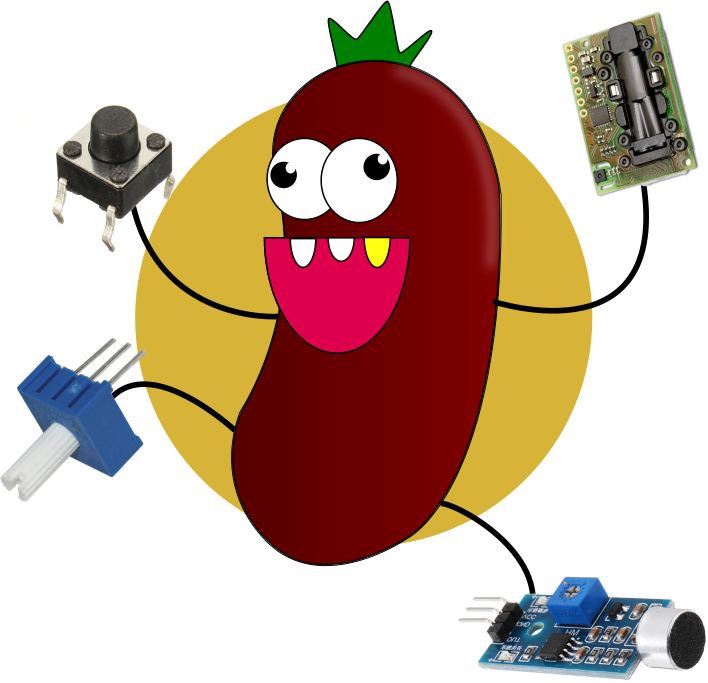
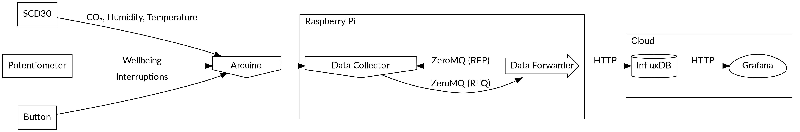

# Logo

{height=200px}

# Idea

- Monitor and Assess Workplace Quality Parameters (Subjective and Objective)
    - CO₂ Concentration (ppm)
    - Temperature (°C)
    - Humidity (%)
    - Interruptions
    - Subjective Well Being (1..100)
- Collect and Visualize Data to Gain Insight

# Architecture

{height=250px}

# Sensors

Example Configuration:

1. SCD30: CO₂, Humidity, Temperature
2. Potentiometer: Subjective Well Beeing
3. Button: Interruptions

The system can handle any combination of sensors.

# Protocol

Arduino to Raspberry Pi (UART):

    key=value,key=value,key=value

For example:

    co2=1024,temp=25.49,humid=47.39,interrupt=0,wellbeing=7

Measured every 2 seconds (interrupt either happened or not)

# Processing

1. Data Collector
    1. String is Parsed into Python Dictionary
    2. Dictionary is «Pickled» and Sent over ZeroMQ Socket as a Message
2. Data Forwarder
    1. Message is Received and «Unpickled» into a Dictionary
    2. Dictionary is Converted into JSON
    3. JSON is Sent to InfluxDB

Using a publish-subscribe pattern (instead of request-response) allows to combine `m` collectors with `n` forwarders.

# Visualization

Grafana (Live Demo)
