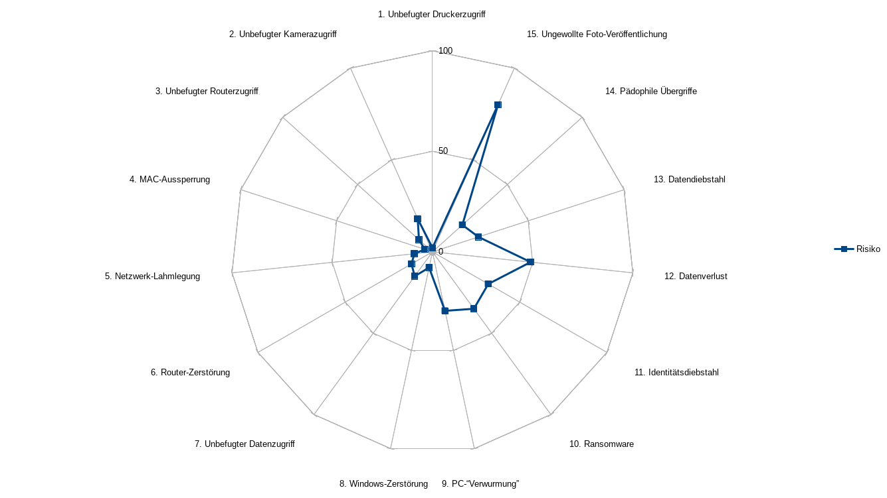

# Risiken

a. Ein Nachbar (oder dessen durch Viren, Würmer und dergleichen kompromittierter
PC) könnte die WEP-WLAN-Verschlüsselung knacken. Dadurch ergeben sich die
folgenden Risiken:
    1. Der Drucker könnte von Unbefugten verwendet werden. Das bringt diesen
    zwar nichts, könnte aber Papier und Toner bzw. Tinte verschwenden und das
    Gerät abnutzen.
    2. Die beiden installierten Kameras könnten zur Spionage verwendet werden.
    Das bedeutete einerseits die Verletzung der Privatsphäre, andererseits
    könnte dies auch zur Einbruchsplanung genutzt werden, da man so herausfinden
    kann, wann niemand zu Hause ist.
    3. Besteht erst einmal Zugriff auf den Router, und erlaubt dieser
    Konfiguration über WLAN, könnte ein Angreifer auf sämtliche ungeschützten
    Freigaben im Netzwerk zugreifen.
    4. Weiter könnten Geräte per MAC-Sperre aus dem Netzwerk ausgeschlossen
    werden.
    5. Das Netzwerk könnte so gänzlich lahmgelegt werden.
    6. Der Router könnte durch Einspielung einer manipulierten Firmware gar
    unbrauchbar gemacht werden.
    7. Über das gekaperte Netzwerk könnten trojanische Pferde eingespeist
    werden, womit dann Remote-Kontrolle über die Systeme übernehmen werden
    könnte. Dadurch könnten private Daten abgegriffen und/oder gelöscht werden.
    8. Die Windows-Installationen könnten unwiderruflich zerstört werden.
b. Onkel Özutöcks Laptop könnte von Viren, Würmern und dergleichen
kompromittiert sein.
    9. Die Programme, die er so auf die PCs überspielt, könnten dadurch
    ebenfalls kompromittiert sein.
c. Es ist nirgends die Rede von Antiviren-Software oder einer Datensicherung.
Doch Windows ist aufgrund seiner Verbreitung ein beliebtes Ziel für Entwickler
von Schadsoftware.
    10. Mit sogenannter Ransomware könnten private Daten verschlüsselt werden,
    sodass sie nur durch eine Lösegeldzahlung entschlüsselt werden könnten. Es
    droht Datenverlust oder finanzieller Schaden.
    11. Trojanische Pferde oder Würmer könnten aktive Logins (über
    Session-Cookies) übernehmen und auf verschiedenen Benutzerkonti
    strafrechtlich relevante Informationen verbreiten (Facebook, Twitter) oder
    sogar auf das Online-Banking zugreifen. Sind die Passwörter im Klartext
    abgespeichert, können sie alle problemlos abgegriffen werden.
    12. Bei einem plötzlichen Festplatten-Crash gehen die darauf gespeicherten
    Daten unwiderruflich verloren. Daten könnten auch aus Versehen gelöscht
    werden. Wird dies lange nicht bemerkt, kann die Wiederherstellung der Daten
    scheitern, wenn die betroffenen Festplattensektoren in der Zwischenzeit
    wieder beschrieben worden sind.
d. Arbeitet Herr Meier zu Hause, dürften vertrauliche Daten der Bundesverwaltung
betroffen sein.
    13. Es könnten vertrauliche Daten oder gar Staatsgeheimnisse an Unbefugte
    gelangen. Herr Meier könnte im schlimmsten Fall der Veruntreuung oder gar
    des fahrlässigen Landesverrats angeklagt werden. (Die Verwendung von WEP zur
    Sicherung eines WLAN ist fahrlässig.)
e. Die jüngste Tochter Dora (12) kann vielleicht die Risiken nicht abschätzen,
die ein Smartphone mit Kamera mit sich bringt.
    14. Pädophile könnten sie nach Bildern und nach ihrer Adresse fragen,
    wodurch sie direkt gefährdet werden könnte.
    15. Bilder, die nicht für die Öffentlichkeit bestimmt sind, könnten auf
    soziale Medien gelangen, wo sie kaum mehr gelöscht werden können.

## Risikogewichtung

Häufigkeit und Schadensausmass sind in einer Skala von 1 (am tiefsten) bis 10
(am höchsten) angegeben.

Bezeichnung                           Häufigkeit  Schadensausmass  Risiko
------------------------------------ ----------- ---------------- -------
1. Unbefugter Druckerzugriff                   2                1       2
2. Unbefugter Kamerazugriff                    2                9      18 
3. Unbefugter Routerzugriff                    3                3       9
4. MAC-Aussperrung                             2                2       4
5. Netzwerk-Lahmlegung                         3                3       9
6. Router-Zerstörung                           3                4      12 
7. Unbefugter Datenzugriff                     3                5      15 
8. Windows-Zerstörung                          4                2       8
9. PC-"Verwurmung"                             6                5      30 
10. Ransomware                                 5                7      35 
11. Identitätsdiebstahl                        4                8      32 
12. Datenverlust                               7                7      49 
13. Datendiebstahl                             3                8      24 
14. Pädophile Übergriffe                       2               10      20 
15. Ungewollte Foto-Veröffentlichung          10                8      80 

# Massnahmen für ein Budget bis CHF 500.-

- Die Risiken 1-8 sind zwar nicht die grössten, können aber dadurch entschärft
werden, dass ein WLAN-Router mit WPA2 installiert wird. Es wird ein schwer
knackbares Passwort eingesetzt, das nur den Eltern bekannt ist, und das sie bei
allen Geräten selber eingeben müssen. Kosten: CHF 100.-
- Risiko 9, PC-Verwurmung: Der Onkel Özutöck soll geschult werden, sodass er
Programme nicht mehr von seinem Laptop auf andere Computer überträgt, sondern
sie jeweils in einer aktuellen Version direkt vom Anbieter herunterlädt und,
falls möglich, die heruntergeladene Version gegen einen Hash-Wert auf ihre
Integrität überprüft. Kosten: CHF 100.-
- Risiko 10, Ransomware und Risiko 12, Datenverlust: Mittels Backup-Lösung von
Windows und einer externen Festplatte soll eine einfache Datensicherung
eingerichtet werden. Kosten: CHF 100.-
- Risiko 11, Identitätsdiebstahl: Die Webbrowser sollen so eingestellt werden,
dass Session-Cookies beim Beenden des Browsers immer automatisch gelöscht
werden. Kosten: CHF 100.-
- Risiko 15, Ungewollte Foto-Veröffentlichung: Ein Fachmann soll der ganzen
Familie eine einstündige Schulung geben, wie man mit Fotos umgehen soll: Kosten:
CHF 100.-

## Risikosituation nach diesen Massnahmen

- Die Risiken 1-8 (unsicheres WLAN) sollten durch die Umstellung von WEP auf
  WPA2 nahezu eliminiert worden sein.
- Risiko 9 (Özutöcks potenziell kompromittierte Software) sollte durch eine
  entsprechende Schulung erheblich gemindert worden sein.
- Die Risiken 10 (Ransomware) und 12 (Datenverlust) werden durch die einfache
  Backup-Lösung stark gemindert.
- Das Risiko 11 (Identitätsdiebstahl) wurde durch die Schulung etwas
  abgemindert. Es ist aber möglich, dass die Massnahmen aus Bequemlichkeit
  von den einzelnen Benutzer wieder rückgängig gemacht werden.
- Das Risiko 15 (ungewollt veröffentliche Fotos) wird durch die Schulung der
  Familie gemindert.

Bezeichnung                           Häufigkeit  Schadensausmass  Risiko
------------------------------------ ----------- ---------------- -------
1. Unbefugter Druckerzugriff                   1                1       1
2. Unbefugter Kamerazugriff                    1                9       9
3. Unbefugter Routerzugriff                    1                3       3
4. MAC-Aussperrung                             1                2       2
5. Netzwerk-Lahmlegung                         1                3       3
6. Router-Zerstörung                           1                4       4
7. Unbefugter Datenzugriff                     1                5       5
8. Windows-Zerstörung                          1                2       2
9. PC-"Verwurmung"                             2                5      10 
10. Ransomware                                 5                2      10
11. Identitätsdiebstahl                        2                8      16
12. Datenverlust                               7                2      14
13. Datendiebstahl                             2                8      16
14. Pädophile Übergriffe                       2               10      20 
15. Ungewollte Foto-Veröffentlichung           2                8      16 

# Fazit

Die Verwundbarkeiten in dieser Fallstudie gehen v.a. auf zwei Faktoren zurück:

1. Einsatz veralteter Sicherheits-Technologie (WEP)
2. Falsches, unbedachtes Verhalten
    a. im Umgang mit Passwörtern
    b. im Umgang mit Datensicherung
    c. im Umgang mit persönlichen Daten, z.B. Fotos

Viele Risiken konnten durch das Ersetzen der WEP-Verschlüsselung durch eine
zeitgemässere Technologie stark vermindert werden, ohne dass dabei grosse Kosten
entstanden sind. Der ständige Zugewinn an Rechenkapazität zwingt einen immer
wieder zum Austausch der eingesetzten Verschlüsselungstechnologie.

Einige Risiken (Identitätsdiebstahl, ungewollte Foto-Veröffentlichung) konnten
mittels Schulungen gemindert werden. Dies funktioniert aber nur, wenn die dort
eingeübten Verhaltensregeln konsequent eingehalten werden.

Manche Massnahmen zielen darauf ab, die Häufigkeit der Schadensfälle bzw. deren
Wahrscheinlichkeit zu minimieren, so etwa das Ersetzen von WEP durch WPA2.
Andere Massnahmen helfen dabei, das Schadensausmass zu reduzieren, so das
Durchführen einer regelmässigen und systematischen Datensicherung.

Möchte Herr Meier vertrauliche Dateien von seiner Arbeit zu Hause bearbeiten,
bräuchte er zusätzliche Sicherheitsmassnahmen. Die Installation einer
vorgelagerten Firewall und die Segmentierung des Heimnetzwerks in
unterschiedliche Sicherheitszonen wäre darum wünschenswert. Dies lässt sich nur
mit einem höheren Budget bewerkstelligen.

Risiken wie Datenverlust und Pädophilie können durch IT-Massnahmen nicht
komplett eliminiert werden. Hardware kann kaputt gehen, und Pädophile gab es
auch schon, bevor es Computer gab. Hier ist Vorsicht ebenso wichtig wie eine
entsprechende technische Infrastruktur.
