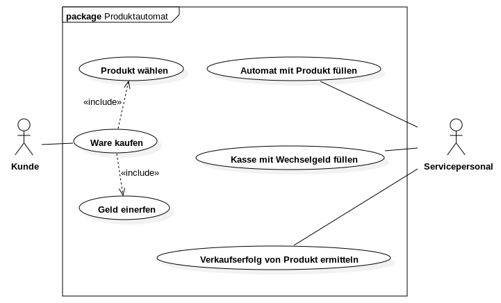

# Use Cases "Produktautomat"

# Use Case "Ware kaufen"

## Use Case Name

"Ware kaufen"

## Auslösender Akteur

Kunde

## Zweck/Ziel

Beschreibt den typischen Ablauf eines Warenverkauf des Produktautomaten

## Eingehende Informationen

- Nummer des Produktschachtes
- eingeworfener Geldbetrag

## Ergebnis (Output)
Aus Sicht des Systems (des Automaten):

1. der Automat enthält ein Produkt weniger
2. der Automat enthält mehr Geld

## Grundlegender Ablauf

1. Der Kunde sucht sich ein Produkt aus.
2. Der Kunde wirft den passenden Betrag ein.
3. Der Kunde gibt die Nummer des Produktschachtes ein.
4. Der Produktautomat gibt das Produkt aus.
5. Der Produktautomat gibt das Wechselgeld aus.
6. Der Kunde entnimmt das Produkt dem Ausgabeschacht.
7. Der Kunde entnimmt das Wechselgeld.

## Erweiterungen

3a [Der Kunde wählt einen leeren Produktschacht] Keine Aktion

## Alternativen

[keine]
