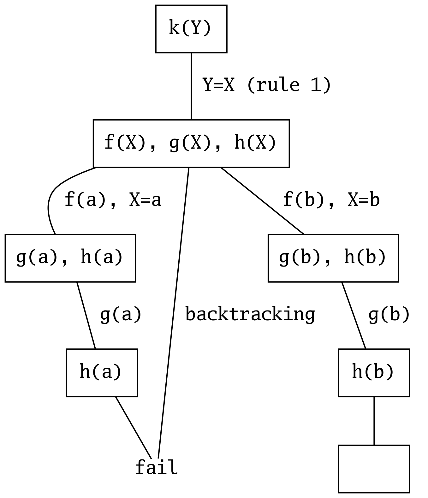

# Prolog

- Prolog: deklarative, logische Programmiersprache
- Beschreibung des Resultats, nicht des Weges dorthin: _was_, nicht _wie_
- Wichtigste Mechanismen: Matching und automatisches Backtracking
- Funktionsweise von Prolog
    - Wissensdatenbank wird mit Fakten und Regeln gefüttert
    - Input: Es werden Anfragen (Queries) an die Wissensdatenbank gestellt
    - Output: Antworten werden mithilfe der Wissensdatenbank geliefert

## Terme

Prolog-Terme:

1. Zahlen (numbers): Ganz- und Gleitkommazahlen
    - `324`, `-65`, `839.69`
2. Atome (atoms): mit Kleinbuchstaben beginnend oder mit Apostrophen umschlossen
    - `elephant`, `'Monty Python'`
3. Variablen (variables): mit Grossbuchstabe oder Underscore beginnend
    - `X`, `Elephant`, `_whatever`
    - anonyme Variable `_`: Platzhalter, falls Wert nicht von Interesse
4. Zusammengesetzte Terme (compound terms):
    - `is_neighbour('Node A', X)`

Term-Hierarchie:

- Einfache und zusammengesetzte Terme
    - Einfacher Term: Variable oder Atomarer Term
        - Atomarer Term: Atom oder Zahl
    - Zusammengesetzter Term: Kombination aus einfachen Termen
        - `smaller_of(A, B)`
        - `bigger_of(smaller_of(X, Y), bigger_of(A, B))`

Grundterme und Prädikate:

- Grundterme: Fakten
- Prädikate: Fakten oder Regeln
    - atomarer Term: Faktum
    - nicht-atomarer Term: Regel

Stelligkeit (Arity): Anzahl Argumente eines Prädikats für dessen Identifizierung.

- `bigger(A, B)`: `bigger/2`
    - zwei Argumente: Stelligkeit 2
- `division(dividend, divisor, result, remainder)`: `division/4`

## Struktur eines Prolog-Programms

- Prolog-Programm: Liste von Klauseln
- Klausel: Fakten und Regeln (zusammengesetzte Terme)
- Prozedur: alle Klauseln zum gleichen Prädikat (Name und Stelligkeit gleich)

### Fakten

Fakten: Prädikate gefolgt von einem Punkt; definieren etwas als bedingungslos wahr.

```prolog
bigger(elephant, horse).
parent(peter, mary).
```

Prolog geht von einer geschlossenen Welt aus: Alles, was unbekannt ist, gilt
als falsch!

### Regeln

Regeln: Kopf (head) und Hauptteil (body), durch `:-` getrennt:

```prolog
grandfather(X, Y) :-    % head
    father(X, Z),       % body, goal 1
    parent(Z, Y).       % body, goal 2
```

Das Komma verkettet zwei Ausdrücke als logisches Und (Konjunktion):

- Hornklauseln: `(p1 AND p2 AND ... AND pn) -> q`
- Prolog: `q :- p1, p2, ..., pn.`

### Anfragen

Anfrage: Sequenz von 1..n Prädikaten gefolgt von einem Punkt:

```prolog
?- bigger(elephant, dog).
true .
```

## Funktionsweise

### Matching

Matching:

- Zwei Terme sind identisch.
- Zwei Terme können durch Ersetzen von Variablen durch andere Terme identisch gemacht werden.

Matching wird per Gleichheits-Prädikat `=/2` abgefragt (Infix-Notation):

```prolog
?- owns(alice, computer) = owns(X, computer).
X = alice.

?- owns(alice, computer) = owns(X, house).
false.
```

#### Atomare Terme

Atomare Terme matchen, wenn sie die gleiche Zahl oder das gleiche Atom sind:

```prolog
?- =(tom, tom).
true.

?- tom = tom.
true.

?- 'Tom' = tom. % case sensitive!
false.

?- 'tom' = tom
true.
```

#### Variable und Term

Ist einer der Terme eine Variable, matchen die Terme, und die Variable erhält
den Wert des anderen Terms:

```prolog
?- alice = X.
X = alice.

?- owns(house) = X.
X = owns(house).

?- X = Y.
X = Y.

?- X = Y, X = alice.
X = Y, Y = alice.

?- X = Y, X = alice, Y = bob.
false.
```

#### Zusammengesetzte Terme

Zusammengesetzte Terme stimmen überein, wenn:

1. Sie vom gleichen Funktor mit der gleichen Stelligkeit sind.
2. Alle korrespondierenden Argumente übereinstimmen.

```prolog
?- meet(drink(alice), eat(X)) = meet(Y, eat(bob)).
X = bob
Y = drink(alice).

?- meet(X, X) = meet(drink(alice), bob).
false.

?- meet(alice, bob) = meet(Y).
false.
```

### Backtracking

Eine Anfrage führt zu einer Beweissuche im Suchbaum. Die Abarbeitung erfolgt:

- in der Wissensdatenbank von oben nach unten
- im Ausdruck von links nach rechts

Kann ein Ausdruck in einem Suchbaum nicht aufgelöst werden, kehrt die
Abarbeitung automatisch auf die letzte Verzweigung zurück. Für den nicht
aufgelösten Ausdruck wird nun die nächste Variante probiert. Sind keine
weiteren Varianten verfügbar, wird die Abarbeitung abgebrochen.

Beispiel:

```prolog
f(a).
f(b).
g(a).
g(b).
h(b).

k(X) :- f(X), g(X), h(X). % rule1

?- k(Y).
Y = b
```

{width=250px}

Die Reihenfolge von Regeln und Zielen ist wichtig!

1. Die Reihenfolge der Regeln und Ziele wirkt sich auf die Performance aus.
    - Triviale Fälle (einfache Regeln, Rekursionsbasis) sollten immer oberhalb
      von nicht-trivialen Fällen (allgemeine Regel, Rekursionsanweisung)
      stehen.
2. Eine Tiefensuche kann aufgrund einer nicht-terminierenden Rekursion
   unendlich laufen.
    - Bei zusammengesetzten Prädikaten sollten die einfachen Ziele vor den
      rekursiven Ziele stehen.

## Beispiele

Einträge in die Wissensdatenbank:

```prolog
bigger(elephant, horse).
bigger(horse, dog).
bigger(horse, sheep).
```

Anfrage:

```prolog
?- bigger(dog, elephant).
false.

?- bigger(elephant, horse).
true.

?- bigger(horse, X).
X = dog ;
X = sheep.

?- bigger(elephant, dog).
false
% elephant > horse und horse > dog,
% aber bigger ist nicht transitiv definiert!
```

### Transitive Hülle

```prolog
bigger(X, Y) :- bigger(X, Z), bigger(Z, Y).
```

Anfrage:

```prolog
?- bigger(elephant, dog).
true

?- bigger(X, dog).
X = horse ;
X = elephant ;
false.

?- bigger(elephant, X).
X = horse ;
X = dog ;
X = sheep ;
false.

?- bigger(elephant, X), bigger(X, dog).
X = horse ;
false.

?- bigger(horse, X), bigger(X, dog).
false.
```

### Matching

Zwei Punkte sind durch eine vertikale (bzw. horizontale) Linie verbunden, wenn
sie die gleiche X-Koordinate (bzw. Y-Koordinate) haben:

```prolog
vertical(line(point(X, _), point(X, _))).
horizontal(line(point(_, Y), point(_, Y))).
```

Anfrage:

```prolog
?- vertical(line(point(1, 1), point(1, 5))).
true.

?- horizontal(line(point(1, 2), point(3, X))).
X = 2.

?- horizontal(line(point(1, 2), P)).
P = point(_G4232, 2).
```

## Arithmetik und Operatoren

Der Gleichheitsoperator `=/2` macht Matching:

```prolog
?- X = 1 + 2.
X = 1+2.
```

Für die Zuweisung wird der `is/2`-Operator verwendet:

```prolog
?- X is 1 + 2.
X = 3.
```

Die Dokumentation gibt den Operator als `-Number is +Expr` an.

- `-`: der Operand muss ungebunden sein
- `+`: der Operand muss gebunden sein
- `?`: der Operand kann gebunden oder ungebunden sein

Nur gebundene  Operanden können an ungebundene Operanden zugewiesen werden.

Folgende arithmetische Operatoren sind vordefiniert:

- `+`: Addition
- `-`: Subtraktion
- `/`: Division
- `**`: Potenz 
- `//`: Ganzzahldivision 
- `mod`: Modulo (Rest der Ganzzahldivision)
- `sqrt`: Quadratwurzel

Beispiel:

```prolog
?- X is 3 + 2.
X = 5.

?- X is 3 - 2.
X = 1.

?- X is 2 * 4.
X = 8.

?- X is 10 / 3.
X = 3.3333333333333335.

?- X is 2 ** 3.
X = 8.

?- X is 10 // 3.
X = 3.

?- X is 10 mod 3.
X = 1.

?- X is sqrt(16).
X = 4.
```

Es stehen folgende Vergleichsoperatoren zur Verfügung:

- `>`: grösser als
- `<`: keiner als
- `>=`: grösser-gleich
- `=<`: kleiner-gleich
- `=:=`: Gleichheit
- `=\=`: Ungleichheit
- `==`: Identität

Beispiel:

```prolog
?- 4 > 5.
false.

?- 4 < 5.
true.

?- 4 >= 5.
false.

?- 4 =< 5.
true.

?- 4 =:= 5.
false.

?- 4 =\= 5.
true.

?- 4 == 5.
true.
```

Operatoren sind Prädikate, die mit Infix-Notation verwendet werden können:

```prolog
?- 11 > 7.
true.

?- >(11, 7).
true.
```

### Eigene Operatoren definieren

Mit dem Direktiven `op/3` können eigene Operatoren definiert werden:

- Syntax: `:- op(+Precedence, +Type, :Name)`
    - `:-` steht für eine Direktive
    - Precedence: Ganzzahl zwischen 1 und 1200 (je tiefer, desto stärker bindend)
    - Type: Infix, Präfix, Postfix
        - Infix (Operator zwischen Operanden): xfx, xfy, yfx, z.B. `+` (Addition)
        - Präfix (Operator vor Operand): fx, fy, z.B. `+` (Vorzeichen)
        - Postfix (Operator nach Operand): xf, yf
        - x: Operand mit Präzedenz kleiner derjenigen von Operator f
        - y: Operand mit Präzedenz kleiner/gleich derjenigen von Operator f
        - yfx: linsassoziativ
        - xfy: rechtsassoziativ
    - Name: Prädikatsname

Beispiel:

```prolog
bigger(elephant, dog).

?- op(1150, xfx, bigger).
true.

?- elephant bigger dog.
true.
```

### Verknüpfung von Zielen

- Konjunktion: UND-Logik mit Komma-Operator `,` (Prädikat `,/2`)
- Disjunktion: ODER-Logik mit Semikolon-Operator `;` (Prädikat `;/2`)

Disjunktionen können auch implizit als Liste von Regeln ausgedrückt werden:

```prolog
% loud OR smelly OR stupid
annoying(X) :- loud(X); smelly(X); stupid(X).

annoying(X) :- loud(X).   % loud
annoying(X) :- smelly(X). % OR smelly
annoying(X) :- stupid(X). % OR stupid
```

## Rekursion

Beispiel (`bigger/2`):

```prolog
bigger(X, Y) :- bigger(X, Y).               % simple case (Rekursionsbasis)
bigger(X, Y) :- bigger(X, Z), bigger(Z, Y). % general case (Rekursionsanweisung)
```

Fakultätsberechnung (`fak/2`):

```prolog
fak(0, 1).
fak(A, B) :-
    A > 0,
    A1 is A - 1,
    fak(A1, B1),
    B is A * B1.

?- fak(5, X). % 5! = 120
X = 120
false.

?- fak(4, 24). % is 4! = 24? yes
true.
```

Fibonacci-Zahlen (`fib/2`):

```prolog
fib(0, 0).
fib(1, 1).
fib(N, F) :-
    N > 1,
    N1 is N - 1,
    N2 is N - 2,
    fib(N1, F1),
    fib(N2, F2),
    F is F1 + F2.

?- fib(7, X). % seventh fibonacci number? 13
X = 13.

?- fib(6, 8). % sixth fibonacci number is 8? yes
true.
```

### Optimierung mittels Endrekursion

- Problem: Rekursion ist oft ineffizient
    - der Stack ist mit laufenden Prozeduren gefüllt
    - manche Zwischenergebnisse müssen mehrmals berechnet werden (Fibonacci)
- Endrekursion (tail recursion) gilt für eine Prozedur, wenn:
    - diese nur einen rekursiven Aufruf hat
    - dieser der letzte Aufruf der letzten Klausel der Prozedur ist
    - alle anderen Aufrufe deterministisch sind
- Endrekursion kann als Iteration ausgeführt werden
    - kein Backtracking notwendig
    - kein zusätzlicher Speicherbedarf
    - Umwandlung rekursive in endrekursive Prozedur nicht trivial
    - benötigt zusätzliche Akkumulator-Argumente

Beispiel (Fibonacci-Zahlen mittels Endrekursion):

```prolog
fib(N, F) :- fib(N, 0, 1, F). % accumulator
fib(0, A, _, A).              % simple case
fib(N, A, B, F) :-            % general case
    N1 is N - 1,
    N1 >= 0,                  % avoid underflow
    Sum is A + B,             % accumulator Sum
    fib(N1, B, Sum, F).       % tail-recursive call
```

C-Implementierung zum Vergleich:

```c
int fib(int n) {
    return tailrec_fib(n-1, 0, 1);
}

int tailrec_fib(int n, int a, int b) {
    if (n >= 0) {
        return tailrec_fib(n-1, b, a+b);
    } 
    return a;
}
```

### Optimierung mittels Assertions (Memoization)

Fakten und Regeln können zur Laufzeit hinzugefügt und gelöscht werden. Dadurch
lassen sich Programme durch Caching optimieren (Memoization).

Beispiel (`bigger.pl`):

```prolog
:- dynamic bigger/2. % Prädikat modifizierbar machen.
bigger(elephant, horse).
bigger(horse, dog).
bigger(horse, sheep).
```

`listing/1` zeigt die Fakten und Regeln zu einem Prädikat an:

```prolog
?- listing(bigger).
:- dynamic bigger/2.
bigger(elephant, horse).
bigger(horse, dog).
bigger(horse, sheep).
```

`asserta/1` fügt eine neue Regel _zuoberst_, `assertz/1` _zuunterst_ ein:

```prolog
?- asserta(bigger(horse, hamster)).
?- assertz(bigger(dog, hamster)).
?- listing(bigger).
bigger(horse, hamster).
bigger(elephant, horse).
bigger(horse, dog).
bigger(horse, sheep).
bigger(dog, hamster).
```

`retract/1` entfernt eine Regel:

```prolog
?- retract(bigger(horse, dog)).
?- retract(bigger(horse, sheep)).
?- listing(bigger).
bigger(horse, hamster).
bigger(elephant, horse).
bigger(dog, hamster).
```

#### Anwendungsbeispiel: Optimierung Fibonacci-Zahlen

Bei der rekursiven Berechnung von Fibonacci-Zahlen werden manche
Zwischenresultate mehrmals berechnet:

- Beispiel: `f(4)=f(3)+f(2)`, `f(3)=f(2)+f(1)` (`f(2)` doppelt)
- Bei `f(5)` wird `f(2)` fünf mal berechnet.
- Wird das Zwischenergebnis von `f(2)` als neue Regel abgespeichert, müsste es
  nur einmal berechnet werden.

```prolog
:- dynamic fib/2.
fib(0, 0).
fib(1, 1).
fib(N, F) :-
    N > 1,
    N1 is N-1,
    N2 is N-2,
    fib(N1, F1),
    fib(N2, F2),
    F is F1+F2,
    asserta(fib(N, F)). % memoize result as a new rule
```

## Listen

- Liste: endliche Sequenz von Elementen
- Notation: in eckigen Klammern, Elemente durch Kommas getrennt
- leere Liste: `[]`
- Elemente: beliebige Prolog-Terme (Atome, Zahlen, Listen)
- Aufbau: Rekursiv, aus zwei Teilen bestehend
    1. Listenkopf (head): erstes Element
    2. Listenschwanz (tail): Liste übriger Elemente

Liste `[a, b, c]` als Baumdarstellung (terminiert durch leere Liste als
Rekursionsbasis):

      |
     / \
    a   |
       / \
      b   |
         / \
        c   []

Der Listen-Operator `|` (Pipe) teilt eine Liste in die Variablen Head und Tail
auf:

```prolog
?- [a, b, c] = [Head | Tail].
Head = a
Tail = [b, c].
```

Bestimmte Elemente aus der Liste lesen (Beispiel: zweites und drittes):

```prolog
?- [_, Second, Third | _] = [a, b, c, d, e, f].
Second = b.
Third = c.
```

### Listenoperationen

#### Listenzugehörigkeit

Ist ein Element X in einer Liste L enthalten?

- Relation `mem(X, L)`:
    - `mem(a, [a, b, c])` trifft zu
    - `mem(d, [a, b, c])` trifft nicht zu
    - `mem(b, [a, [b, c]])` trifft nicht zu
    - `mem([b, c], [a, [b, c]])` trifft zu
- Element X ist in der Liste L enthalten, wenn:
    - X der Kopf von L ist
    - X im Schwanz von L vorkommt

```prolog
mem(X, [X | _]).      % X as list header (ignore tail)
mem(X, [_ | Tail]) :- % X in list tail (ignore header)
    mem(X, Tail).

?- mem(a, [a, b, c]).
true .

?- mem(d, [a, b, c]).
false.

?- mem(b, [a, [b, c]]).
false.

?- mem([b, c], [a, [b, c]]).
true .
```

`mem` kann zur Auflistung aller Listenelemente oder zum Finden von Listen mit
speziellen Eigenschaften verwendet werden:

```prolog
?- mem(X, [a, b, c]). % list all list members
X = a ;
X = b ;
X = c ;
false.

?- mem(foo, L). % create a list containing foo
L = [foo|_2502] ;
L = [_2500, foo|_2508] .

?- mem(a, L), mem(b, L), mem(c, L). % find list containing a, b and c
L = [a, b, c|_2700] ;
L = [a, b, _2689, c|2706] .

?- L = [_, _, _], mem(a, L), mem(b, L), mem(c, L). % permutations of L
L = [a, b, c] ;
L = [a, c, b] ;
L = [b, a, c] ;
L = [b, c, a] ;
L = [c, a, b] ;
L = [c, b, a] ;
false.
```

Prolog stellt bereits das Prädikat `member/2` mit der beschriebenen Semantik
zur Verfügung.

#### Listenkonkatenation

Ergeben die Listen L1 und L2 zusammengehängt die Liste L3?

- Relation `conc(L1, L2, L3)`
    - `conc([a, b], [c, d], [a, b, c, d])` trifft zu
    - `conc([a, b], [c], [a, b, c, d])` trifft nicht zu
    - `conc([a, b, c], [d], [a, b, c, d])` trifft zu
    - `conc([a, b, c], [], [c, b, a])` trifft nicht zu
- L1 und L2 ergeben zusammengehängt L3, wenn:
    1. L1 leer ist, und L2 und L3 gleich sind.
    2. L1 nicht leer ist; Kopf und Schwanz hat: `[X | L1]`
        - `[X | L3]` als Resultat der Konkatenation,
        - wobei L3 die Konkatenation aus L1 und L2 ist

```prolog
conc([], L, L).                 % case 1
conc([X | L1], L2, [X | L3]) :- % case 2
    conc(L1, L2, L3).
```

Der zweite Fall tritt solange ein, bis die Abspaltung des Listenkopfes X von L1
eine leere Liste ergibt, wobei der erste Fall eintritt.

Anwendung (Verkettung, Subtraktion, Zerlegung in alle möglichen Teillisten):

```prolog
?- conc([a, b], [c, d], L).
L = [a, b, c, d].

?- conc(X, [b, c], [a, b, c, d]).
X = [a, b] .

?- conc(L1, L2, [a, b, c]).
L1 = [],
L2 = [a, b, c] ;
L1 = [a],
L2 = [b, c] ;
L1 = [a, b],
L2 = [c] ;
L1 = [a, b, c],
L2 = [];
```

## Cut `!/0`

Cut bindet die bisherige Wahl innerhalb der aktuellen Klausel, sodass der vor
dem Cut-Operator eingeschlagene Pfad mittels Backtracking nicht mehr verlassen
werden kann.

- Green Cut: verändert die Semantik eines Prädikats nicht
    - zur Performanceoptimierung (durch bereits erfüllte Regeln redundant
      gewordene Regeln nicht mehr prüfen)
- Red Cut: verändert/bestimmt die Semantik eines Prädikats
    - Anwendungsbeispiel: Lösungsfindung nach gefundener Lösung abbrechen
    - Verwendung führt zu nicht rein deklarativen, teilweise schwer
      verständlichen Programmen

### Beispiel zur Funktionsweise

Beispiel ohne Verwendung von `!/0` (`cut1.pl`):

```prolog
p(X) :- a(X).       % Rule r1
p(X) :- b(X), c(X). % Rule r2
p(X) :- d(X).       % Rule r3

a(1).
b(2). b(3).
c(2). c(3).
d(4).

?- p(X).
X = 1 ;
X = 2 ;
X = 3 ;
X = 4
```

Suchbaum:

{width=250px}

Beispiel unter Verwendung von `!/0` (`cut2.pl`):

```prolog
p(X) :- a(X).          % Rule r1
p(X) :- b(X), !, c(X). % Rule r2 (modified)
p(X) :- d(X).          % Rule r3

a(1).
b(2). b(3).
c(2). c(3).
d(4).

?- p(X).
X = 1 ;
X = 2
```

{width=250px}

### Anwendungsbeispiel: Maximum berechnen

Relation `max/3` zum Finden der grösseren der beiden Zahlen:

```prolog
max(X, Y, X) :- X >= Y. % r1: X grösser/gleich Y
max(X, Y, Y) :- X < Y.  % r2: X kleiner als Y
```

Die beiden Regeln `r1` und `r2` schliessen sich gegenseitig aus.
Optimierungsversuch mit `!/0` (_green cut_):

```prolog
max(X, Y, X) :- X >= Y, !. % r1: X grösser/gleich Y
max(_X, Y, Y).             % r2: sonst muss Y grösser sein

?- max(77, 55, 55).
true. % müsste false sein!
```

Umformulierte Version, die auch mit drei instanzierten Variablen funktioniert:

```prolog
max(X, Y, Z) :- X >= Y, !, X = Z.
max(_X, Y, Y).
```

#### Anwendungsbeispiel: Listenzugehörigkeit

Relation `mem/2` zum Prüfen, ob X ein Element der Liste L ist:

```prolog
mem(X, [X | _]).
mem(X, [_ | Tail]) :- mem(X, Tail).

?- mem(a, [a, b, c, a, b, c, a, b, c]).
true ;
true ;
true ;
false.
```

Es werden alle Lösungen gefunden (`a` ist dreimal in der Liste enthalten).

Soll nur eine Lösung gefunden werden, muss nur der erste Fakt als Regel mit
`!/0` umformuliert werden (_red cut_):

```prolog
mem(X, [X | _]) :- !. % cut after first match
mem(X, [_ | Tail]) :- mem(X, Tail).

?- mem(X, [a, b, c, a, b, c, a, b, c]).
X = a.
```

## Negation

Gegeben sei diese Wissensdatenbank:

```prolog 
food(hamburger).
food(chickennuggets).
food(fishnchips).
food(salad).
vegan(salad).
```

Um auszudrücken, dass Tom alles ausser veganes Essen mag, könnte man für jedes
Essen ein Prädikat definieren:

```prolog
likes(tom, hamburger).
likes(tom, chickennuggets).
likes(tom, fishnchips).
```

Dazu müsste aber die Wissensdatenbank bei jedem neuen Essen ergänzt werden.
Einfacher lässt sich der Sachverhalt mittels `fail`-Prädikat als Negation
ausdrücken:

```prolog
likes(tom, X) :- % special negation rule
    vegan(X),    % is X vegan
    !,           % then cut
    fail.        % and evaluate to false
likes(tom, X) :- % general positive rule
    food(X).     % evaluate everything else to true
```

### Verschiedenheit

Verschiedenheit zweier Ausdrücke X und Y kann unterschiedlich interpretiert werden:

1. X und Y sind nicht buchstäblich gleich.
2. X und Y matchen nicht.
3. X und Y haben unterschiedliche arithmetische Werte.

Die Fälle 1 und 3 werden durch Standardoperatoren abgedeckt. Fall 2 lässt sich
folgendermassen ausdrücken:

```prolog
different(X, X) :- % two matching variables are not different
    !,
    fail.
different(_X, _Y). % two non-matching variables are different

-? different(X, tom).
false.

-? different(3, tom).
true.

-? different(1 + 2, 3).
true.

-? different(mary, tom).
true.
```

### NOT-Prädikat

Allgemein lässt sich Negation in Prolog folgendermassen ausdrücken:

```prolog
not(P) :- 
    P,     % if true
    !,     % cut
    fail.  % and fail
not(_P) :-
    true.
```

Prolog hat ein eingebautes Prädikat `not/1` mit der alternativen Syntax `\+`:

```prolog
?- not(3 = 2).
true.

?- \+ 3 = 2.
true.

?- not(3 = 3).
false.

?- \+ 3 = 3.
false.
```

### Negation und _Closed World Assumption_

Alles, was nicht in der Wissensdatenbank abgelegt ist, wird von Prolog als
falsch interpretiert:

```prolog
round(ball).

?- round(ball).       % known fact: true
true.

?- round(earth).      % unknown: false
false.

?- not(round(earth)). % unknown (false) negated: true
true.
```

Dies kann zu unerwarteten Effekten führen:

```prolog
works_on_linux(idle).
works_on_linux(pycharm).
requires_java(pycharm).

bloatfree(IDE) :-
    not(requires_java(IDE)).

?- works_on_linux(X), bloatfree(X). % as expected
X = idle.

?- bloatfree(X), works_on_linux(X). % something went wrong
false.
```

- Im ersten Aufruf matcht `works_on_linux(X)` zunächst mit `X = idle`.
    - `requires_java(idle)` ergibt keinen Treffer, es evaluiert zu `false`.
    - Das Ergebnis `false` wird negiert und ergibt `true`, sodass `idle` ein Treffer ist.
    - Das Prädikat `works_on_linux(idle)` matcht ebenfalls.
    - Das Gesamtprädikat evaluiert zu `true`.
- Im zweiten Aufruf matcht `requires_java(IDE)` nur auf `IDE = pycharm`.
    - Das Ergebnis wird mit `not` negiert, sodass `bloatfree` zu `false` evaluiert.
    - Das zweite Prädikat wird aufgrund der AND-Logik nicht mehr evaluiert.
    - Das gesamte Prädikat evaluiert zu `false`.

Ein Prädikat `not(predicate(X))` bedeutet:

> existiert _kein_ X, wofür `predicate` gilt? (universelle Quantifikation)

und nicht:

> existiert ein X, wofür `predicate` _nicht_ gilt? (existenzielle Quantifikation)

Merke: Negation sollte nur mit instanziierten Variablen verwendet werden!

## Constraint Logic Programming (CLP)

- _Constraint Satiscaftion Problems_ (CSP) sind definiert durch:
    1. Variablen
    2. mit Wertebereichen (Domains),
    3. die bestimmte Bedingungen (Constraints) erfüllen müssen
- Es wird eine Wertezuweisung zu den Variablen gesucht, sodass alle Bedingungen erfüllt sind.
- Es gibt drei CSP-Domänen:
    1. CLP-R: für reelle Zahlen (Library `clpr`)
    2. CLP-Q: für rationale Zahlen (Library `clpq`)
    3. CLP-FD: für finite Domänen (eigene Wertebereiche, Library `clpfd`)

### CLP-R

Erfordert `clpr` libary:

```prolog
:- use_module(library(clpr)).
```

Beispiel (Celsius/Fahrenheit-Umrechung):

```prolog
:- use_module(library(clpr)).

% "old" solution
convert(Celsius, Fahrenheit) :-
    Celsius is (Fahrenheit - 32) * 5 / 9.

% CLP-R solution
convert_clpr(Celsius, Fahrenheit) :-
    { Celsius = (Fahrenheit - 32) * 5 / 9 }.

?- convert(C, 95).
C = 35.

?- convert(35, F).             % only works in one direction
ERROR

?- convert_clpr(C, 95).
C = 35.0 .

?- convert_clpr(35, F).        % works in both directions
F = 95.0 .

?- convert_clpr(C, F).
{F=32.0+1.7999999999999998*C}. % even works without arguments, displays the rule
```

Beispiel (Fibonacci-Zahlen):

```prolog
:- use_module(library(clpr)).
fib_clpr(N, F) :- { N = 0, F = 0 }.
fib_clpr(N, F) :- { N = 1, F = 1 }.
fib_clpr(N, F) :-
    { N >= 2, F = F1 + F2, N1 = N - 1, N2 = N - 2 },
    fib_clpr(N1, F1),
    fib_clpr(N2, F2).

?- fib_clpr(5, F).  % forward lookup
F = 5.0 .

?- fib_clpr(N, 55). % reverse lookup
N = 10.0 .
```

Beispiel (Zahlenrätsel):

> Ludwig ist 16 Jahre alt. Damit ist Ludwig genau doppelt so alt, wie Luise
> war, als Ludwig so alt war, wie es Luise jetzt ist! Wie alt ist Luise? 

```prolog
:- use_module(library(clpr)).
?- { LudwigNow = 16,               % Ludwig ist 16 Jahre alt.
     LudwigNow = 2 * LuiseThen,    % Damit ist Ludwig genau doppelt so alt wie Luise war,
     LudwigThen = LuiseNow,        % als Ludwig so alt war, wie es Luise jetzt ist!
     LuiseNow = LuiseThen + N,     % (Luise und Ludwig sind beide...
     LudwigNow = LudwigThen + N }. %  ... um N Jahre gealtert.)
LudwigNow = 16.0,
LuiseThen = 8.0,
LudwigThen = LuiseNow, LuiseNow = 12.0,
N = 4.0 .
```

### CLP-FD

Erfordert `clpfd` libary:

```prolog
:- use_module(library(clpfd)).
```

Wichtige Prädikate:

- `in/2`: Wertebereich einer Variable festlegen
- `ins/2`: Wertebereich für eine Liste von Variablen festlegen
- `all_distinct/1`: Sicherstellen, dass alle Variablen in einer Liste unterschiedliche Werte haben
- `label/1`: allen Variablen in der Liste Werte zuweisen (konkrete Lösungen finden)
- alle FD-Vergleichsoperatoren benötigen das Präfix `#`

Beispiel (interaktive Session):

```prolog
?- use_module(library(clpfd)).
true.

?- X in 1..3, X #> 2.
X = 3.

?- [X, Y] ins 1..2, X #< Y.
X = 1.
Y = 2.

?- [X, Y] ins 1..2, all_distinct([X, Y]).
X in 1..2,
all_distinct([X, Y]),
Y in 1..2.

?- [X, Y] ins 1..2, all_distinct([X, Y]), label([X, Y]). % find specific solutions
X = 1,
Y = 2 ;
X = 2,
Y = 1.
```

#### Anwendungsbeispiel: Sudoku-Solver

Problemstellung:

- ein 9x9-Grid aufgeteilt in 9 Blöcke von 3x3 Feldern
- in jedem Feld muss eine Zahl zwischen 1 und 9 (inklusiv) stehen
- pro Zeile, Spalte und Block darf jede Ziffer nur einmal auftauchen

Lösung:

```prolog
:- use_module(library(clpfd)).

sudoku(Rows) :-
    append(Rows, Vs),                   % join all Rows to one flat list
    Vs ins 1..9,                        % define domain of all list items
    maplist(all_distinct, Rows),        % unique values per row
    transpose(Rows, Columns),           % pivot row/col grid to col/row grid
    maplist(all_distinct, Columns),     % unique values per column
    Rows = [A, B, C, D, E, F, G, H, I], % extract rows to check blocks
    blocks(A, B, C),                    % check 3 blocks of rows A, B, C
    blocks(D, E, F),                    % check 3 blocks of rows D, E, F
    blocks(G, H, I),                    % check 3 blocks of rows G, H, I
    maplist(label, Rows).               % map solution to variables

blocks([], [], []).                     % basic case: empty lists
% the three first elements of three adjacent form a block
blocks([A, B, C | T1], [D, E, F | T2], [G, H, I | T3]) :-
    all_distinct([A, B, C, D, E, F, G, H, I]),
    blocks(T1, T2, T3).
```

Aufruf:

```prolog
Puzzle = [                            % define the grid
    [5, 3, _, _, 7, _, _, _, _],
    [6, _, _, 1, 9, 5, _, _, _],
    [_, 9, 8, _, _, _, _, 6, _],
    [8, _, _, _, 6, _, _, _, 3],
    [4, _, _, 8, _, 3, _, _, 1],
    [7, _, _, _, 2, _, _, _, 6],
    [_, 6, _, _, _, _, 2, 8, _],
    [_, _, _, 4, 1, 9, _, _, _],
    [_, _, _, _, 8, _, _, 7, 9]
],
Puzzle = [A, B, C, D, E, F, G, H, I], % map grid to rows
sudoku([A, B, C, D, E, F, G, H, I]).  % call solver for list of rows
```

Lösung:

    A = [5, 3, 4, 6, 7, 8, 9, 1, 2],
    B = [6, 7, 2, 1, 9, 5, 3, 4, 8],
    C = [1, 9, 8, 3, 4, 2, 5, 6, 7],
    D = [8, 5, 9, 7, 6, 1, 4, 2, 3],
    E = [4, 2, 6, 8, 5, 3, 7, 9, 1],
    F = [7, 1, 3, 9, 2, 4, 8, 5, 6],
    G = [9, 6, 1, 5, 3, 7, 2, 8, 4],
    H = [2, 8, 7, 4, 1, 9, 6, 3, 5],
    I = [3, 4, 5, 2, 8, 6, 1, 7, 9].

## Weitere vordefinierte Prädikate

- `trace/0`: Abarbeitung mitverfolgen
- `guitrace/0`: Abarbeitung in GUI mitverfolgen
