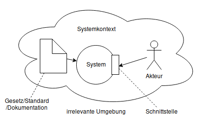

# System und Systemkontext abgrenzen

- Was ist ein Systemkontext?
    - Ausschnitt der Realität
    - für die Anforderungen des Systems massgebend
    - und für das Verständnis derselben relevant
- Aus welchen Aspekten besteht ein Systemkontext?
    - Personen: Stakeholder und -gruppen
    - Systeme im Betrieb: Hardware und Software
    - Prozesse: technische und Geschäftsprozesse
    - Ereignisse: technische oder physische
    - Dokumente: Gesetze, Standards, Dokumentationen
- Warum ist der Systemkontext kritisch für den Projekterfolg?
    - Ein falscher oder unvollständig berücksichtigter Systemkontext führt zu
      fehlerhaften Anforderungen.
    - Ein unter fehlerhaften Anforderungen entwickeltes System kann im Betrieb
      versagen.
    - Anforderungen sind immer in einem bestimmten Kontext definiert und können
      nur innerhalb dieses Kontexts richtig interpretiert werden.
- Wie erfolgt die System- und Kontextabgrenzung?
    - Systemabgrenzung: welche Aspekte müssen durch das geplante System
      abgedeckt werden?
        - grenzt den durch das Projekt veränderbaren Teil von unveränderbaren
          Aspekten der Umgebung ab
        - legt den Scope (Projektumfang) fest
        - ermöglicht die Identifikation von Schnittstellen (Quellen und Senken
          ermitteln; werden zu Eingabe- und Ausgabeschnittstellen)
    - Kontextabgrenzung: welche Aspekte in der Systemumgebung sind für dieses
      relevant?
        - Grenze zwischen relevantem Kontext zur irrelevanten Umgebung
        - grenzt den für das Projekt relevanten Teil von der Umgebung (Einfluss
          auf das System) vom irrelevanten Teil der Umgebung (kein Einfluss auf
          das System) ab
    - Graubereich: Die Grenzen verlaufen zeitweise unscharf.
        - Systemabgrenzung: die Grenze kann oft erst gegen Ende des
          Requirements-Engineering-Prozesses präzise festgelegt werden.
        - Kontextabgrenzung: der Graubereich muss nicht vollständig aufgelöst
          werden können.

{width=414px}
