# Anforderungen modellbasiert dokumentieren

- Welche drei Ausprägungen von Anforderungen gibt es?
    1. Ziele: beschreiben Intentionen von Stakeholdern
    2. Use Cases und Szenarien: dokumentieren beispielhafte Abläufe der
    Systemnutzung
    3. Systemanforderungen: beschreiben detaillierte Funktionalitäten und
    Qualitäten des zu entwickelnden Systems
- Was ist ein Modell?
    - Ein Modell ist ein abstrahiertes Abbild
        1. einer existierenden Realität oder
        2. ein Vorbild für eine zu schaffende Realität.
- Welche drei wesentliche Eigenschaften haben Modelle?
    1. Abbild der Realität
        - deskriptiv: Aspekte einer bestehenden Realität abbilden
        - präskriptiv: Aspekte einer zu schaffenden Realität abbilden
    2. Verkürzung der Realität
        - Selektion: Aspekte auswählen
        - Verdichtung: Aspekte zusammenfassen
    3. Pragmatische Eigenschaft
        - in spezifischem Verwendungskontext
        - für spezifischen Verwendungszweck
- Wie ist eine konzeptuelle Modellierungssprache definiert?
    - Syntax: Modellelemente und deren gültigen Kombinationen
    - Semantik: Bedeutung der Modellelemente
- Was ist ein Ziel?
    - die intentionale Beschreibung eines von Stakeholdern erwünschten
      charakteristischen Merkmals des zu entwickelnden Systems
- Welche Abschnitte gehören zu einer Use-Case-Spezifikation?
    1. Bezeichner
    2. Name
    3. Autoren
    4. Priorität
    5. Kritikalität (bezüglich Schadensausmass bei Fehlverhalten)
    6. Quelle (Stakeholder, Dokument, System)
    7. Verantwortlicher (Stakeholder)
    8. Beschreibung (zusammengefasst)
    9. Auslösendes Ereignis
    10. Akteure
    11. Vorbedingungen
    12. Nachbedingungen (für Hauptszenario)
    13. Ergebnis (erzeugte Ausgaben)
    14. Hauptszenario
    15. Alternativszenarien
    16. Ausnahmeszenarien
    17. Qualitäten
- Welche Modelle eignen sich für welche Perspektive einer Anforderung?
    - Strukturperspektive: Klassendiagramme, ER-Diagramme
    - Funktionsperspektive: Aktivitätsdiagramm
    - Verhaltensperspektive: Zustandsdiagramm, Datenflussdiagramm, Statechart

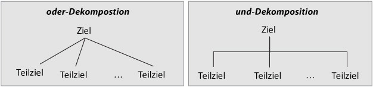{width=475px}

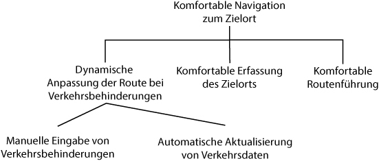{width=475px}

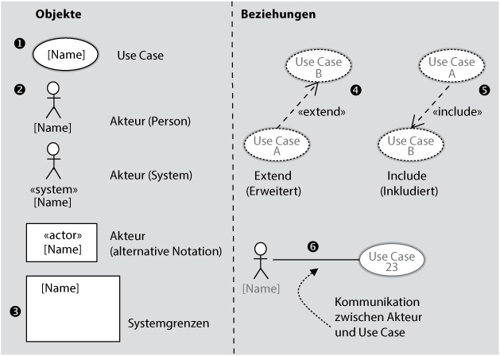{width=475px}

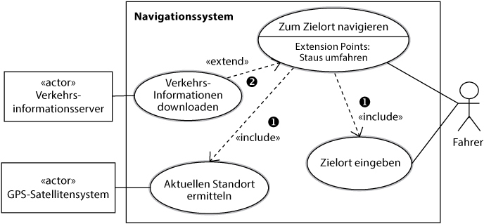{width=475px}

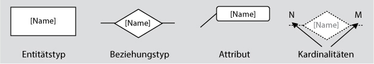{width=475px}

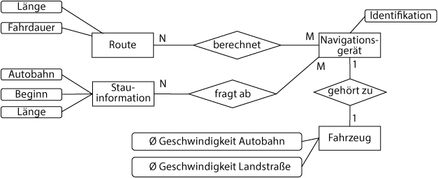{width=475px}

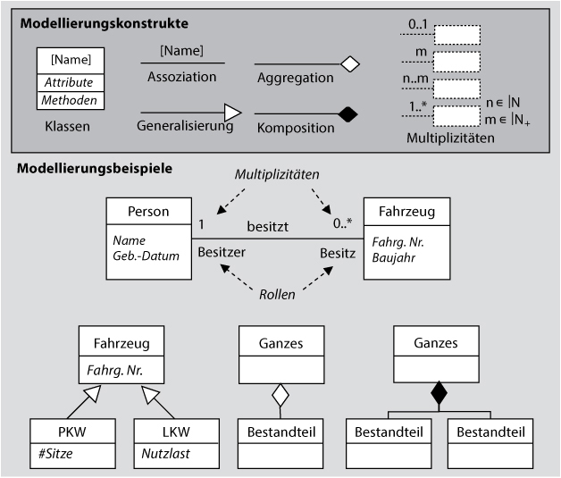{width=475px}

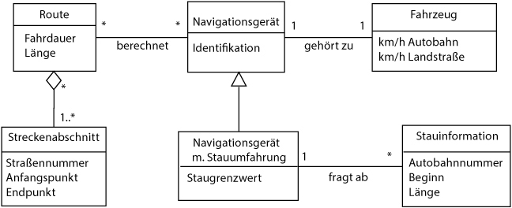{width=475px}

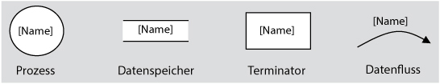{width=475px}

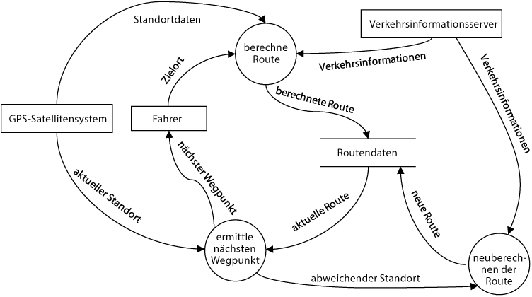{width=475px}

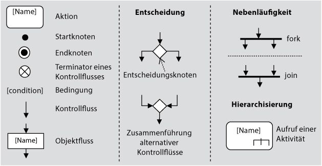{width=475px}

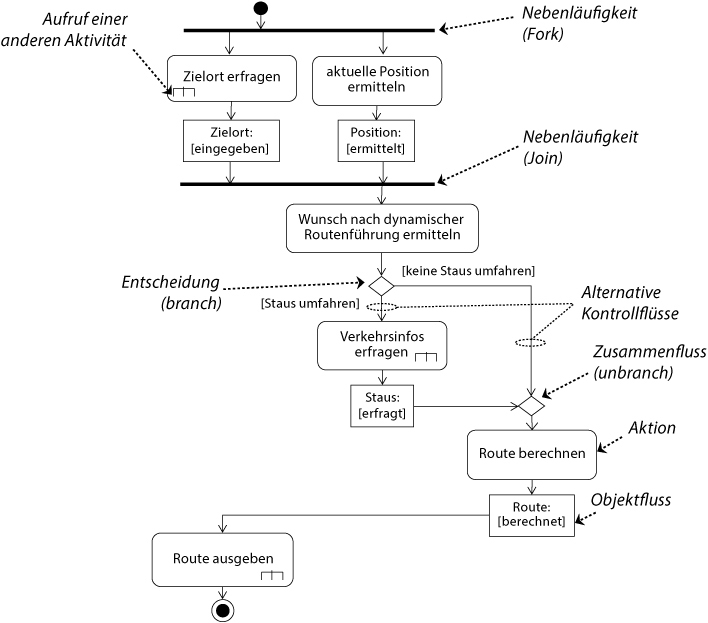{width=475px}

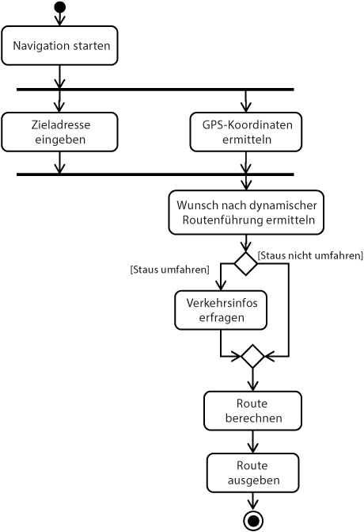{width=400px}

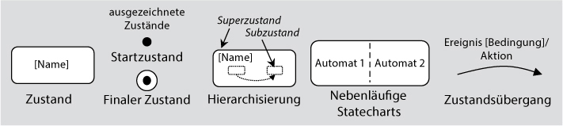{width=475px}

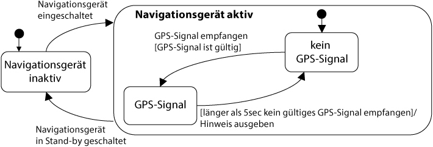{width=475px}

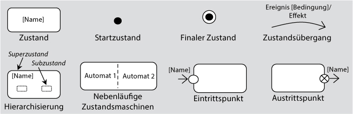{width=475px}

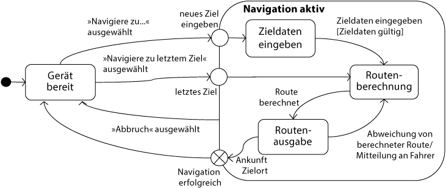{width=475px}
