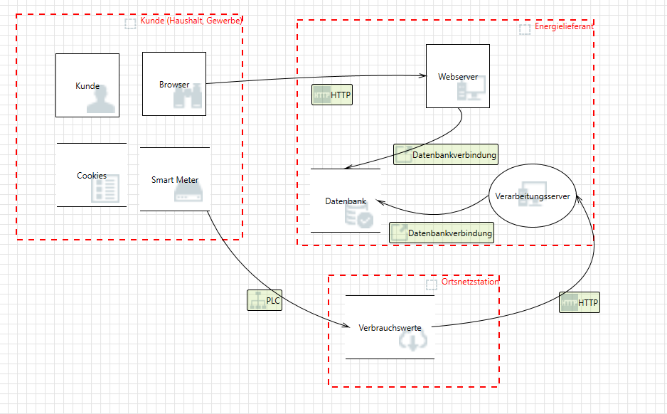
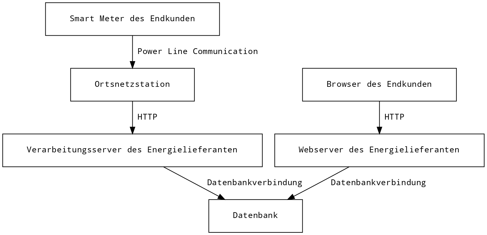

# Ausgangslage

Ein Energielieferant beliefert eine mittlere Stadt mit elektrischer Energie. Bei den Kunden handelt es sich um ca. 50 000 Haushalteund einige hundert Gewerbebetriebe. Das Energieverteilungsnetz besteht aus ca. 400 Ortsnetzstationen („Trafostationen“), 4 Umspannwerken und mehreren Energieproduzenten (externe Firmen, die Kraftwerke, Müllverbrennungsanlagen u.ä. betreiben). Der Energielieferant plant bei allen Stromkunden die alten Ferraris-Stromzähler durch Smart Meter zu ersetzen. Dadurch können die Verbrauchswerte beim Kunden viertelstündlich erfasst und aus der Ferne abgelesen werden. Auch ein Aktivieren bzw. Deaktivieren der Stromzähler ist damit zentral möglich. Die Verbrauchswerte (Viertelstundenwerte) werden einmal pro Tag -- auf Anfrage des Servers -- vom Smart Meter an die Zentrale übertragen. Die übermittelten Werte werden einerseits für die Verrechnung verwendet und andererseits den Kunden am nächsten Tag über ein Webportal zur Verfügung gestellt, damit diese umfassende Information über ihren individuellen Stromverbrauch haben und -- unter Berücksichtigung verschiedener Tarifmodelle entsprechend disponieren können.

Technisch gesehen erfolgt die Datenübertragung folgendermassen: Die Daten der Smart Meter werden über die Stromleitung via PLC (Power Line Communication) an die nächstliegende Ortsnetzstation übermittelt. Dort werden die Daten über ein Gateway in eine Internetleitung eingespeist und über diese TCP/IP-Verbindung zum Server des Energielieferanten übertragen, wo sie weiterverarbeitet werden.

# Bedrohungen nach STRIDE

Die folgenden Bedrohungen wurden mit dem [Microsoft Threat Modeling Tool](https://www.microsoft.com/en-us/download/details.aspx?id=49168) ermittelt. Manche Bedrohungen können bei mehreren Komponenten auftreten. Wo diese einen unterschiedlichen Kontext betreffen, wurden solche Duplikate beibehalten.

## Datenbankverbindungen

### Spoofing of Destination Data Store Datenbank

- Priority: High
- Category: Spoofing

Datenbank may be spoofed by an attacker and this may lead to data being written to the attacker's target instead of Datenbank. Consider using a standard authentication mechanism to identify the destination data store.

### Potential SQL Injection Vulnerability for Datenbank

- Priority: High
- Category: Tampering

SQL injection is an attack in which malicious code is inserted into strings that are later passed to an instance of SQL Server for parsing and execution. Any procedure that constructs SQL statements should be reviewed for injection vulnerabilities because SQL Server will execute all syntactically valid queries that it receives. Even parameterized data can be manipulated by a skilled and determined attacker.

### Potential Excessive Resource Consumption for Server or Datenbank

- Priority: High
- Category: Denial Of Service

Does Verarbeitungsserver or Datenbank take explicit steps to control resource consumption? Resource consumption attacks can be hard to deal with, and there are times that it makes sense to let the OS do the job. Be careful that your resource requests don't deadlock, and that they do timeout.

### Spoofing of Destination Data Store Datenbank

- Priority: High
- Category: Spoofing

Datenbank may be spoofed by an attacker and this may lead to data being written to the attacker's target instead of Datenbank. Consider using a standard authentication mechanism to identify the destination data store.

## HTTP (von Ortsnetzstation zu Verarbeitungsserver)

### Weak Access Control for a Resource

- Priority: High
- Category: Information Disclosure

Improper data protection of Verbrauchswerte can allow an attacker to read information not intended for disclosure. Review authorization settings.

### Persistent Cross Site Scripting

- Priority: High
- Category: Tampering

The web server 'Verarbeitungsserver' could be a subject to a persistent cross-site scripting attack because it does not sanitize data store 'Verbrauchswerte' inputs and output.

### Cross Site Scripting

- Priority: High
- Category: Tampering

The web server 'Verarbeitungsserver' could be a subject to a cross-site scripting attack because it does not sanitize untrusted input.

### Spoofing of Source Data Store Ortsnetzstation

- Priority: High
- Category: Spoofing

Verbrauchswerte may be spoofed by an attacker and this may lead to incorrect data delivered to Verarbeitungsserver. Consider using a standard authentication mechanism to identify the source data store.

### Spoofing the Server des Energielieferanten Process

- Priority: High
- Category: Spoofing

Verarbeitungsserver may be spoofed by an attacker and this may lead to information disclosure by Verbrauchswerte. Consider using a standard authentication mechanism to identify the destination process.

### Potential Data Repudiation by Server des Energielieferanten

- Priority: High
- Category: Repudiation

Verarbeitungsserver claims that it did not receive data from a source outside the trust boundary. Consider using logging or auditing to record the source, time, and summary of the received data.

### Potential Process Crash or Stop for Server des Energielieferanten

- Priority: High
- Category: Denial Of Service

Verarbeitungsserver crashes, halts, stops or runs slowly; in all cases violating an availability metric.

### Data Flow HTTP Is Potentially Interrupted

- Priority: High
- Category: Denial Of Service

An external agent interrupts data flowing across a trust boundary in either direction.

### Data Store Inaccessible

- Priority: High
- Category: Denial Of Service

An external agent prevents access to a data store on the other side of the trust boundary.

### Server des Energielieferanten May be Subject to Elevation of Privilege Using Remote Code Execution

- Priority: High
- Category: Elevation Of Privilege

Verbrauchswerte may be able to remotely execute code for Verarbeitungsserver.

### Elevation by Changing the Execution Flow in Server des Energielieferanten

- Priority: High
- Category: Elevation Of Privilege

An attacker may pass data into Verarbeitungsserver in order to change the flow of program execution within Verarbeitungsserver to the attacker's choosing.

## HTTP (von Browser zu Webserver)

### External Entity Webserver Potentially Denies Receiving Data

- Priority: High
- Category: Repudiation

Webserver claims that it did not receive data from a process on the other side of the trust boundary. Consider using logging or auditing to record the source, time, and summary of the received data.

### Data Flow HTTP Is Potentially Interrupted

- Priority: High
- Category: Denial Of Service

An external agent interrupts data flowing across a trust boundary in either direction.

## PLC (von Smart Meter zu Ortsnetzstation)

### Spoofing of Source Data Store Smart Meter

- Priority: High
- Category: Spoofing

Smart Meter may be spoofed by an attacker and this may lead to incorrect data delivered to Verbrauchswerte. Consider using a standard authentication mechanism to identify the source data store.

### Spoofing of Destination Data Store Ortsnetzstation

- Priority: High
- Category: Spoofing

Verbrauchswerte may be spoofed by an attacker and this may lead to data being written to the attacker's target instead of Verbrauchswerte. Consider using a standard authentication mechanism to identify the destination data store.

### Data Store Denies Ortsnetzstation Potentially Writing Data

- Priority: High
- Category: Repudiation

Verbrauchswerte claims that it did not write data received from an entity on the other side of the trust boundary. Consider using logging or auditing to record the source, time, and summary of the received data. 

### Data Flow PLC Is Potentially Interrupted

- Priority: High
- Category: Denial of Service

An external agent interrupts data flowing across a trust boundary in either direction.

### Data Store Inaccessible

- Priority: High
- Category: Denial of Service

An external agent prevents access to a data store on the other side of the trust boundary.

# Bewertung und Mitigations

## Scope

Im Folgenden wird erläutert, welche Vulnerabilities genauer angeschaut werden und weshalb diese gewählt wurden.

### Datenbankverbindung: Potential SQL Injection Vulnerability for Datenbank

Diese Vulnerability ist in der OWASP-Top-10-Liste enthalten: Fehlende Bereinigung von Datenbankabfragen stellt eine schwere und leicht ausnutzbare Angriffsfläche für das Lesen und Manipulieren der Verbrauchswerte dar. Da dies einen direkten Einfluss auf die Kosten (v.a. auf Kundenseite) hat, und sich die Mitigation von solchen Angriffen aufwandsmässig in engen Grenzen hält, wird dieser Punkt in den Scope aufgenommen (fortan _SQL Injection_).

### HTTP (Ortsnetz zu Verarbeitungsserver): Weak Access Control for a Resource

Die Offenlegung von heiklen Daten kann zu grossem Vertrauensverlust führen und einem Angreifer Möglichkeiten bieten, diese Daten zum eigenen Vorteil zu missbrauchen. Auch hier ist die Mitigation davon nicht umständlich und wird deswegen in den Scope aufgenommen (fortan _Access Control_).

### HTTP (Ortsnetz zu Verarbeitungsserver): Cross Site Scripting

Das Injizieren von böswilligen clientseitigen Skripten auf dem Verarbeitungsserver könnte dem Angreifer die Möglichkeit bieten alles mögliche auf dem Server anzustellen, da die Verbrauchswerte-Inputs und -Outputs nicht bereinigt werden. Dies könnte zu grossen Datenverlusten oder -manipulationen führen mit verheerenden Folgen. Auch hier sind mögliche Mitigationen bekannt, womit dieses Problem relativ einfach gelöst werden kann (fortan _XSS_).

### HTTP (Ortsnetz zu Verarbeitungsserver): Potential Process Crash or Stop for Server des Energielieferanten

Bei 50'000 Haushalten und mehreren hundert Gewerbebetrieben könnten verlorene Verbrauchswerte einen hohen Verlust bedeuten. Sollte der Verarbeitungsserver genau zu dieser Zeit von einem Denial-of-Service-Angriff betroffen und nicht mehr erreichbar sein, wenn die Verbrauchswerte übertragen werden, würden diese Daten verloren gehen. Somit könnte man den Energieverbrauch von diesem Tag nicht verrechnen (fortan _Process Crash/Stop_).

### PLC: Data Store Denies Ortsnetzstation Potentially Writing Data

Fehlendes oder inkorrektes Logging könnte dazu führen, dass der Energielieferant das Vertrauen der Energieverbraucher verliert, weil sie die Daten scheinbar falsch speichern. Dies obwohl sich ein Angreifer Zugang im Namen eines authorisierten Nutzers verschafft und die Verarbeitung der Daten verändert hat (fortan _Denies Writing Data_).

## DREAD-Rating

Beim DREAD-Rating werden die zuvor herausgearbeiteten potenziellen Vulnerabilities nach den folgenden Kriterien auf einer Skala von 1 (tief) über 2 (mittel) bis 3 (hoch) gewichtet:

- Damage (Dmg): Schadensausmass (gering bis hoch)
- Reproducibility (Repr): Reproduzierbarkeit (schwierig bis einfach)
- Exploitation (Expl): Ausnutzbarkeit (schwierig bis einfach)
- Affected Users (Aff): Betroffene Benutzer (wenige bis viele)
- Discoverability (Disc): Entdeckbarkeit (schwierig bis einfach)

| Vulnerability          | Dmg   | Repr   | Expl   | Aff   | Disc   | Sum   |
| :--------------------- | ----: | -----: | -----: | ----: | -----: | ----: |
| SQL Injection          | 3     | 2      | 1      | 3     | 1      | 10    |
| Access Control         | 3     | 2      | 1      | 3     | 1      | 10    |
| XSS                    | 3     | 2      | 1      | 2     | 2      | 10    |
| Process Crash/Stop     | 2     | 3      | 1      | 3     | 1      | 10    |
| Denies Writing Data    | 2     | 1      | 1      | 3     | 1      | 8     |

## Mitigations

### SQL Injection

Um SQL Injection zu vermeiden, werden alle User-Inputs durch Prepared Statements von böswilligen Inhalten bereinigt. 

### Access Control

Um den Zugriff auf den Verarbeitungsserver zu schützen, könnte man die CORS-Einstellungen dahingehend verändern, dass nur Requests vom Origin der Ortsnetzstation zugelassen sind. Für den Zugriff auf den Webserver könnten Strategien wie ein Throttle und Zweifaktor-Authentifizierung implementiert werden, wobei nur limitierter Zugang zu den Daten ermöglicht wird. Alle Verbindungen über HTTP sollten zudem via TLS verschlüsselt sein.

### XSS

Auch hier könnten korrekte Bereinigung von User-Inputs das Ausführen von böswilligen Skripts verhindern. Hier sollten vor allem HTML-Tags escaped werden, damit sich kein ausführbarer JavaScript-Code einschleichen kann. OWASP hat unter dem folgenden Link eine ausführliche Erläuterung, wie man dieses Problem angehen kann: [https://github.com/OWASP/CheatSheetSeries/blob/master/cheatsheets/Cross_Site_Scripting_Prevention_Cheat_Sheet.md](https://github.com/OWASP/CheatSheetSeries/blob/master/cheatsheets/Cross_Site_Scripting_Prevention_Cheat_Sheet.md).

### Process Crash/Stop

Die Verbraucherwerte der Konsumenten werden genau einmal pro Tag übertragen. Im Grunde genommen sollte die Anzahl Requests von der Ortsnetzstation aus also bekannt sein. Man könnte aber im Fall eines DoS- oder DDoS-Angriffs Load Balancer verwenden, die sich dynamisch der Menge an Anfragen anpasst. Somit zahlt man nur für die zusätzlichen Ressourcen zu dem bestimmten Zeitpunkt des Angriffs, und nicht mehr, da man nicht unnötig Ressourcen verbraucht.

### Denies Writing Data

Mit korrektem Logging und planmässiger Überprüfung dieser Logs kann gegen einen solchen Angriff vorgegangen werden.

# Fazit

Die Analyse mit dem _Microsoft Threat Modeling Tool_ ergab zahlreiche mögliche Bedrohungen, welche nach STRIDE kategoriesiert und mit Hilfe des DREAD-Ratings beurteilt wurden. Anschliessend wurden Mitigations definiert für die wichtigsten Bedrohungen.

Diese lassen sich wie folgt zusammenfassen:

1. *Input Sanitization* zur Verhinderung von SQL-Inections und XSS.
2. *Zugriffskontrolle* & *Authentifizierung* zur Verhinderung von unerlaubtem Datenzugriff und Spoofing.
3. *Load Balancing* und dynamisch erweiterbare Ressourcen für kurzfristige hohe Belastungen, um die Verfügbarkeit sicherstellen zu können.

Die am höchsten gewichteten Bedrohungen gemäss DREAD-Rating sind allesamt wohl bekannt und es existieren Best Pratices und Gegenmassnahmen, die problemlos umsetztbar sein sollten.
Zusammenfassend lässt sich also sagen, dass mit ein paar wenigen, relativ einfachen Massnahmen ein Grossteil der analysierten Bedrohungen mitigiert werden können.
