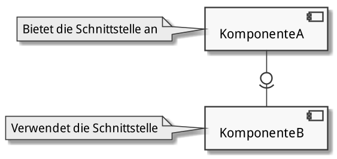

# Komponenten

Herkunft: _componere_ (lat.) = zusammensetzen

{width=360px}

## Begriffe und Architekturen

- Definition: Eine Software-Komponente
    1. ist ein Software-Element
    2. passt zu einem bestimmten Komponentenmodell
    3. folgt einem bestimmten _Composition Standard_
    4. kann ohne Änderungen mit anderen Komponenten verknüpft und ausgeführt
    werden
- Eigenschaften: Software-Komponenten
    1. sind eigenständig ausführbare Softwareeinheiten
    2. sind über ihre Schnittstellen austauschbar definiert
    3. lassen sich unabhängig voneinander entwickeln
    4. können kunden- und anwendungsspezifisch oder anwendungsneutral und
    wiederverwendbar sein
        - COTS (Commercial off-the-shelf): Software «von der Stange»
    5. können installiert und deployed werden
    6. können hierarchisch verschachtelt sein
- Komponentenmodelle
    - sind konkrete Ausprägungen des Paradigmas der komponentenbasierten
      Entwicklung
    - definieren die genaue Form und Eigenschaften einer Komponente
    - definieren einen _Interaction Standard_ 
        - wie können die Komponenten miteinander über Schnittstellen
          kommunizieren (Schnittstellenstandard)
        - wie werden die Abhängigkeiten der Komponenten voneinander festgelegt
            - von der Komponente verlange Abhängigkeiten: _Required Interfaces_
            - von der Komponente angebotene Abhängigkeiten: _Provided
              Interfaces_
    - definieren einen _Composition Standard_ 
        - wie werden die Komponenten zu grösseren Einheiten zusammengefügt
        - wie werden die Komponenten ausgeliefert (Deployment)
- Beispiele verbreiteter Komponentenmodelle:
    - Microsoft .NET
    - EJB (Enterprise Java Beans)
    - OSGi (Open Services Gateway Initiative)
    - CORBA (Common Object Request Broker Architecture)
    - DCOM (Distributed Component Object Model)

### Der Nutzen von Komponenten

- Packaging: _Reuse Benefits_
    - Komplexität durch Aufteilung reduzieren (_Divide and Conquer_)
    - Wiederverwendung statt Eigenentwicklung spart Entwicklungszeit und
      Testaufwand
    - erhöhte Konsistenz durch Verwendung von Standardkomponenten
    - Möglichkeit zur Verwendung bestmöglichster Komponente auf dem Markt
- Service: _Interface Benefits_
    - erhöhte Produktivität durch Zusammenfügen bestehender Komponenten
    - erhöhte Qualität aufgrund präziser Spezifikationen und vorgetesteter
      Software
- Integrity: _Replacement Benefits_
    - erweiterbare Spezifikation durch inkrementelle Entwicklung und
      inkrementelles Testing
    - parallele und verteilte Entwicklung durch präzise Spezifizierung und
      Abhängigkeitsverwaltung
    - Kapselung begrenzt Auswirkungen von Änderungen und verbessert so wie
      Wartbarkeit

### Entwurf und Entwicklung mit Komponenten

- Komponentenbasierte Enwicklung
    - steigende Komplexität von Systemen, Protokollen und Anwendungsszenarien
    - Eigenentwicklung wegen Wirtschaftlichkeit und Sicherheit nicht ratsam
    - Konstruktion von Software aus bestehenden Komponenten immer wichtiger
    - Anforderungen (aufgrund mehrmaliger Anwendung) an Komponenten höher als
      an reguläre Software
- Praktische Eigenschaften
    - Einsatz einer Komponente erfordert nur Kenntnisse deren Schnittstelle
    - Komponenten mit gleicher Schnittstelle lassen sich gegeneinander
      austauschen
    - Komponententests sind Blackbox-Tests
    - Komponenten lassen sich unabhängig voneinander entwickeln
    - Komponenten fördern die Wiederverwendbarkeit
- Komponentenspezifikation
    - Export: angebotene/unterstützte Interfaces, die von anderen Komponenten
      genutzt werden können
    - Import: benötigte/verwendete Interfaces von anderen Komponenten
    - Kontext: Rahmenbedingungen für den Betrieb der Komponente
    - Verhalten der Komponente
- Komponenten in Java SE
    - Komponenten als normale Klassen implementiert
    - Komponenten können, müssen sich aber nicht and die _Java Beans
      Specification_ halten
        - Default-Konstruktor
        - Setter/Getter
        - Serialisierbarkeit
        - PropertyChange
        - Vetoable
        - Introspection
    - Weitergehende Komponentenmodelle in Java EE
        - Servlets
        - Enterprise Java Beans
- Austauschbarkeit
    - Die Austauschbarkeit von Komponenten wird durch den Einsatz von
      Schnittstellen erleichtert.
    - Schnittstellen werden als Java-`Interface` definiert und dokumentiert
      (JavaDoc).
    - Eine Komponente implementieren eine Schnittstelle als Klasse.
        - mehrere, alternative Implementierungen möglich
        - Austauschbarkeit über Schnittstellenreferenz möglich
    - Beispiel: API von JDBC (Java Database Connectivity)
        - von Sun/Oracle als API definiert
        - von vielen Herstellern implementiert (JDBC-Treiber für spezifische
          Datenbanksysteme)
        - Datenbankaustausch auf Basis von JDBC möglich
- Deployment
    - über `.jar`-Dateien (Java Archive): gezippte Verzeichnisstrukturen
      bestehend aus
        - kompilierten Klassen und Interfaces als `.class`-Dateien
        - Metadaten in `META-INF/manifest.mf`
        - optional weitere Ressourcen (z.B. Grafiken, Textdateien)
    - Deployment von Schnittstelle und Implementierung zum einfacheren
      Austausch häufig in getrennten `.jar`-Dateien mit Versionierung, Beispiel
      (fiktiv):
        - `jdbc-api-4.2.1.jar` enthält die Schnittstelle
        - `jdbc-mysql-3.2.1.jar` enthält die MySQL-Implementierung
        - `jdbc-postgres-4.5.7.jar` enthält die PostgreSQL-Implementierung
        - Versionierung idealserweise im Manifest und im Dateinamen (Konsistenz
          beachten!)

## Schnittstellen

- Der Begriff _Schnittstelle_ als Metapher
    - Beim Zerschneiden eines Apfels entstehen zwei spiegelsymmetrische
      Oberflächen.
    - Die Komponenten müssen so definiert werden, damit sie an der
      Schnittstelle zusammenpassen, als ob sie vorher auseinandergeschnitten
      worden wären.
    - Tatsächlich werden _Verbindungsstellen_ erstellt, welche Kombinierbarkeit
      sicherstellen.
    - Eine Schnittstelle tut nichts und kann nichts.
    - Schnittstellen trennen nichts, sie verbinden etwas:
        - Komponenten untereinander (Programmschnittstellen)
        - Komponenten mit dem Benutzer 
- Die Bedeutung von Schnittstellen (bei korrektem Gebrauch):
    1. machen Software leichter verständlich (man braucht nur die Schnittstelle
    und nicht die Implementierung zu kennen)
    2. helfen uns Abhängigkeiten zu reduzieren (Abhängigkeit nur von einer
    Schnittstelle, nicht von einer Implementierung)
    3. erleichtern die Wiederverwendbarkeit (bei der Verwendung bewährter
    Schnittstellen statt Eigenentwicklung)
- Die Beziehung zwischen Schnittstellen und Architektur:
    - System > Summe seiner Teile (Beziehungen zwischen den Teilen: durch
      Schnittstellen ermöglicht)
        - Schnittstellen & Beziehungen zwischen den Komponenten: wichtigste
          Architekturaspekte!
        - Mehrwert des Systems gegenüber Einzelkomponenten liegt in den
          Schnittstellen & Beziehungen der Komponenten zueinander
    - Spezialisten für Teilsysteme konzentrieren sich auf ihr Zeilproblem
        - Architekten halten das Gesamtsystem über Schnittstellen zusammen
        - Schnittstellen verbinden ein System mit der Aussenwelt und
          ermöglichen die Interaktion damit
- Kriterien für gute Schnittstellen
    1. Schnittstellen sollen _minimal_ sein:
        - wenige Methoden (mit möglichst geringen Überschneidungen in ihren
          Aufgaben)
        - geringe Anzahl von Parameters
        - setzen möglichst keine oder nur wenige globale Daten voraus
    2. Schnittstellen sollen _einfach zu verstehen_ sein
    3. Schnittstellen sollen _gut dokumentiert_ sein

### Spezifikation von Schnittstellen

- Die Schnittstelle als Vertrag:
    - Ein _Service Consumer_ schliesst einen Vertrag mit einem _Service
      Provider_ für eine _Dienstleistung_ ab
- Design by Contract (DbC): Das Zusammenspiel zwischen den Komponenten wir mit
  einem Vertrag geregelt
    - _Preconditions_: Zusicherungen, die der Aufrufer einhalten muss
        - Nutzer: Prüfen der Vorbedingungen vor der Ausführung
        - Anbieter: Überprüfung mittels Assertions
    - _Postconditions_: Nachbedingungen, die der Aufgerufene garantiert
        - Nutzer: Überprüfung mittels Assertions
        - Anbieter: Prüfen der Nachbedingungen nach der Ausführung
    - _Invarianten_: Über alle Instanzen einer Klasse geltende Grundannahmen ab
      deren Erzeugung
        - Anbieter: Überprüfung mittels Assertions
- Dokumentation von Schnittstellen
    - Umfang:
        - was ist wichtig für die Benutzung der Komponente
        - was muss der Programmierer versethen und beachten
    - Eigenschaften der Methoden:
        - Syntax (Rückgabewerte, Argumente, Typen, call by value/reference)
        - Semantik (was bewirkt die Methode)
        - Protokoll (synchron/asynchron)
        - Nichtfunktionale Eigenschaften (Performance, Robustheit,
          Verfügbarkeit)
    - Schnittstellen an der Systemgrenze fliessen in die Systemspezifikation
      ein
- öffentliche Schnittstellen werden als _API_ bezeichnet (Application
  Programming Interface)
    - objektorientierte API (sprachabhängig, z.B. API der JSE)
    - REST-API (Representational State Transfer, sprach- und
      plattformunabhängig, datenzentriert)
    - Messaging-API (sprach- und plattformunabhängig, z.B. Push-Notifications
      für Mobile Apps)
    - dateibasierte API (Informationsaustausch, Konfigurationsdateien)

## Modularisierung

Modul: in sich abgeschlossener Teil des Programmcodes, bestehend aus
Verarbeitungsschritten und Datenstrukturen

- Kopplung und Kohäsion
    - Kopplung: Ausmass der Kommunikation zwischen Modulen
        - hohe Kopplung: grosse Abhängigkeit
        - Kopplung minimieren!
    - Kohäsion: Ausmass der Kommunikation innerhalb eines Moduls
        - gerine Kohäsion: geringer Zusammenhalt
        - Kohäsion maximieren!
    - Viele Module: Hohe Kopplung, geringe Kohäsion
    - Wenige Module: Geringe Kopplung, hohe Kohäsion
    - Idealer Kompromiss: Reduziert Gesamtkomplexität
- Arten von Modulen
    - Bibliothek: Sammlung oft verwendeter, thematisch zusammengehörender
      Funktionen (Datumsmodul, Mathematik-Modul, I/O-Modul)
    - Abstrakte Datentypen: Implementierung eines neuen Datentyps mit
      definierten Operationen (verkettete Liste, binärer Baum Hash-Tabelle)
    - Physische Systeme: Abgegrenztes Hardware-Modul (Ultraschallsensor,
      Anzeigemodul, Kommunikationsmodul)
    - Logisch-konzeptionelles System: Modellierung von Funktionalität auf hoher
      Abstraktionsstufe (Datenbankmodul, Bildverarbeitungsmodul, GUI-Framework)
- Entwurfskriterien
    - Zerlegbarkeit (_modular decomposability_): Teilprobleme können unabhängig
      voneinander gelöst werden
        - _Divide and Conquer_: Softwareproblem in weniger komplexe
          Teilprobleme zerlegen, sodass sie unabhängig voneinander bearbeitet
          werden können
        - Rekursive Zerlegung: Weitere Zerlegung von Teilproblemen
    - Kombinierbarkeit (_modular composability_): Module sind unabhängig
      voneinander wiederverwendbar
        - Module sollten möglichst frei kombinierbar sein und sich auch in
          anderen Umfeldern wieder einsetzen lassen
        - Zerlegbarkeit und Kombinierbarkeit sind unabhängig voneinander
    - Verständlichkeit: Module sind unabhängig voneinander verständlich
        - Der Code eines Moduls soll ohne Kenntnis anderer Module verstehbar
          sein
        - Module müssen unabhängig voneinander versteh- und wartbar sein
    - Stetigkeit: Änderungen der Spezifikation proportional zu Codeänderungen
        - Anforderungen können sich ändern, sollten sich aber nur auf ein
          Teilsystem auswirken
- Entwurfsprinzipien
    - lose Kopplung: schlanke Schnittstellen, Austausch nur des Nötigsten
    - starke Kohäsion: hoher Zusammenhalt innerhalb des Moduls
    - Geheimnisprinzip (_information hiding_): Modul nach aussen nur über
      dessen Schnittstellen bekannt
    - wenige Schnittstellen: zentrale Struktur mit minimaler Anzahl
      Schnittstellen
    - explizite Schnittstellen: Aufrufe und gemeinsam genutzte Daten sind im
      Code ersichtlich
- Vorgehen bei Modularisierung
    - Basiskonzepte: Kopplung & Kohäsion
    - Kriterien: Verständlichkeit, Kombinierbarkeit, Zerlegbarkeit, Stetigkeit
    - Modularten: Bibliotheken, abstrakte Datentypen, physische und logische
      Systeme
    - Prinzipien: geringe Kopplung, hohe Kohäsion, Geheimnisprinzip, wenige &
      explizite Schnittstellen
    - sinnvolle Modularisierung: eine der anspruchsvollsten Aufgaben der
      Informatik
- Parnas: _On the Criteria to be Used in Decomposing Systems into Modules_ (1972)
    - Ziele der Modularisierung:
        1. Die Flexibilität und Verständlichkeit eines Systems verbessern
        2. Die Entwicklungszeit eines Systems reduzieren
    - Voraussetzung für modulares Programmieren:
        1. Ein Modul kann mit wenig Kenntnis des Codes eines anderen Moduls
           geschrieben werden.
        2. Module können neu zusammengesetzt und ersetzt werden, ohne dass das
          ganze System neu zusammengesetzt werden muss.
    - Nutzen der Modularisierung:
        - Verkürzung der Entwicklungszeit, da mehrere Teams gleichzeitig an je
          einem Modul arbeiten können und nur wenig Kommunikation zwischen
          ihnen nötig ist.
        - Erhöhte Flexibilität, da grössere Änderungen an einem Modul keine
          Änderungen in anderen Modulen zur Folge haben.
        - Bessere Verständlichkeit, da ein System nicht als ganzes, sondern
          Modul für Modul analysiert werden kann.
    - Ansätze der Modularisierung:
        1. _Flowchart-Analyse_: Jeder grosse Verarbeitungsschritt wird als
           Modul implementiert (konventionell).
        2. _Information Hiding_: Jede Design-Entscheidung wird in einem Modul
           versteckt (neuer Ansatz).
    - Interpretation:
        - Mit dem traditionellen Ansatz (_Flowchart-Analyse_) wird ein
          _Algorithmus_ in einzelne Verarbeitungsschritte zerlegt.
        - Mit dem neuen Ansatz (_Information Hiding_) werden die
          _Datenstrukturen_ herausgearbeitet. (Datenstruktur =
          Design-Entscheidung)
        - Die einzelnen Schritte eines Algorithmus sind _nicht_ beliebig
          austauschbar.
        - Datenstrukturen können abstrahiert und über ein einfaches Interface
          angeboten werden.

### Layers, Tiers & Packages

- Layer
    - öffentliche Methoden eines tieferstehenden Layers B dürfen vom
      höherstehenden Layer A genutzt werden
    - Beispiel (Layers von oben nach unten): `A B C`
        - richtig: `A -> B`, `B -> C`
        - zulässig: `A -> C` (gefährlich: Umgehung einer API)
        - falsch: `C -> B`, `B -> A`, `C -> A` (von unten nach oben)
        - falsch: `A -> B -> C -> A` (zyklische Abhängigkeit)
    - _call_-Beziehung: ein höherstehender Layer verwendet Funktionalität eines
      tieferstehenden Layers
    - _use_-Bezehung: korrektes Verhalten von Layer A hängt von der korrekten
      Implementierung des Layers B ab (initialisiertes Device, aufgenommene
      Netzwerkverbindung, erstellte Datei)
- Tier: oft mit Layern verwechselt
    - Presentation Tier
    - Business Logic (Tier)
    - Data Tier
- Packages: Implementierung des Layer-Konzepts
    - abstrakt: UML
    - konkret: Java-Package
