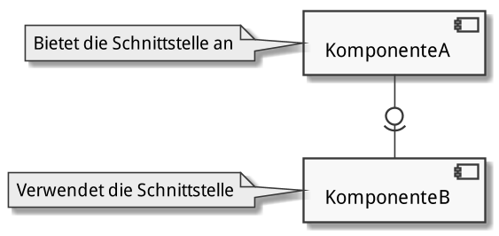
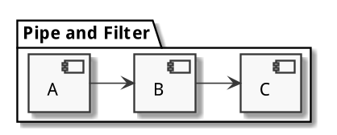
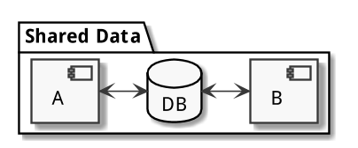
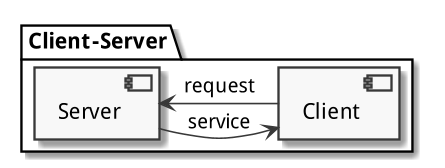
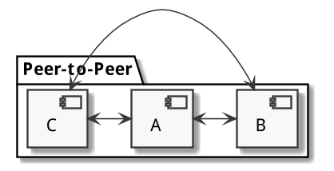

# Komponenten

Herkunft: _componere_ (lat.) = zusammensetzen

{width=80%}

## Begriffe und Architekturen

### Der Komponentenbegrif

- Definition: Eine Software-Komponente
    1. ist ein Software-Element
    2. passt zu einem bestimmten Komponentenmodell
    3. folgt einem bestimmten _Composition Standard_
    4. kann ohne Änderungen mit anderen Komponenten verknüpft und ausgeführt werden
- Eigenschaften: Software-Komponenten
    1. sind eigenständig ausführbare Softwareeinheiten
    2. sind über ihre Schnittstellen austauschbar definiert
    3. lassen sich unabhängig voneinander entwickeln
    4. können kunden- und anwendungsspezifisch oder anwendungsneutral und wiederverwendbar sein
        - COTS (Commercial off-the-shelf): Software «von der Stange»
    5. können installiert und deployed werden
    6. können hierarchisch verschachtelt sein
- Komponentenmodelle
    - sind konkrete Ausprägungen des Paradigmas der komponentenbasierten Entwicklung
    - definieren die genaue Form und Eigenschaften einer Komponente
    - definieren einen _Interaction Standard_ 
        - wie können die Komponenten miteinander über Schnittstellen kommunizieren (Schnittstellenstandard)
        - wie werden die Abhängigkeiten der Komponenten voneinander festgelegt
            - von der Komponente verlange Abhängigkeiten: _Required Interfaces_
            - von der Komponente angebotene Abhängigkeiten: _Provided Interfaces_
    - definieren einen _Composition Standard_ 
        - wie werden die Komponenten zu grösseren Einheiten zusammengefügt
        - wie werden die Komponenten ausgeliefert (Deployment)
- Beispiele verbreiteter Komponentenmodelle:
    - Microsoft .NET
    - EJB (Enterprise Java Beans)
    - OSGi (Open Services Gateway Initiative)
    - CORBA (Common Object Request Broker Architecture)
    - DCOM (Distributed Component Object Model)

### Der Nutzen von Komponenten

- Packaging: _Reuse Benefits_
    - Komplexität durch Aufteilung reduzieren (_Divide and Conquer_)
    - Wiederverwendung statt Eigenentwicklung spart Entwicklungszeit und Testaufwand
    - erhöhte Konsistenz durch Verwendung von Standardkomponenten
    - Möglichkeit zur Verwendung bestmöglichster Komponente auf dem Markt
- Service: _Interface Benefits_
    - erhöhte Produktivität durch Zusammenfügen bestehender Komponenten
    - erhöhte Qualität aufgrund präziser Spezifikationen und vorgetesteter Software
- Integrity: _Replacement Benefits_
    - erweiterbare Spezifikation durch inkrementelle Entwicklung und inkrementelles Testing
    - parallele und verteilte Entwicklung durch präzise Spezifizierung und Abhängigkeitsverwaltung
    - Kapselung begrenzt Auswirkungen von Änderungen und verbessert so wie Wartbarkeit

### Der Entwurf mit Komponenten

- Komponentenbasierte Enwicklung
    - steigende Komplexität von Systemen, Protokollen und Anwendungsszenarien
    - Eigenentwicklung wegen Wirtschaftlichkeit und Sicherheit nicht ratsam
    - Konstruktion von Software aus bestehenden Komponenten immer wichtiger
    - Anforderungen (aufgrund mehrmaliger Anwendung) an Komponenten höher als an reguläre Software
- Praktische Eigenschaften
    - Einsatz einer Komponente erfordert nur Kenntnisse deren Schnittstelle
    - Komponenten mit gleicher Schnittstelle lassen sich gegeneinander austauschen
    - Komponententests sind Blackbox-Tests
    - Komponenten lassen sich unabhängig voneinander entwickeln
    - Komponenten fördern die Wiederverwendbarkeit
- Komponentenspezifikation
    - Export: angebotene/unterstützte Interfaces, die von anderen Komponenten genutzt werden können
    - Import: benötigte/verwendete Interfaces von anderen Komponenten
    - Kontext: Rahmenbedingungen für den Betrieb der Komponente
    - Verhalten der Komponente

Architekturmuster:

{width=50%}
{width=50%}
{width=50%}
{width=50%}
{width=50%}

### Komponenten in Java

- Komponenten in Java SE
    - Komponenten als normale Klassen implementiert
    - Komponenten können, müssen sich aber nicht and die _Java Beans Specification_ halten
        - Default-Konstruktor
        - Setter/Getter
        - Serialisierbarkeit
        - PropertyChange
        - Vetoable
        - Introspection
    - Weitergehende Komponentenmodelle in Java EE
        - Servlets
        - Enterprise Java Beans
- Austauschbarkeit
    - Die Austauschbarkeit von Komponenten wird durch den Einsatz von Schnittstellen erleichtert.
    - Schnittstellen werden als Java-`Interface` definiert und dokumentiert (JavaDoc).
    - Eine Komponente implementieren eine Schnittstelle als Klasse.
        - mehrere, alternative Implementierungen möglich
        - Austauschbarkeit über Schnittstellenreferenz möglich
    - Beispiel: API von JDBC (Java Database Connectivity)
        - von Sun/Oracle als API definiert
        - von vielen Herstellern implementiert (JDBC-Treiber für spezifische Datenbanksysteme)
        - Datenbankaustausch auf Basis von JDBC möglich
- Deployment
    - über `.jar`-Dateien (Java Archive): gezippte Verzeichnisstrukturen bestehend aus
        - kompilierten Klassen und Interfaces als `.class`-Dateien
        - Metadaten in `META-INF/manifest.mf`
        - optional weitere Ressourcen (z.B. Grafiken, Textdateien)
    - Deployment von Schnittstelle und Implementierung zum einfacheren Austausch häufig in getrennten `.jar`-Dateien mit Versionierung, Beispiel (fiktiv):
        - `jdbc-api-4.2.1.jar` enthält die Schnittstelle
        - `jdbc-mysql-3.2.1.jar` enthält die MySQL-Implementierung
        - `jdbc-postgres-4.5.7.jar` enthält die PostgreSQL-Implementierung
        - Versionierung idealserweise im Manifest und im Dateinamen (Konsistenz beachten!)

## Schnittstellen

### Begriff und Konzept

- Metapher: Beim Zerschneiden eines Apfels entstehen zwei spiegelsymmetrische Oberflächen.
- Die Komponenten müssen so definiert werden, damit sie an der Schnittstelle zusammenpassen, als ob sie vorher auseinandergeschnitten worden wären.
- Tatsächlich werden _Verbindungsstellen_ erstellt, welche Kombinierbarkeit sicherstellen.
- Eine Schnittstelle tut nichts und kann nichts.
- Schnittstellen trennen nichts, sie verbinden etwas:
    - Komponenten untereinander (Programmschnittstellen)
    - Komponenten mit dem Benutzer 

### Dienstleistungsperspektive

### Spezifikation von Schnittstellen
