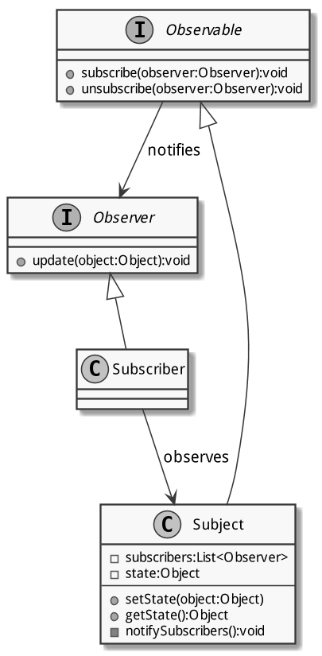
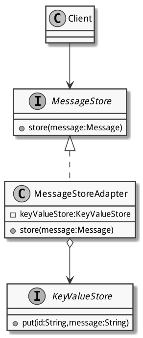
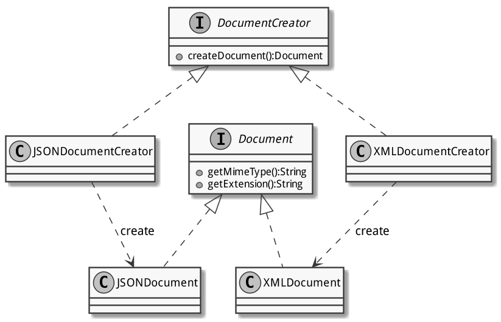
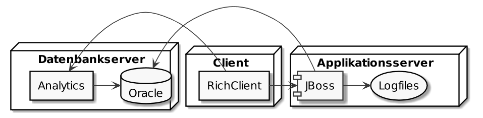

# Entwicklungsprozess

## Versionskontrolle

SCM: Source Code Management

- hält zeitliche Entwicklung von Artefakten fest
- erlaubt Rückgriff auf frühere Revisionen (Änderungsstände)
- ermöglicht Zusammenarbeit an gemeinsamen Quellen im Team
- automatisiertes Zusammenfügen von Änderungen (Merging) -- soweit möglich
  (Konflikte)
- zentrale oder verteilte Datenhaltung -- oder beides
- können fehlende Koordinaten _nicht_ ersetzen
- machen Änderungen an Artefakten nachvollziehbar
    - als _Changesets_ innerhalb einer Transaktion gespeichert
    - $1..n$ Dateiartefakte werden vom konsistentem Zustand $z_1$ in den
      konsistenten Zustand $z_2$ überführt
- sind _keine_ Backupsysteme

### Arbeiten mit SCM

- Grundlegende Operationen
    - `checkout`: lokale Arbeitskopie von Repository erstellen
    - `update`: Änderungen von Repository in der lokalen Arbeitskopie
      aktualisieren
    - `log`: Revisionen von Artefakten einsehen
    - `diff`: Vergleich verschiedener Revisionen zweier Artefakte
    - `commit`: Änderungen in das Repository schreiben
- Operationen verteilter SCM
    - `clone`: lokale Kopie eines entfernten Repositories erzeugen
    - `fetch`: Änderungen eines entfernten Repositories herunterladen
    - `pull`: Änderungen eines entfernten Repositories lokal
      nachtragen/einpflegen
    - `push`: Lokale Änderungen auf entferntes Repository schreiben
- Tagging: Markieren eines bestimmten Revisionsstands mit Namen oder
  Versionsnummer
    - CVS: Markierung auf Dateiebene
    - Subversion (SVN): Kopie in ein Verzeichnis
    - `git`, Mercurial (`hg`): Identifikation der Revision über das ganze
      Dateisystem des Repositories
- Branching: Voneinander unabhängig bearbeitbare Entwicklungszweige
    - für Bugfixing, Prototypen (Tests, Experimente), neue Features
    - Branch wird entweder verworfen (abgebrochene Experimente) …
    - … oder in den Hauptzweig eingepflegt (Merge)
- Inhalte: Was gehört ins Repository?
    - Ja: Quellcode (`*.java`), Konfigurationsdateien (`*.xml`), Dokumentation
      (`*.md`, `*.txt`)
    - Nein: Kompilate (`*.class`), generierte Dokumente (HTML-Reports)
    - Filterregeln: `.gitignore` (`git`) bestimmt, was ins Repository kommt

### Verschiedene SCM

- Unterschiede zwischen verschiedenen SCM
    - zentral oder verteilt
    - optimistische oder pessimistische Lockverfahren
    - Versionierung anhand Datei, Verzeichnisstruktur oder Changeset
    - mit oder ohne Transaktionsunterstützung
    - weitere Features: Zugriffsprotokolle, Sicherheitsmassnahmen,
      Webserver-Integration
- Beispiele bekannter SCM
    - CVS: zentral, robust, stabil, alt, Verbreitung rückläufig
    - Subversion: zentral, transaktionsorientiert, Versionierung auf
      Verzeichnisebene, flexibler und anspruchsvoller als CVS, als
      CVS-Nachfolger angetreten (bereits wieder rückläufig)
    - `git`: dezentral, weit verbreitet, «billiges» Branching (schnell und
      einfach), skalierbar (einfach und schnell bei kleinen Repositories,
      funktioniert auch für gigantische  Repositories -- Linux-Kernel),
      aufgrund dezentraler Struktur nicht ganz einfach zu verstehen
- Code-Hosting-Plattformen: GitLab, GitHub
    - Verwaltung von Teams (Berechtigungen), Projekten (Issue-Tracking)
    - Werkzeuge zur Bearbeitung von Merge-Requests (GitLab), Pull-Requests
      (GitHub)
    - Webseiten, Wikis, Durchsuchen des Source-Trees
    - Community-Gedanke (GitHub), Social Network für Nerds
- Praktische Empfehlungen für die Arbeit mit SCM
    - Vor Arbeitsbeginn das lokale Repository auf den neuesten Stand bringen
      (`pull` bzw. `checkout`)
    - Aussagekräftige `commit`-Messages verwenden, am besten mit Verweis auf
      Issue-/Tasknummer
    - Lieber öfters kleinere Änderungen als selten grössere Änderungen
      schreiben (weniger und kleinere Merge-Konflikte)

## Buildautomatisierung

Buildprozess: aus Quellartefakten ein fertiges Produkt erstellen

- Generieren, Kompilieren, Testen, Packen, JavaDoc erzeugen etc.
- Per IDE möglich (manuell), mühsam und fehleranfällig bei mehreren
  Buildvorgängen pro Tag
- Per Skript
    - Vorteile: automatisierter Ablauf, reproduzierbare Ergebnisse, nächtlich
      getriggerte Ausführung möglich, Unabhängigkeit von der IDE
    - Nachteile: unflexibler Ablauf -- oder aufwändige Skripte, Abhängigkeit
      von Shell und Plattform, aufwändige Wartung und Erweiterung
- Per Build-Werkzeug: spezialisiertes Werkzeug mit eigener Skript- oder
  Definitionssprache
    - für Build-Aufgaben (Generieren, Kompilieren etc.) optimiert
    - vereinfachte Handhabung von Ressourcen (Dateimengen)
    - automatische Prüfung von und Steuerung durch Abhängigkeiten
    - Abstraktion der plattformspezifischen Eigenheiten: plattformübergreifend
      funktionierend
- Unterschiedliche Ansätze: imperativ vs. deklarativ -- Vorgeben der Schritte
  oder Beschreibung des Resultats?
- Vorteile von Build-Werkzeugen
    - einfache und einheitliche Definition des Builds
    - einfache Handhabung mit Build-Targets
    - optimierte Abläufe: nur bei Änderungen neu kompilieren/generieren etc.
      (Auflösung des Abhängigkeitenbaums)
    - Erweiterbarkeit für neue Aspekte und projektspezifische Bedürfnisse
    - geringer Ressourcenverbrauch (ohne GUI, auf Server ausführbar)
    - reproduzierbarer Ablauf mit reproduzierbaren Ergebnissen
- Beispiele für Build-Werkzeuge
    - `make`: Urvater der Build-Tools, v.a. für C/C++ verwendet, sehr flexibel
      einsetzbar
    - Ant: alt und bewährt, für Java mit XML
    - Maven: populär und etabliert, für Java mit XML
    - Gradle: populär und jung, mit Groovy-Script und DSL

### Apache Maven

Apache Maven: deklaratives (XML), in Java entwickeltes und weit verbreitetes
Build-Werkzeug

- schlank: Funktionalität aus dynamisch geladenen Plugins (Maven-Core-Plugins
  und grosse Auswahl von Drittanbietern)
- zentrales Binär-Repository [search.maven.org](https://search.maven.org) zum
  Einbinden von Libraries
- Project Object Model: in `pom.xml` deklarierte Metainformationen (Targets,
  Plugins, Dependencies) für das Projekt
- Lifecycle-Phasen: generalisierter Ablauf mit typischen Build-Phasen
    - `validate`: Projektdefinition (`pom.xml`) überprüfen
    - `compile`: Quellen kompilieren
    - `test`: Ausführung der Unit-Tests
    - `package`: Packen der Distribution (`.jar`, `.ear`, `.war`)
    - `verify`: Ausführen der Integrationstests
    - `install`: Deployment (lokales Repository)
    - `deploy`: Deployment (zentrales Repository)
- Lokales Repository: `$HOME/.m2/repository` mit `$HOME/.m2/settings.xml`
  (Repository-Konfiguration)
- Module: Aufteilung des Projekts in Untermodule, Definition ihrer
  Abhängigkeiten, Vererbung von Modulkonfigurationen an Untermodule

## Dependency Management

Dependency Management: Organisation und Techniken für den Umgang mit
Abhängigkeiten zu anderen Modulen

- Abhängigkeiten: meist in Binärform (kompiliert), Zugriff über
  Binär-Repositories mit Paketmanagern
    - intern: Modul im selben Projekt
    - extern: Modul aus einem anderen Projekt, evtl. von anderer Organisation
- Merkmale von Dependency-Management-Software
    - zentrale Ablage auf Server (oftmals mit verschiedenen Mirrors)
    - standardisiertes Paketformat
    - zusätzliche Metainformationen
    - definierte Abhängigkeiten
    - Konsistenzsicherung (automatisches überprüfen von Prüfsummen)
    - Suchfunktion und weitere Hilfswerkzeuge
- Beispiele für Dependency-Management-Software
    - apt: Advanced Packaging Tool (für Debian GNU/Linux und Derivate)
    - pip: Pip Installs Packages (Paketverwaltung für Python)
    - npm: Node Package Manager (Paketverwaltung für Node.js/JavaScript)
- Java Dependency Management
    - binäre Module: `.jar`, `.ear`, `.war` 
    - kein Verfahren zur Definition von Abhängigkeiten, keine Modulverwaltung
    - Modularisierung ab Java 9, ohne Versionierung
    - Manuelles Verwalten von `CLASSPATH` und `.jar`-Dateien im
      `lib/`-Verzeichnis: _JAR Hell_
    - ab 2001: Maven als Buildsystem mit Dependency Management

### Apache Maven

- Maven Repository
    - zahlreiche öffentliche Repositories mit Leserechten (z.B. Maven Central)
        - schreibrechte für ausgewählte Personen gemäss definierten Prozessen
    - interne Repositories bei professionellen Organisationen
        - diverse Produkte: Apache Archiva, Sonatype Nexus
        - HSLU: [RepuHub Nexus](https://repohub.enterpriselab.ch)
    - Zwischenspeicherung (Caching) in lokalem Repository
      `$HOME/.m2/repository`
- Weltweit eindeutige Identifikation: über _Maven Coordinates_, drei Attribute
    1. GroupId: _Reverse Domain Name_ der Organisation mit Zusatz:
    `ch.hslu.vsk.g05`
    2. ArtifactId: Projektname, Modulname: `logger-server`, `logger-viewer`
    3. Version: Empfohlen nach _Semantic Versioning_: `4.0.1`
    - Identifikation: `ch.hslu.vsk.g05:logger-server:1.1.3`
    - Deklaraton von Dependencies
- Dependency Scopes: Geltungsbereich (Scope) kann pro Abhängigkeit angegeben
  werden
    - `compile`: für die Kompilierung und Programmlaufzeit (Standard)
    - `test`: für die Kompilierung und Ausführung der Testfälle
    - `runtime`: für die Laufzeit, aber nicht für die Kompilierung
    - in IDEs mehr oder weniger gut umgesetzt (Referenzprüfung)
- Transitive Abhängigkeiten ($\rightarrow$: hängt ab von): $m_a \rightarrow m_b
  \rightarrow m_c$
    - $m_a$ hängt direkt von $m_b$ ab
    - $m_b$ hängt direkt von $m_c$ ab
    - $m_a$ hängt _transitiv_ von $m_c$ ab
    - Maven erstellt einen Dependency-Graph, um die Abhängigkeiten aufzulösen;
      Konflikte und Zyklen zu erkennen und -- soweit möglich -- automatisch
      aufzulösen
- Versionierung und Snapshots: Dependencies sind grundsätzlich versioniert,
  dies ermöglicht
    - Erkennung neuer Versionen
    - Automatische Verwendung von Aktualisierungen (Verbesserungen, Bugfixes)
    - Angabe kompatibler Versionsbereiche
    - Versionen sollen nicht überschrieben werden können (Nachvollziehbarkeit)
- Snapshots: erneuerbare, nicht stabile Version während Entwicklungsphase
    - mit dem Suffix `-SNAPSHOT` markierte Abhängigkeiten werden bei jedem
      Build aufgelöst und aktualisiert
    - Beispiel: `1.0.0-SNAPSHOT` ist die Weiterentwicklung von Version `1.0.0`,
      die noch nicht stabil ist und später als `2.0.0`, `1.1.0` oder `1.0.1`
      freigegeben wird.
- Multimodul-Projekte: Projekte, die aus mehreren Submodulen bestehen
    - Submodule haben gleiche Dependencies (`log4j`, `JUnit`) und sollten
      unbedingt die gleiche Version davon verwenden!
    - Problem: Konfiguration des Dependencies in jedem Submodul (Konflikte,
      mühsam nachzutragen)
    - Lösung: Übergeordnetes Master-POM mit `dependencyManagement` als
      Grundeinstellung für Version und Scope

Beispiel für `pom.xml`:

```xml
<project>
    <groupId>ch.hslu.vsk.g05</groupId>
    <artifactId>logger-server</artifactId> 
    <version>1.1.3</version>
    <dependencyManagement> 
        <!-- nur in Parent-POM --> 
        <dependencies> 
            <dependency>
                <groupId>org.apache.logging.log4j</groupId> 
                <artifactId>log4j-api</artifactId>
                <version>2.10.0</version> 
                <scope>compile</scope> 
            </dependency> 
        </dependencies>
    </dependencyManagement> 
    <dependencies> 
        <dependency>
            <groupId>ch.hslu.vsk.g05</groupId> 
            <artifactId>logger-common</artifactId>
            <version>1.1.0</version> 
            <scope>compile</scope> 
        </dependency> 
        <dependency> 
            <!-- in Child-POM ohne Version und Scope -->
            <groupId>org.apache.logging.log4j</groupId> 
            <artifactId>log4j-api</artifactId>
        </dependency> 
    </dependencies> 
</project>

```

## Buildserver

Buildserver: Serversoftware, die Builds automatisch erstellt und das Resultat
den Entwicklern zur Verfügung stellt

- Auslösung des Builds
    - automatisch aufgrund von Änderungen im SCM
    - automatisch zu bestimmten Zeitpunkten
    - manuell durch Anwender
- Vorteile von Buildservern
    - Entlastung der Entwickler und ihrer Rechner von repetitiven Aufgaben
    - regelmässige und häufige Verifikation (Build, Test, Deployment)
    - statistische Informationen über Entwicklungsprozess
    - automatische Informationen über den Projektzustand
- Produkte und Dienste
    - Jenkins/Hudson: sehr verbreitet, Open Source
    - Continuum: speziell für Maven-Projekte, Open Source
    - Bamboo: mit JIRA verknüpft, kommerziell
    - GitLab: Kombination von SCM und CI, Cloud
    - Travis: Mit GitHub und anderen Diensten kombinierbar, Cloud
- Konfiguration
    1. klassisch: Konfiguration von Projekt getrennt, vom Server vorgegeben
    2. DevOps-Ansatz: Konfiguration im Projekt (`.yml`-Datei) durch Entwickler
- Voraussetzungen
    - Automatisierung des Builds (Ant, Maven, Gradle)
    - Einsatz eines Versionskontrollsystems (Git, Subversion, CVS)
- Aufgabentrennung im CI-Prozess
    - _Wann_ wird ein Build durchgeführt: Buildserver, Anwender
    - _Was_ wird gebaut: Versionskontrollsystem
    - _Wie_ wird gebaut: Buildautomatisierung (Ant, Maven, Gradle)
    - _Wohin_ gelangen die Artefakte: Binary-Repo, Roll-Out auf Testsystem
    - Das _wie_ sollte nicht mit dem Buildserver sondern mit der
      Buildautomatisierung umgesetzt werden, damit auch auf anderen Umgebungen
      (Entwicklerrechner) ein gleichwertiger Build durchgeführt werden kann.
- Verschiedene Buildszenarien
    - Continuous Build: automatisch bei Änderungen im SCM für schnelles
      Feedback
    - Nightly Build: zeizlich gesteuert (meistens nachts) für vollumfängliches
      Feedback
    - Release Build: manuell oder durch Versionstag ausgelöst für
      auslieferbares Produkt
- Integration und Verknüpfung von Buildservern
    - Buildtools
    - Versionskontrollsysteme
    - Kommunikationstechnologien für Notifikation
    - Auswertungen, Visualisierungen (auch für IDEs)
    - mit Issue-Tracking- und Code-Review-Systemen

## Continuous Integration

Ziele von Continuous Integration:

- lauffähiges Buildresultat immer vorhanden (kontinuierliche Tests möglich)
- schnelles Feedback bei Fehlern (Unit- und Integrationstests,
  Kompilierung, Codeprüfung)
- parallele Entwicklung im Team (gemeinsamer, aktueller Stand und
  Überblick)
- agile Software-Entwicklung ermöglichen

### 10 Praktiken der Continuous Integration

1. Einsatz eines zentralen Versionskontrollsystems
    - alles, was für einen Build benötigt wird, aber nichts, was mit einem
      Build erstellt werden kann, liegt im SCM vor
    - sinnvolle Commit-Kommentare mit Referenz auf Issue
    - Tagging von Versionen zur Identifikation eines Release
    - temporäre Branches für parallele Entwicklung von Features und bei Bugs
2. Automatisierter Buildprozess
    - auf einer kontrollierten, stabilen, «sauberen» Umgebung
    - nur auf Basis der aktuellen Quellen aus dem SCM
    - inklusive Ausführung der automatischen Testfälle
3. Automatisierte Testfälle
    - möglichst hohe Abdeckung durch automatisierte Tests anstreben (möglichst
      mit Unit-Tests, sekundär mit Integrationstests)
    - schnelles Erkennen fehlerhafter und unvollständiger Implementierungen
    - ständige Performance-Tests zur Erkennung imperformanter Neuentwicklungen
    - Tests müssen immer laufen und sollen im Fehlerfall als erstes korrigiert
      werden
4. Änderungen des Quellcodes auf dem Hauptzweig
    - Feature-Branches oft in den Hauptzweig mergen
    - oft kleine statt selten grosse Changesets mergen
5. Automatischer Build bei Änderungen
    - Änderungen im SCM per push-Verfahren (hook) oder polling ermitteln und
      sofort ein Build aufgrund der neuesten Revision starten
    - Kommunikation der Buildergebnisse inkl. Metriken
    - Build sollte immer funktionieren; Buildfehler sollten als erstes
      korrigiert werden
    - Zielkonflikt: umfassender Build (inkl. Integrationstests) vs. schneller
      Build (kompilieren, Unit-Tests)
6. Schneller Build-Prozess
    - Entwickler bekommen sofort Feedback, gerade im Fehlerfall
    - nicht alle Tests werden lokal vor dem Commit ausgeführt (zeitintensive
      Integrationstests)
    - möglichst viele Tests sollen auf dem Buildserver ausgeführt werden
    - gestaffelte Builds: kleiner, sofortiger Build; grosser, nächtlicher Build
7. Tests auf Produktivumgebungen (oder mit Kopien davon)
    - Build- und Testumgebungen möglichst ähnlich zur Produktivumgebung
      (Hardware, Betriebssystem, Laufzeitumgebung, Netzwerkzugriff, Datenmenge,
      Datenqualität, Berechtigungen)
    - finanzieller Aspekt: Produktivsysteme oft besser ausgestattet
8. Einfacher Zugriff auf Buildartefakte
    - Bereitstellung der aktuellen Buildresultate für weitere (manuelle) Tests
    - Archivierung von Buildartefakten auf Buildserver (Tests mit _bestimmter_
      Version)
    - zusätzliches Deployment in binäres Repository (z.B. Maven-Repository)
9. Offensive Information über den aktuellen Zustand
    - Urheber und Zeitpunkt jeder Änderung sowie deren Auswirkung sind
      jederzeit für jeden einsehbar
    - nicht als Kontrollinstrument, sondern zur gegenseitigen Unterstützung
    - gemeinsames Ziel: funktionierender Build und fehlerfreie Software
10. Automatisches Deployment
    - erfolgreiche Buildergebnisse auf repräsentative Zielsysteme verteilen
    - abgestuftes Deployment: jeder Build auf Entwicklungssystem, nächtlicher
      Build auf Testsystem, versionierter Build auf Staging-System
    - Ziel: aktueller Build für manuelle Tests auf repräsentativer Umgebung
      bereitstellen

## Integrations- und Systemtesting

- Testen und das V-Modell: Zu jeder Disziplin (absteigende Flanke im V) gibt es
  eine bestimmte Art von Tests (aufsteigende Flanke im V)
    1. Customer Requirements: Acceptance Tests
    2. Detailed Requirements: System Tests
    3. System Design: Integration Tests
    4. Detailed Design: Unit Tests
- Test-Design: Nur dokumentierte oder automatisierte Tests lassen sich
  wiederholen (Regressionstests)
    - Die Komplexität von Software erfordert einen Testentwurf nach Modellen.
    - _«Testing by poking around is a waste of time.»_ (Robert Binder)
- Mit keiner Testart können alle Fehler gefunden werden.
    - Unit Test: Überprüfung konkreter Implementierungen.
    - Integrationstest: Spielen die Implementierungen richtig zusammen?
    - Systemtest: Arbeiten die einzelnen Systemkomponenten richtig zusammen?
    - Aktepzanztest: Wurde überhaupt das entwickelt, was der Kunde wollte?
    - Vollständiges Testen ist nicht machbar: Mit welcher Kombination von Tests
      wird das optimale Verhältnis von entdeckten Fehlern gegenüber Aufwand und
      Kosten erreicht?

### Integrationstests

- Integrationstests prüfen die Schnittstellen und das Zusammenspiel von
  Systemkomponenten.
    - iterative Entwicklung = iterative Integration
    - Anstreben eines stabilen Systems und stabiler Teilsysteme
    - einzelne Komponenten sollten nach Möglichkeit schon getestet sein
      (Unit-Tests)
    - gewisse Fehler können nur statistisch geprüft werden (Race Conditions,
      Performance)
- Durch Integrationstests abzudeckende Aspekte
    - Schnittstellen
        - Kompatibilität der Objekte: Typen, Wertbereiche
        - Aufruf-Sequenzen
        - Validierung von Inputs
    - Datenabhängigkeiten der Komponenten
    - Abdeckung (Call Graph, verschiedene Aufrufvarianten)
- Integrationsstrategien
    - Bottom-Up the Small: Integration kleinerer Teilsysteme
    - Top-Down the Controls: Integration aufwändiger Kontrollstrukturen
      (mithilfe von Stubs)
    - Big-Bang the Backbone: Alles weitere in einem grossen Schritt
    - Continuous Integration: Bei iterativ-inkrementeller Entwicklung
- Platzhalter: Ersetzen (noch) fehlender Komponenten durch Test Doubles
     - Stubs: Ersatzbaustein mit identischem Interface und statischem Verhalten
     - Mocks: Intelligenter Stub mit zusätzlicher Logik

### Systemtests

- Systemtests prüfen die gesamte Wirkungskette im Softwareprodukt.
    - Ziel: potenziell auslieferbares Softwareprodukt am Ende jedes Sprints
        - ausserhalb der Entwicklungsumgebung lauffähig
        - mit funktionierender Benutzerschnittstelle
        - Interaktion mit anderen Applikationen/Systemen möglich
    - benötigen Testfälle, die in einer möglichst realitätsnahen Testumgebung
      ausgeführt werden 
    - Testen mit verschiedenen Konfigurationen nötig (Konfigurationsmanagement)
- Systemtestfälle: können abgeleitet werden aus
    - dem Backlog (formulierte Anforderungen und Abnahmekriterien)
    - den Use-Case-Beschreibungen
    - der Definition of Done
- Testen nicht funktionaler Anforderungen
    - Last-, Performance-, Stress-, Sicherheit-, Robustheitstests
    - Anforderungen werden oft gar nicht oder zu wenig spezifisch festgehalten
    - sollen auch durch Systemtests abgedeckt werden
- Test-First-Ansatz: Formulieren der Systemtests zu Beginn fördert das
  Verständnis der Anforderungen und deren Testbarkeit

### Regressionstests

Regressionstest: Wiederholtes Ausführen bestehender (und erfolgreich
durchlaufener) Testfälle zu einem späteren Zeitpunkt, um sicherzustellen, dass
durch die Neuentwicklung keine bestehende Funktionalität beeinträchtigt wurde.

- Regressionstests beschreiben keine bestimmte Art von Tests, sondern das
  wiederholte Ausführen bestehender Tests.
- Wiederholbarkeit von Tests erfordert nachvollziehbare Dokumentation der
  Testfälle.
    - Vorbedingungen für die Testausführung (_given_)
    - Handlungen und Eingaben bei der Testdurchführung (_when_)
    - erwartete Ergebnisse und Nachbedingungen (_then_)
    - Die beste Dokumentation von Tests liegt bei automatischen Tests vor: Code
      lügt nicht -- kann aber auch falsch sein (falsche Vorbedingungen, falsche
      Handlungen/Eingaben, falsche Erwartugen).

### Agiles Testing

Die vier Quadranten des agilen Testens:

1. Unit- und Komponententests (automatisiert)
    - Ziel: Vertrauen in den Code
    - Verifikation: Code funktioniert, Komponenten spielen zusammen
    - Tests: automatische Testfälle, liegen im SCM vor
    - Werkzeuge: JUnit, Stubs, Mocks
    - Wer: Team
    - Wann: bei jeder Änderung, in jedem Sprint
2. Funktionale Tests (automatisiert und manuell)
    - Ziel: Vertrauen in den Weg
    - Verifikation: Software macht, was Kunde erwartet
    - Tests: teilweise automatisiert, dokumentiert und protokolliert
    - Werkzeuge: Prototypen, Mockups
    - Wer: Team und Product Owner
    - Wann: in jedem Sprint
3. Abnahmetests (manuell)
    - Ziel: Vertrauen in das Produkt
    - Verifikation: Software macht, was Kunde erwartet
    - Tests: manuell, dokumentiert (Testplan) und protokolliert (Test- und
      Abnahmeprotokoll)
    - Werkzeuge: Testdaten, Logs
    - Wer: Team und Product Owner, Kunde bei Abnahme
    - Wann: nach einem Sprint, vor einem Release
4. Performance-, Last-, Sicherheitstests (mit speziellen Tools)
    - Ziel: Vertrauen in Performance, Sicherheit etc.
    - Verifikation: Code läuft stabil und ist leistungsfähig
    - Tests: Tool-gestützte, teilweise automatisierte Testfälle

### Testing in SoDa

- Testplanung und -Organisation
    - Ziel: Abnahmetests am Ende des Sprints
    - Einplanung von Tests zu jeder User Story
    - Durchführung ständig zunehmender Regressionstests
- Testaufgaben im Scrum-Team
    - Planning-Meeting: Aufwandsschätzung für das Testing
    - Sprint: Tests möglichst bald durchführen (Anhäufung vermeiden)
    - Sprint-Abnahme: Demonstration getesteter Features (inkrementelle
      Validierung)
    - Retrospektive: Stolpersteine ermitteln, Verbesserungsvorschläge
      erarbeiten

## Entwurfsmuster

- Aus der Architektur entlehnter Begriff: bewährte Entwürfe (Schablonen) für
  wiederkehrende Entwurfsprobleme.
- Von der _Gang of Four_ (GoF) -- Erich Gamma, Richard Helm, Ralph Johnson und
  John Vlissides im Buch _Design Patterns. Elements of Reusable Object-Oriented
  Software_ (1995) gesammelt (23 Entwurfsmuster) und popularisiert.

### Wiederverwendung

- Ziel: Wiederverwendung bewährter Lösungen
    - Wiederverwendung von Objekten zur Laufzeit für höhere Effizienz
        - Threads in einem Thread-Pool
        - Datenobjekte in einem Cache
    - Wiederverwendung von Klassen zur Entwicklungszeit für geringeren
      Entwicklungsaufwand und geringere Fehlerrate
        - Copy & Paste: schlecht
        - Vererbung: je nach Kontekt mehr oder weniger gut geeignet
        - Aggregation und Komposition: meist besser als Vererbung
    - Wiederverwendung von Komponenten für geringeren Entwicklungsaufwand und
      geringere Fehlerrate
        - Libraries und Frameworks
        - Entwicklung eigener Komponenten für verschiedene Projekte
- Problem: Wiederverwendung von Code ist schwierig
    - verschiedene Kontexte
    - verschiedene Technologien
    - verschiedene Designkonzepte
    - Weiterentwicklung und Wartung
    - aufwändige Verwaltung
    - Abhängigkeiten von Dritten
- Alternative: Wiederverwendung von Konzepten
    - Konzepte ändern sich selten
    - meist unabhängig von Sprache und Implementierung
    - gut erprobt, weit verbreitet und allgemein bekannt

### Klassifikation von Entwurfsmustern

Entwurfsmuster werden nach ihrem Zweck klassifiziert.

1. Creational Patterns (Erzeugungsmuster): Erzeugung von Objekten abstrahieren
   (Typ, Zeitpunkt, Art); Objekterzeugung delegieren und Details auslagern
    - Abstrakte Fabrik (Abstract Factory)
    - Erbauer (Builder)
    - Fabrikmethode (Factory Method)
    - Prototyp (Prototype)
    - Einzelstück (Singleton)
2. Structural Patterns (Strukturmuster): Objekte/Klassen zu neuen Strukturen
   zusammenfassen; verschiedene Strukturen aneinander anpassen und miteinander
   verbinden
    - Adapter (Adapter)
    - Bridge (Brücke)
    - Composite (Kompositum)
    - Decorator (Dekorierer)
    - Facade (Fassade)
    - Flyweight (Fliegengewicht)
    - Proxy (Stellvertreter)
3. Behavioral Patterns (Verhaltensmuster): Interaktionen zwischen Objekten
   beschreiben; Kontrollflüsse zwischen Objekten festlegen; Zuständigkeiten und
   Kontrolle delegieren
    - Chain of Responsibility (Zuständigkeitskette)
    - Command (Befehl) 
    - Interpreter (Interpreter)
    - Iterator (Iterator)
    - Mediator (Vermittler)
    - Memento (Memento)
    - Observer (Beobachter)
    - State (Zustand)
    - Strategy (Strategie)
    - Template Method (Schablonenmethode)
    - Visitor (Besucher)
- Sekundäre Unterteilung
    - Klassenmuster: Beziehungen zur Kompilierzeit festgelegt
    - Objektmuster: Beziehung zur Laufzeit dynamisch veränderbar

### Singleton (Einzelstück)

Zweck: Gewährleistet, dass es von einer Klasse nur eine Instanz geben kann und
stellt einen globalen Zugriffspunkt auf diese bereit. Siehe [UML-Diagramm
Singleton](#singleton).

- Klassifikation: Erzeugungsmuster, objektbasiert
- Merkmale
    - Speichert die Objektinstanz als privates, statisches Attribut ab.
    - Verfügt über einen privaten Konstruktor zur Verhinderung der
      Neuinstanziierung von aussen.
    - Erlaubt den Zugriff auf die eine Instanz über eine öffentliche, statische
      Methode.
- Problematik: Singleton führt zu starker Kopplung und lässt sich schwer
  austauschen.

{#singleton width=120px}

Implementierung:

```java
public class Singleton {
    private static final Singleton instance = new Singleton();
    private Singleton() {
    }
    public static Singleton getInstance() {
        return instance;
    }
    public void operation() {
        // ...
    }
}
```

### Facade (Fassade)

Zweck: Bietet eine einheitliche Schnittstelle für eine Reihe von Schnittstellen
in einem Untersystem. Eine Fassade definiert eine Schnittstelle auf einer
höheren Abstraktionsstufe, welche die Handhabung des Untersystem einfacher
macht. Siehe [UML-Diagramm Facade](#facade).

- Klassifikation: Strukturmuster, objektbasiert
- Merkmale
    - Vereinfacht die Anwendung mehrerer Subsysteme.
    - Entkoppelt die Subsysteme vom Client.
        - geringere Kopplung
        - einfachere Austauschbarkeit
- Problematik: Sollte weder zu reinem Durchlauferhitzer verkommen noch
  wesentliche Logik beinhalten.

{#facade width=380px}

Implementierung:

```java
public class BuildFacade {
    private Compiler compiler = new Compiler();
    private TestExecutor testExecutor = new TestExecutor();
    private DocumentationGenerator documentationGenerator = new DocumentationGenerator();
    public void quickBuild() {
        compiler.compileSources();
        testExecutor.runUnitTests();
    }
    public void fullBuild() {
        quickBuild();
        testExecutor.runIntegrationTests();
        documentationGenerator.createJavaDoc();
    }
    public void releaseBuild() {
        fullBuild();
        documentationGenerator.createSysSpec();
        documentationGenerator.createClassDiagrams();
    }
}
public class Compiler {
    public void compileSources() { /* ... */ }
}
public class TestExecutor {
    public void runUnitTests() { /* ... */ }
    public void runIntegrationTests() { /* ... */ }
}
public class DocumentationGenerator {
    public void createJavaDoc() { /* ... */ }
    public void createSysSpec() { /* ... */ }
    public void createClassDiagrams() { /* ... */ }
}
```

### Strategy (Strategie)

Zweck: Definiert eine Familie von Algorithmen, kapselt jeden davon und macht
sie austauschbar. Mit einer Strategie kann der Algorithmus unabhängig vom
Client, der ihn verwendet, austauschen. Siehe [UML-Diagramm
Strategy](#strategy).

- Klassifikation: Verhaltensmuster, objektbasiert
- Merkmale
    - Bietet unterschiedliche Varianten/Implementierungen von Algorithmen an
    - Fasst Klassen mit gleichem Interface zusammen, die sich in ihrem
      Verhalten unterscheiden.
    - Erlaubt das Hinzufügen weiterer Implementierungen ohne Änderungen am
      bestehenden Code.
- Problematik: Der oftmals lohnende Einsatz bei kleinen Methoden wird gerne
  übersehen.

{#strategy width=350px}

Implementierung:

```java
public interface SortingStrategy {
    public <T> void sort(List<T> items);
}
public class QuickSort implements SortingStrategy {
    public <T> void sort(List<T> items) { /* ... */  }
}
public class MergeSort implements SortingStrategy {
    public <T> void sort(List<T> items) { /* ... */  }
}
public class BubbleSort implements SortingStrategy {
    public <T> void sort(List<T> items) { /* ... */  }
}
```

### Observer (Beobachter)

Zweck: Definiert eine eins-zu-viele-Abhängigkeit zwischen Objekten, damit bei
der Änderung des Zustands des einen Objekts alle von ihm abhängigen Objekte
automatisch benachrichtigt und aktualisiert werden. Siehe [UML-Diagramm
Observer](#observer).

- Klassifikation: Verhaltensmuster, objektbasiert
- Merkmale
    - Realisiert eine lose Kopplung zwischen einem Subjekt und einer
      theoretisch beliebigen Anzahl von Beobachtern.
    - Erlaubt Kommunikation entgegen der Abhängigkeitsrichtung.
    - Hilft bei der Auflösung von zyklischen Referenzen.
    - Bildet die Grundlage für das Model-View-Controller-Pattern (MVC) und das
      Event-Handling in Java-GUI-Frameworks.
- Problematik: Eine enge funktionale Kopplung von Subjekt und Beobachter führt
  zu grossen Schnittstellen. Das Observer-Pattern ist kein Ersatz für schlechte
  Aufgabenteilung zwischen Klassen!

{#observer width=200px}

Implementierung:

```java
public interface Observable {
    public void subscribe(Observer observer);
    public void unsubscribe(Observer observer);
}
public interface Observer {
    public void update(Object state);
}
public class Subject implements Observable {
    private List<Observer> subscribers = new ArrayList<Observer>;
    private Object state = null;
    public void subscribe(Observer observer) {
        subscribers.add(observer);
    }
    public void unsubscribe(Observer observer) {
        subscribers.remove(observer);
    }
    public void setState(Object state) {
        this.state = state;
        notifySubscribers();
    }
    public Object getState() {
        return state;
    }
    private void notifySubscribers() {
        subscribers.stream().forEach(s -> s.update(state));
    }
}
public class Subscriber implements Observer {
    public void update(Object state) { /* ... */  }
}
```

### Adapter (Adapter)

Zweck: Konvertiert die Schnittstelle einer Klasse in eine andere Schnittstelle,
die von einem Client erwartet wird. Ein Adapter lässt Klassen zusammenarbeiten,
die es ansonsten aufgrund von inkompatibler Schnittstellen nicht könnten. Siehe
[UML-Diagramm Adapter](#adapter).

- Klassifikation: Strukturmuster, klassen- oder objektbasiert
- Merkmale
    - Erlaubt die Wiederverwendung von existierenden Klassen und Schnittstellen
      trotz inkompatibler/ungeeigneter Schnittstellen.
    - Erlaubt die Definition einer möglichst allgemeinen Schnittstelle und die
      spätere Anpassung für die Bedürfnisse unterschiedlicher Clients.
- Problematik: Ein Adapter ist kein Ersatz für die sinnvolle Ausgestaltung
  kompatibler Schnittstellen! Sein Einsatz ist oft sinnvoll im Umgang mit
  Fremd-APIs. Bei eigenen (internen) APIs ist ein Refactoring einem Adapter
  meist vorzuziehen.

{#adapter width=146px}

Implementierung:

```java
public interface MessageStore {
    public void store(Message message);
}
public interface KeyValueStore {
    public void put(String id, String message);
}
public class MessageStoreAdapter implements MessageStore {
    private KeyValueStore keyValueStore = KeyValueStore.getInstance("messages");
    public void store(Message message) {
        keyValueStore.put(message.getId(), message.getPayload());
    }
}
```

### Factory Method (Fabrikmethode) {#sec-factorymethod}

Zweck: Definiert eine Klassenschnittstelle mit Operationen zum Erzeugen eines
Objekts. Die Unterklassen entscheiden, von welcher Klasse das zu
erzeugende Objekt ist. Siehe [UML-Diagramm Fabrikmethode](#factorymethod).

- Klassifikation: Erzeugungsmuster, klassenbasiert
- Merkmale
    - Erlaubt das Erstellen von Instanzen der Klassen einer bestehenden
      Klassenhierarchie.
    - Stellt eine einheitliches Schnittstelle zur Erzeugung dieser Klassen zur
      Verfügung.
    - Delegiert die Details der Objekterzeugung an die
      Unterklassen/Implementierungen.
- Problematik: Bei der Erweiterung der Klassenhierarchie muss auch die
  Hierarchie der Factory-Klassen erweitert werden. Erweiterungen wirken sich 
  auf mehrere Stellen im Code aus.

{#factorymethod width=410px}

Implementierung:

```java
public interface Document {
    public String getMimeType();
    public String getExtension();
}
public class JSONDocument implements Document {
    public String getMimeType() {
        return "application/json";
    }
    public String getExtension() {
        return ".json";
    }
}
public class XMLDocument implements Document {
    public String getMimeType() {
        return "application/xml";
    }
    public String getExtension() {
        return ".xml";
    }
}
public interface DocumentCreator {
    public Document createDocument();
}
public class JSONDocumentCreator {
    public Document createDocument() {
        return new JSONDocument();
    }
}
public class XMLDocumentCreator {
    public Document createDocument() {
        return new XMLDocument();
    }
}
```

### Prototype (Prototyp) {#sec-prototype}

Zweck: Entkoppelt die Objekterzeugung vom eigentlichen System. Gibt die
Möglichkeit beliebig komplexe Prototypen aus einzelnen, einfachen Prototypen
zusammenzubauen. Siehe [UML-Diagramm Prototyp](#prototype).

- Klassifikation: Erzeugungsmuster, objektbasiert
- Merkmale
    - Erlaubt die Erzeugung von Objekten aufgrund bereits existierender
      Objekte.
    - Steigert die Effizient bei der Erstellung neuer Objekte, indem bestehende
      Objekte kopiert und nicht komplett neu aufgebaut werden.
    - Wird oftmals im Zusammenhang mit einem Prototyp-Cache verwendet, aus dem
      bestehende Objekte zum Klonen herausgelesen werden können.
- Problematik: Das Klonen von Objekten kann fehleranfällig sein, gerade wenn
  viele Referenzen auf andere Objekte bestehen. Man muss sich bewusst sein, ob
  und wo eine _deep copy_ (Klonen sämtlicher referenzier Objekte) oder eine
  _shallow copy_ (blosses Kopieren aller Referenzen) vorgenommen werden soll.

{#prototype width=240px}

Implementierung:

```java
public interface MessagePrototype {
    public String getPayload();
    public MessagePrototype clone();
}
public class TextMessage implements MessagePrototype {
    public String getPayload() {
        // ...
        return payload;
    }
    public MessagePrototype clone() {
        return super.clone();
    }
}
public class EmailMessage implements MessagePrototype {
    public String getPayload() {
        // ...
        return payload;
    }
    public MessagePrototype clone() {
        return super.clone();
    }
}
public MessageClient() {
    // provide new instances of MessagePrototype by cloning the existing ones
}
```

### Einsatz von Entwurfsmustern

- Voraussetzungen: Man muss die Entwurfsmuster kennen und verstehen!
    - Quelle: Literatur (GoF-Buch), Internet
- Sinnvolle Auswahl: Kein Entwurfsmuster löst jedes Problem (_no golden
  hammer_).
    - Anhand Kategorie vorselektieren (Erzeugung, Struktur, Verhalten)
    - Vor- und Nachteile abwägen (siehe _Consequences_-Sektion im GoF-Buch)
    - Im Zweifelsfall das Muster auswählen, das eine grössere Flexibilität
      bietet.
- Überlegter Einsatz: Macht der Einsatz eines Entwurfsmuster den Code besser
  und einfacher verständlich -- oder wird der Code dadurch nur aufgebläht und
  unflexibel?
    - Verifikation anhand fiktivem oder (besser) realem Beispiel durchführen!
- Im Umgang mit Entwurfsmustern braucht es viel Erfahrung. Im Zweifelsfall
  sollte man besser auf den Einsatz eines Entwurfsmusters verzichten.
    - Habe ich ein Problem, auf das ein Entwurfsmuster passt?
    - Oder habe ich ein Entwurfsmuster, wofür ich ein passendes Problem suche?
    - Entwurfsmuster sind Konzepte, die erweitert und kombiniert (MVC) werden
      können.
    - Ein stures Festhalten an originalen Konzepten im GoF-Buch ist nicht sinnvoll!

Der Vorteil von Entwurfsmustern liegt nicht nur im durch sie besser
strukturierten Code, sondern darin, dass die Entwickler _eine gemeinsame
Sprache_ mit kurzen und prägnanten Begriffen für ansonsten schwer vermittelbare
Konzepte haben.

## Automatisiertes Testing

- Testen geniesst unter Entwicklern und Projektleitern einen schlechten Ruf.
    - Entwickler wollen lieber programmieren als testen und glauben, dass sie
      keine Fehler machen.
    - Projektleiter sehen das Testen als unnötigen Arbeitsschritt, der keinen
      Mehrwert schafft.
- Problem: Falscher Testing-Ansatz in der Entwicklung
    - Getestet wird erst am Schluss: Suche nach Fehlern, die man lieber nicht
      finden würde.
    - Konsequenz: Es wird schlecht getestet, Fehler werden verschwiegen oder
      Entwickler verhalten sich defensiv.
    - Werden keine Fehler gefunden heisst dies nicht, dass es keine Fehler
      gibt!
- Lösung: Kontinuierlich testen; nicht um Fehler zu finden, sondern um
  Gewissheit zu haben, was bereits funktioniert.
- Test-First-Ansatz (Test Driven Development)
    - Idee: Mögliche Fehler finden, bevor sie gemacht werden, und korrigieren,
      bevor sie implementiert werden. (Fehler bereits im Ansatz erkennen.)
    - Ursprung: Extreme Programming (Kent Beck, Erich Gamma)
    - Ansatz: Zuerst Testfälle (Code) schreiben, dann den produktiven Code.
    - Vorteil: Der Test kann automatisch erfolgen, sobald der produktive Code
      geschrieben worden ist.
    - Folge: Schnelles Feedback und erhöhte Motivation!

### Unit- und Integrationstests

- Unit-Tests (oder Komponenten-, Modul-, Entwicklertests): funktionale Tests
  einzelner, in sich abgeschlossener Einheiten (Klasse, Komponente, Modul)
    - Ziel: Testen einzelner Einheiten ohne Abhängigkeiten zu anderen Einheiten
    - Vorteile: schnell, einfach ausführbar, selbstvalidierend (Assertions) und
      automatisiert
    - Ausführung in der Entwicklungsumgebung durch den Entwickler und in der
      CI-Umgebung während des Buildprozesses
    - Nutzen
        - schnell ausführbare Tests neuer Komponenten oder veränderter
          Komponenten (Regressionstests)
        - Testen erfolgt bereits während der Implementierungsphase
        - Möglichkeit des Test-First-Ansatzes: gute Testbarkeit von Anfang an
          gegeben
        - automatisiertes, schnelles und übersichtliches Feedback (Reporting)
        - Messung von Codeabdeckung möglich
    - Probleme
        - für GUI-Komponenten aufwändig
        - Qualität und Nachvollziehbarkeit der Tests wichtig (aber
          zeitaufwändig)
        - es lässt sich nicht «alles» mit Unit-Tests abdecken
    - JUnit: Am häufigsten eingesetztes Test-Framework in Java
        - Version 4.12 am stärksten verbreitet und am besten integriert
        - Version 5.0 seit September 2017 mit Java 8 (für neue Projekte)
- Integrationstests: Testen das Zusammenspiel verschiedener Komponenten
    - Abgrenzug zu Unit-Tests oft kontrovers und nicht eindeutig
    - Verwendung von Umgebungsressourcen (Netzwerk, Dateisystem):
      Integrationstest!
    - Fehlschlagen aufgrund von Fremdeinflüssen möglich: Integrationstest!
    - Faustregel: Unit-Tests sind auf einem beliebigen System jederzeit
      lauffähig.
- JUnit-Namenskonvention: Suffix `Test` für Unit-Tests, Suffix `IT` für
  Integrationstests; erlaubt die Unterscheidung für verschiedene
  Verifikationsphasen und unterschiedlich umfassende Builds
    - Vor dem Commit/Push in der Entwicklungsumgebung: schneller Build mit
      Unit-Tests
    - Nightly Build auf der CI-Umgebung: umfassender Build mit Unit- und
      Integrationstests

### Codeabdeckung

- Problem: Wie erreicht man mit möglichst wenig Aufwand möglichst umfassende
  Tests?
- Lösung: Durch Messung der Codeabdeckung durch Testfälle!
    - Dadurch gezielte Entwicklung von Tests möglich, die mit wenig Testcode
      viel produktiven Code testen.
    - Statistische Auswertung möglich, auch mit zeitlicher Entwicklung
      (Verbesserung oder Verschlechterung der Testabdeckung).
- Verfahren: Testumgebung merkt sich, welcher Code in einem Testdurchlauf
  ausgeführt wurde.
- Es gibt verschiedene Messtechniken
    - Welche Zeilen oder Statements wurden ausgeführt? (Line Coverage)
    - Welche Verzweigungen wurden genommen? (Branch Coverage)
    - Welche Bedingungen wurden evaluiert? (Decision Coverage)
    - Welche Programmablaufpfade wurden durchlaufen? (Path Coverage)
        - Inpraktikabel, da die Anzahl Pfade exponentiell mit der Anzahl
          Entscheidungen wächst.
    - Welche Funktionen wurden ausgeführt? (Function Coverage)
    - Welche Codestellen laufen parallel ab? (Race Coverage)
    - Diese Metriken sind unterschiedlich aussagekräftig und sollten am besten
      kombiniert verwendet werden.
- Technische Umsetzung
    1. Instrumentierung des Quellcodes: Compiler fügt Statements zur
       Coverage-Messung in den Code ein. Zu vermeiden, da der Quellcode zuvor
       manipuliert und dadurch das Debugging erschwert wird.
    2. Instrumentierung des Bytecodes: Der Bytecode wird nach der Kompilierung
       um Coverage-Messungen ergänzt. Die ergänzten `.class`-Dateien müssen von
       den «produktiven» Kompilaten gesondert werden.
    3. Just-in-time Instrumentierung zur Laufzeit: Die Laufzeitumgebung
       instrumentiert den Bytecode über den Classloader. Bester Ansatz.

### Dependency Injections

- Schlechte Testbarkeit von Komponenten aufgrund hoher Kopplung
    - Komponente A hängt von Komponente B ab, Komponente B hängt von Komponente
      C ab.
    - Ein Unit-Test der Komponente A erfordert und testet sogleich Komponente B
      und C -- und ist also kein eigentlicher Unit-Test mehr.
- Lösung: Dependency Injection
    - Die Komponenten werden nicht länger fest verdrahtet (A instanziiert B, B
      instanziiert C).
    - Stattdessen können jeder Komponente ihre Abhängigkeiten über einen
      zusätzlichen Konstruktor mitgegeben werden.
    - Dadurch wird die Kopplung reduziert; idealerweise über ein Interface.
    - Die Testbarkeit wird erhöht, erfordert aber die Entwicklung von _Test
      Doubles_, die als abhängige Komponenten eingesetzt werden können.

### Test Doubles

- Anforderungen und Vorbedingungen für den Einsatz von Test Doubles
    - Einsatz von Interfaces: Test Double und Produktivkomponente müssen das
      gleiche Interface implementieren.
    - Ersetzung der Komponente zur Laufzeit: mittels Dependency Injection!
    - Sicherungsmassnahmen, um die Verwendung von Test Doubles in der
      Produktivumgebung zu verhindern. (Aufteilung in Test- und
      Produktivprojekt)
- Dummy: primitive, funktionslose Attrappe; häufig eine «leere» Implementierung
  eines Interfaces 
    - Beispiel: Eine Komponente benötigt einen Logger, das Logging ist aber
      nicht Gegenstand des Tests
    - Lösung: Ein `LoggingDummy` implementiert die `Logging`-Schnittstelle,
      ohne tatsächlich etwas zu loggen, und wird der Komponente mitgegeben.
- Stub: einfachste Implementierung eines Interfaces, die mit konstante,
  vordefinierte Rückgaben liefert
    - Beispiel: Eine Komponente hängt von einem Loginmechanismus ab, doch es
      stehen keine Credentials für Tests zur Verfügung.
    - Lösung: Es wird ein `LoginStub` entwickelt, das die
      Authentifikatonsschnittstelle implementiert, und einfach alle
      Loginversuche akzeptiert. (Ein zweiter Stub könnte alle Loginversuche
      ablehnen, je nach Anforderungen.)
- Spy: alternative Implementierung, welche dynamische Werte zurückliefert und
  sich die Aufrufe der Methoden merkt (Anzahl, Häufigkeit, Parameter,
  Zeitpunkt, Exceptions)
    - Einsatz: Wenn nicht der Rückgabewert einer Aktion, sondern deren
      Verhalten getestet werden, wozu die Aufzeichnungen des Spies ausgewertet
      werden können.
- Mock: Spezialisierung von Spy, welche die Verifikation der gesammelten Daten
  selber vornehmen kann
    - Einsatz: Mithilfe von Mocking-Frameworks (z.B. Mockito) werden zur
      Laufzeit Mock-Objekte erstellt.
- Fake: vollständige und korrekte -- aber einfachere! -- Implementierung einer
  Komponente
    - Beispiel: Eine Komponente benötigt einen Webservice als Abhängigkeit,
      welcher in der Testumgebung nicht zur Verfügung steht.
    - Lösung: Es wird ein Fake-Webservice erstellt, der die Anfragen direkt und
      nicht über das Netzwerk zurückgibt. (Der Fake-Webservice könnte auf
      Aspekte wie Logging, Persistenz und Concurrency verzichten.)
- Einsatzzweck der verschiedenen Verfahren
    - Dummy und Stub: Erreichen einer besseren Testisolation und höhreren
      Selektivität der Testfälle
    - Spy und Mock: Universeller Ansatz zur Durchführung von Behaviour-Testing
    - Fake: Aufwändige Implementierung zur vollständigen Entkopplung vom Original

Die Test Doubles sind nicht der Gegenstand der Tests sondern nur Mittel zum
Zweck! Es sollte nur so viel Aufwand für deren Umsetzung betrieben werden, bis
dass die Funktion der eigentlich zu testenden Komponente möglichst vollständig
getestet werden kann!

## Review

- Review: Öffentliche, verbale, zwischenmenschliche Untersuchungen eines Artefakts.
- Audit: Unpersönliche Überprüfung eines konkreten Belegs für einen Prozess
  (z.B. einer Dokumentation).
- Acceptance Test: Validierung einer Anforderung mittels Black-Box-Tests auf
  einem System vor einer Übergabe (in Scrum missverständlich als «Review»
  bezeichnet).
- Arten von Reviews
    - Management Review (Beispiel): Entspricht der Projektmanagement-Plan den
      Vorgaben und widerspiegelt er den Projektverlauf?
    - Technisches Review (Beispiel): Erfüllt die Architektur
      (Systemspezifikation) die Anforderungen und ist sie umsetzbar?
    - Sprint-Review (Scrum): Untersuchung des Produkt-Inkrements.
        - Was wurde im Sprint fertiggestellt?
        - Muss das Produkt-Backlog angepasst werden?
        - Bezeichnung in SoDa: Sprint-Abnahme (da kein Review im engeren Sinne)
- Meilenstein: Geplanter Punkt im Projektverlauf, an dem vorher festgelegte
  Ergebnisse vorliegen, die es erlauben den Projektfortschritt zu messen.
    - Artefakte: Dokumente, Software-Komponenten
    - Erreichung des Meilensteins: geforderte Artefakte liegen vor, Überprüfung
      erfolgreich (Reviews und Tests)
- Formen von Reviews: sortiert nach absteigender Formalität
    - Inspection: strenger, wohldefinierter Prozess
    - Team Review: geplant und strukturiert, weniger formal
    - Walkthrough: Autor stellt sein Artefakt einer Gruppe von Fachkollegen vor
    - Pair Programming: Gemeinsame, gleichzeitige Arbeit am selben Artefakt
    - Peer Deskcheck: Überprüfung des Arbeitsergebnisses durch eine Person
    - Passaround: Kopien an verschiedene Personen versenden und Feedback
      einholen
    - Ad Hoc Review: Bestandteil der täglichen Teamarbeit

| Review           | Planning | Preparation | Meeting    | Correction | Verification |
|------------------|----------|-------------|------------|------------|--------------|
| Inspection       | Yes      | Yes         | Yes        | Yes        | Yes          |
| Tema-Review      | Yes      | Yes         | Yes        | Yes        | No           |
| Walkthrough      | Yes      | No          | Yes        | Yes        | No           |
| Pair Programming | Yes      | No          | Continuous | Yes        | Yes          |
| Peer Deskcheck   | No       | Yes         | Perhaps    | Yes        | No           |
| Passaround       | No       | Yes         | No         | Yes        | No           |
| Ad Hoc Review    | No       | No          | Yes        | Yes        | No           |

- Nutzen von Reviews: Reduktion des Nachbearbeitungsaufwands bei der
  Produkteentwicklung reduzieren, indem Probleme frühzeitig erkannt werden.
    - Artefakte wie Anforderungen, Konzepte und Entwürfe sollten unbedingt
      reviewt werden!
    - Je nach Artefakt und Risiko eine passende Review-Art wählen.
- Durchführung von Reviews
    - Sitzungen von 1-2 Stunden zur Überprüfung eines grossen Artefakts oder
      mehrerer kleiner, zusammenhängender Artefakte.
    - Klassisches Projektvorgehen: Reviews an den Projektlebenszyklus gekoppelt.
    - Bestes Verhältnis Aufwand/Ertrag durch Review von übergeordneten
      Artefakten (lieber die Anforderungsliste statt Quellcode gründlich
      überprüfen).
    - Psychologische Aspekte: Reviews sind zwischenmenschliche Angelegenheiten!
        - Anfrage für ein Review sollte vom Autor, nicht vom Reviewer ausgehen.
        - Kompatible Review-Paare sollte man sich selber finden lassen.
        - Konstruktive statt (ab)wertende Kritik üben!
        - Gefundene Fehler nicht an die grosse Glocke hängen, sondern möglichst
          lokal lösen.
    - Vorgehen
        - Zu prüfende Artefakte einige Tage zuvor den Reviewern zur Verfügung stellen.
        - Seriöse Vorbereitung aller Teilnehmer ist wichtig.
        - Der Prozess wird geleitet, es werden alle Teilnehmer nach Inputs gefragt.
        - Fehler werden in einem standardisierten Reviewprotokoll festgehalten.
        - Die Art der Fehlerkorrektur ist nicht Thema des Reviews!
        - Gut durchgeführte Reviews fördern die Lernkultur in einer Organisation.

## Konfigurationsmanagement

- _Configuration Items_ (Hardware, Firmware, Software und die dazugehörigen
  Einstellungen) sind ständigen Änderungen unterworfen.
- Nicht alle Versionen aller Komponenten funktionieren korrekt zusammen.
- Besteht ein System aus mehreren Teilen, ist ein Konfigurationsmanagement
  nötig.
- Das Konfigurationsmanagement umfasst
    1. Identifikation der Systemkonfiguration zu verschiedenen Zeitpunkten
    2. kontrollierte Durchführung von Konfigurationsänderungen unter
       Sicherstellung von Integrität und Rückverfolgung
- Das Konfigurationsmanagement ist eine Führungsaufgabe!
    - Identifikation und Dokumentation der Eigenschaften jedes Configuration Items
    - Steuerung der nötigen Änderungen dieser Eigenschaften
    - Erfassung des Umsetzungsstandes von Änderungen
    - Überprüfung der Einhaltung festgelegter Anforderungen
    - Organisation von Zuständigkeiten, Ressourcen und Terminplänen
    - Auswahl der Werkzeuge und Implementierungen
    - Überwachung der Lieferanten und Schnittstellen
    - SCMP: Software Configuration Management Plan (Festhalten der Erkenntnisse
      und Ergebnisse)
        1. Einführung: Zweck, Gültigkeitsbereich, Begriffsdefinitionen
        2. SCM-Management: Wer?
        3. SCM-Tätigkeiten: Was?
        4. SCM-Termine: Wann?
        5. SCM-Ressourcen: Wie/Womit?
        6. SCM-Aktualisierung: Sicherstellung der Nachführung
- _Software Configuration Item_: Gruppierung von Software, das für das
  Konfigurationsmanagement vorgesehen ist und als eine Entität im
  Konfigurationsmanagementprozess betrachtet wird.
    - Quellcode
    - Pläne
    - Libraries
    - Daten und Datenkataloge
    - Anleitungen für Installation, Wartung, Betrieb etc.
- Version: spezifisches, identifizierbares Artefakt auf einem bestimmten Entwicklungsstand
- Revision: neue Version eines Artefakts zur Ablösung einer älteren Version desselben
- Baseline: Satz von Revisionen, Momentaufnahme der Konfiguration
- Release: getestete und freigegebene Baseline

## Deployment

Deployment: Bereitstellung, Auslieferung von Software

- Beim Deployment geht es um folgende Aspekte
    1. Verteilung von Software und Dokumentation per Datenträger oder Web
    2. Installation: Software auf Zielsystem kopieren
    3. Konfiguration: Einstellung der Software auf jeweilige Anforderungen
    4. Organisation: Information, Schulung, Support, Planung, Produktion
- Wann findet Deployment statt?
    - Am Ende eines (erfolgreichen) Projekts
    - Bei iterativen Entwicklungsmodellen öfters (Continuous Delivery erfordert
      Continuous Deployment)
    - Fortlaufendes Deployment einzelner Iterationsergebnisse (Build, Sprint,
      Meilenstein) auf Entwicklungs- und Testsysteme (Staging)
- Die Deployment-Dokumentation umfasst
    - Technische Aspekte
        - [Deploymentdiagramme](#deploymentdiagramm): Zuordnung der Komponenten
          zu Systemen/Hardware (Zeigt Nodes, Komponenten pro Node und deren
          Verbindungen miteinander)
        - Installations- und Deinstallationsprogramme bzw. -skripte
        - Konfigurationen (Standardkonfiguration, Beispiele, kunden- und
          umgebungsspezifisch)
        - Installationsmedium/Bezugsquelle (physischer Datenträger, URL, Login)
        - Repositories zur Ablage der Binaries
    - Organisatorische Aspekte
        - Konfigurationsmanagement: Aus welchen Komponenten wird der Release
          gebildet?
        - Installations- und Bedienungsanleitung
        - Erwartungsmanagement: Welche Funktionalität ist vorhanden?
        - Bereitstellung von Support (intern/extern, 1st Level/2nd Level etc.)

### Aspekte des Deployments

- Installation und Deinstallation
    - Möglichst automatisierbar und dadurch reproduzierbar
    - Vollständige und saubere Deinstallation muss möglich sein
    - Vollautomatische Softwareverteilung (setzt bestimmte Merkmale voraus)
    - Unterschiedliche Bedürfnisse nach Benutzergruppe
        - Endbenutzer: Interaktive Installation mit Setup-Wizard
        - Administrator: Möglichst automatisierbare Installation
        - Entwickler/Tester: Auf eigene Bedürfnisse zugeschnittene Installation
- Konfiguration von Anwendungen
    - Zielkonflikt: Software soll out-of-the-box laufen, aber möglichst auf die
      eigenen Bedürfnisse anpassbar sein (am liebsten out-of-the-box auf eigene
      Bedürfnisse konfiguriert)
    - Konfigurationsmanagement: Wer hat welche Version, welche Lizenzen, welche
      Umgebung? Welche Kombinationen sind lauffähig? Welche Update-Schritte
      funktionieren? Welche Szenarien wurden getestet?
- Deployment-Manuals
    - Installationsanleitung (möglichst klein mit automatisierter Installation)
        - Gehen auf verschiedene Konfigurationsvarianten und Voraussetzungen
          (Hardware/Software) ein
        - Behandelt einzuhaltende Abfolgen
    - Bedienungsanleitung (Release Notes)
        - neue Funktionen
        - neue Bedingungen zum Betreiben der Software
        - neue Datenformate und Protokolle
        - Manuell aus verschiedenen Quellen zusammengestellt: Commit-Messages,
          Bugfix-Meldungen, Feature-Beschriebe (User Stories) etc.
- Deployment-Support: Muss in jedem Fall bereitgestellt werden!
- Release und Versionierung
    - Eindeutige Versionsbezeichnung (technische Version, Tag im
      Versionskontrollsystem, evtl. zusätzliche «Marketing-Versionierung»)
    - Semantic Versioning: x.y.z [Semver.org](https://semver.org)
        - x: Major (bei inkompatiblen Änderungen hochgezählt)
        - y: Minor (beim Hinzufügen rückwärtskompatibler Funktionalität
          hochgezählt)
        - z: Patch (bei Fehlerkorrekturen hochgezählt)
    - Ein Blick auf die neue Versionsnummer soll Klarheit geben, was sich
      geändert hat.
    - Zeitbasierte Modelle: Ubuntu, Gnome: alle 6 Monate, Arch: monatlicher
      Snapshot

### Deployment in Java

- Verteilung einzelner `.class`-Dateien: inakzeptabel, fehleranfällig
- Verteilung von `.jar`-Archiven (Java Archive): gezippte `.class`-Dateien mit
  zusätzlichen Ressourcen und Meta-Daten (`META-INF/MANIFEST.MF`, u.a.  für
  `CLASSPATH`-Angaben)
    - `.war`-Dateien (Web Archive) für Webcontainer (`META-INF/web.xml`)
    - `.ear`-Dateien (Enterprise Archive) für Applikationsserver
      (`META-INF/application.xml`)
- Einzelne (kombiniert zu Shadow-Archiven) oder mehrere `.jar`-Dateien
  (erfordert `CLASSPATH`-Angabe)
- Zusätzliche `.jar`-Dateien für Quellcode und Dokumentation möglich
    - `foobar.jar`: Ausführbar (`.class`-Dateien)
    - `foobar-doc.jar`: Dokumentation (JavaDoc)
    - `foobar-src.jar`: Quellcode (`.java`-Dateien), v.a. bei Open Source

{#deploymentdiagramm width=480px}

## Code-Qualität

### Kommentare

- Schlechter Code soll nicht kommentiert sondern umgeschrieben werden.
    - Kommentare dienen oft als Ausrede für schlechten Code.
    - Selbsterklärender Code ist besser als jeder Kommentar.
    - Gute Namen ersparen viele Kommentare.
- Kommentare sind kein Qualitätsmerkmal sondern ein (manchmal) notwendiges
  Übel.
    - Code wird geändert, ohne dass die Kommentare nachgeführt werden.
    - Die Wahrheit liegt im Code, Kommentare können «lügen».
- Akzeptable Kommentare
    - Copyright (Lizenzbedingungen)
    - temporäre `TODO`/`FIXME`-Einträge
    - Kommentare zur Hervorhebung unauffälliger aber wichtiger Dinge
    - zusätzliche Erklärungen zur Absicht des Codes
    - Warnungen
- Schlechte Kommentare
    - Redundante Kommentare: `file.save(); // save the file` 
    - Irreführende Kommentare: `extension = ".xml"; // txt file`
    - erzwungene Kommentare: JavaDoc für Getter- und Setter-Methoden
    - Tagebuch- und Changelog-Kommentare: Versionskontrolle verwenden
    - Positionsbezeichner und Banner: `// 3) now save the changes`
    - Zuschreibungen und Nebenbemerkungen: `created by XYZ (xyz@foo.com)`
    - Auskommentierter Code: Kann dank Versionskontrolle gelöscht werden
    - HTML-formatierte Kommentare: Im Code schlecht lesbar
    - Zu viele und unnötige Informationen: `// written on my balcony at 5:00
      am`

### Namensgebung

- Namen von Klassen sollten gut überlegt sein, da sie ihn lange behalten.
    - Noch wichtiger bei Interfaces!
- Kriterien für gute Namen
    - zweckbeschreibend (schlecht: `ThingDoer`, besser: `TreeWalker`)
    - korrekt und ohne Fehlinformationen (schlecht: `ConnectionSingleton` wenn
      gar kein Singleton implementiert wird)
    - differenzierend
        - schlecht: `int a; float b; char c;`
        - besser: `int divisor; float dividend; char decimalSeparator;`
    - gut aussprechbar und suchbar
        - schlecht: `int n_pâtés_mangées; String достопримечательность; float
          l0lOl0lOl0lOfAc70r; double schnäderegägs;`
        - besser: `int pates_eaten; String attraction; float lolFactor; double
          babble;`
    - möglichst keine Codierungen enthalten
        - schlecht: `int range_0x00_0xff; int clr00ff00;`
        - besser: `int rangeFirstByte; int rgbGreen;`
- Heuristiken zur Namensgebung
    1. Beschreibende Namen wählen
    2. Namen passend zur Abstraktionsebene wählen
    3. Standardnomenklatur verwenden
    4. Eindeutige Namen wählen
    5. Namenlänge abhängig von Geltungsbereich
    6. Codierungen vermeiden
    7. Nebeneffekte in Namen miteinbeziehen

### Funktionen

- Funktionen sollen klein sein.
    - Faustregel: Eine Bildschirmhöhe nicht überschreiten (mit vernünftiger
      Schriftgrösse)
    - Vorteil: Kleine Funktionen sind schneller verständlich.
    - Konsequenz: Es gibt mehr Funktionen und evtl. auch mehr Klassen, da
      Klassen nicht zu viele Methoden haben sollen. Dies wirkt sich positiv auf
      die Testbarkeit aus.
- Jede Funktion hat nur eine Aufgabe, welche sie gut erledigt
  (Unix-Philosophie).
    - Finden der Aufgabe: mit einen «to»-Satz: «to sort an array», «to
      establish a connection»
    - Abschnitte in Funktionen deuten auf die Verletzung dieses Prinzips hin.
- Jede Funktion arbeitet auf nur einer Abstraktionsebene (_Single Level of
  Abstraction_).
    - Eine Funktion, die Zeilen zählt, sollte sich nicht mit Encodings
      befassen.
    - Eine Funktion, die Zahlen rundet, sollte sich nicht mit Little- und
      Big-Endian kümmern.
    - Verletzung dieses Prinzips: Codeerosion/Zerfall (schlechter Code als
      Magnet für mehr schlechten Code)
- Die `switch`-Anweisung sollte vermieden werden.
    - `switch` deutet auf mehrere Aufgaben hin (verletzt
      Single-Responsibility-Prinzip)
    - `switch` muss bei jeder Erweiterung angepasst werden (verletzt
      Open-Closed-Prinzip)
    - `switch`-Konstrukte treten im Code oft mehrmals auf (verletzt
      Dont-Repeat-Yourself-Prinzip)
    - Lösung: Polymorphe Konstrukte (z.B. Strategy-Pattern, Funktionsreferenz)
- Die Anzahl der Funktionsargumente sollte klein gehalten werden.
    - Vertauschungsgefahr bereits ab zwei Argumenten
    - Lesbarkeit verschlechtert sich mit Anzahl Funktionsargumente
      (Zeilenumbrüche oder horizontales Scrolling)
    - Je mehr Funktionsargumente übergeben werden müssen, desto eher wird eines
      falsch gesetzt.
        - Ausprobieren von Kombinationen ist die Folge.
        - Die Dokumentation muss konsultiert werden.
    - Die eindimensionale Metrik aus _Clean Code_ («je weniger
      Funktionsargumente, desto besser») ist mit Vorsicht zu geniessen!
        - `summe = addiere(summand1, summand2);` (strukturierte bzw.
          funktionale Lösung)
        - `summe = summand1.addiere(summand2);` (objektorientierte Lösung)
        - `summierer.a = summand1; summierer.b = summand2; summe =
          summierer.summiere()`
        - Bei der dritten «Lösung» gibt es _keine_ Funktionsparameter, sie ist
          aber die denkbar schlechteste, da sie einen bestimmten Kontext
          voraussetzt.
    - Es gibt Funktionen, die _aus fachlicher Sicht_ viele Parameter benötigen
        - `Point p1 = new Point(13, 27);` (x- und y-Koordinate)
        - `Color salmon = new RGB(255, 153, 153);` (RGB-Farbe)
        - `Color translucentSalmon = new RGBA(255, 153, 153, 0.5);` (mit
          Alphakanal)
        - `Color salmon = new
          RGBBuilder().red(255).green(153).blue(153).build()` («schöner» aber
          schwerer lesbar, gerade wenn eine ungebräuchliche Reihenfolge wie
          «BRG» oder «GBR» gewählt wird)
    - Heuristik: Die Funktion soll unter Beibehaltung der Parametertypen und
      Weglassung der Parameternamen noch verständlich sein.
        - Gut: `createPoint3D(int, int, int);` -- x, y und z sind intuitiv
        - Schlecht: `createFile(String, int, boolean);` -- Dateiname intuitiv,
          andere Parameter nicht
        - Besser: `createFileIfNotExists(String, Permissions);`
            - `boolean`-Flag als zusätzliche Funktion mit sprechendem Namen
            - `int`-Dateiberechtigungen (`0x664` für `rw-rw-r--`) als
              Parameterobjekt mit entsprechendem Typnamen
- Auf Flag-Argumente sollte verzichtet werden; besser mehrere Funktionen mit
  sprechenden Namen.
    - `openFile("foo.txt", true)` -- was bedeutet `true`?
    - `openFileCreateIfNotExists("foo.txt");`
- Auf ungewollte Nebeneffekte sollte verzichtet werden (POLS: Principle of
  Least Surprise).
    - Beispiel: `checkPassword(username, password)` erstellt eine Session, wenn
      die Credentials korrekt sind.
    - Die Funktion führt eine zusätzliche, verborgene Aufgabe aus (Verletzung
      _Single Responsibility Principle_)
    - Nebeneffekte können zu Race-Conditions führen, was bei der Fehlersuche
      problematisch ist.
    - Nebeneffekte sollen über den Funktionsnamen «kommuniziert» werden (z.B.
      `tryLogin` für obiges Beispiel).
- Output-Argumente sollen vermieden werden.
    - Der Rückgabewert sollte das Ergebnis einer Funktion beinhalten.
    - Verletzung: `writeInto(buffer, text)` -- Der Parameter `buffer` enthält
      das Ergebnis der Operation, nicht der Rückgabewert.
    - Bei objektorientierten Sprachen sind Output-Argumente einfach vermeidbar.
- Funktionen sollen entweder «etwas tun» (einen Seiteneffekt haben) oder
  «antworten» (Informationen von einem Objekt liefern), nie beides.
    - Beispiel `map.set(key, val)` liefert `boolean` zurück
        - `true`, wenn das Attribut gesetzt wurde
        - `false`, wenn es das Attribut `key` _nicht_ gibt (nicht, wenn es
          nicht geklappt hat!)
        - Der Code ist schwer zu verstehen und kann zu Missverständnissen
          führen.
    - Rückgabewerte von Funktionen verleiten zum Aufruf innerhalb einer
      Bedingung
        - `if (!map.set("x", 42))` -- ist schwer zu interpretieren
    - Lösung: Aufteilung in zwei Methoden!
        1. `map.hasAttribute(key):boolean` (Rückgabewert)
        2. `map.setAttribute(key, val):void` (Seiteneffekt)
- Exceptions sind Fehlercodes vorzuziehen.
    - Trennung Programmablauf und Fehlerbehandlung
    - Fehlercodes verleiten zum Aufrufen von Funktionen an Orten, wo
      Bedingungen verlangt werden.
    - Fehlercodes können zu tief verschachteltem Code führen.
    - Fehlerbehandlung ist eine Aufgabe, eine Funktion sollte nur eine Aufgabe
      erfüllen.
        - Die eine Funktion wirft eine Exception.
        - Die andere Funktion beginnt mit `try` und ruft erstere auf.
- Eine gute Namensgebung ist wichtig, aber schwer.
    - Lange Namen sind sprechender, jedoch mühsamer in der Handhabung.
    - Faustregel (Rob Pike): Lange Namen für grosse Gültigkeitsbereiche, kurze
      Namen für kleine Gültigkeitsbereiche
        - `absolutePathToFileSystemTableFile` ist für den globalen Scope
          sinnvoll.
        - `i` für den Arrayindex und `n` für die Anzahl Elemente sind in einem
          `for`-Loop völlig ausreichend, da konventionell. 
- Code Smells für Funktionen (_Clean Code_): «When it stinks, change it.»
    1. Zu viele Argumente: Können zu Verwechslung und Unübersichtlichkeit
    führen.
    2. Output-Argumente: Entsprechen nicht der Erwartung des Aufrufers.
    3. Flag-Argumente: Deuten auf Funktionen mit mehreren Aufgaben hin.
    4. Tote Funktionen: Was nicht aufgerufen wird, soll gleich gelöscht werden.

### Unit-Tests

- Grundlagen des Unit-Testings
    - Definition _Unit Test_: «A unit test is an automated piece of code that
      invokes a unit of work in the system and then checks a single assumption
      about the behaviour of that unit of work.»
    - Unit-Tests geben ein schnelles Feedback, ob etwas grundsätzlich
      funktioniert.
    - Unit-Tests sind die Basis für jedes Refactoring: Was vorher funktioniert,
      muss auch nachher noch funktionieren.
- Qualität von Testcode
    - Testcode ist kein Wegwerfcode und sollte die gleich hohe Qualität wie der
      getestete Code haben (Namensgebung, Struktur, Verständlichkeit).
        - Testcode lebt oft länger als Produktivcode, da Produktivcode
          refactored wird, aber anschliessend immer noch die gleichen Testfälle
          bestehen muss.
        - Testcode ist auch eine Form von Dokumentation des Produktivcodes.
    - Testcode muss gut lesbar sein. Es soll mit möglichst wenig Code möglichst
      viel ausgesagt werden. Eigenschaften für guten Testcode sind
        1. Klarheit
        2. Einfachheit
        3. Ausdrucksdichte
- Test Driven Development
    - Test- und Produktivcode werden in kurzen, aufeinanderfolgenden Zyklen
      (Sekunden bis Minuten) geschrieben. Der Testcode eilt dem Produktivcode
      immer nur wenig voraus.
    - Gesetze des Test Drive Development
        1. Produktiver Code darf erst implementiert werden, wenn es dafür einen
        Unit-Test gibt.
        2. Dieser Unit-Test darf nur gerade so viel Code enthalten, dass er
        fehlerfrei kompiliert, aber der Test scheitert.
        3. Man ergänzt jeweils nur gerade so viel produktiven Code, bis dass
        der Test erfolgreich durchläuft.
- Aufbau und Organisation von Tests
    - Domänenspezifische Testsprache: durch Schreiben eigener Assert-Methoden
        - der Name der Assert-Methode soll möglichst aussagekräftig sein
    - Pro Testfall sollte möglichst nur eine Assertion verwendet werden
    - Pro Testfall sollte nur eine Sache getestet werden. Es gelten die
      Prinzipien
        - SOC: Separation of Concerns (Verschiedene Klassen werden durch
          verschiedene Tests abgedeckt.)
        - SRP: Single Responsibility Principle (Jeder Testfall kümmert sich um
          eine Sache.)
        - SLA: Single Level of Abstraction (Ein Testfall operiert nicht auf
          verschiedenen Abstraktionsstufen.)
    - Viele kleine Testfälle mit wenig Assertions erlauben eine gezieltere --
      und schnellere -- Ausführung von Tests.
    - BOC-Pattern
        - Build: Erstellen der Testdaten
        - Operate: Manipulieren der Testdaten
        - Check: Verifizieren der Ergebnisse
    - AAA-Pattern
        - Arrange: Ausgangssituation schaffen
        - Act: Aktion ausführen
        - Assert: Ergebnis überprüfen
    - FIRST-Prinzip
        - Fast: Tests sollen schnell sein.
        - Independent: Tests sollen unabhängig voneinander ausführbar sein.
        - Repeatable: Tests sollen immer auf jeder Umgebung ausführbar sein.
        - Self-Validating: Das Testergebnis muss sofort ersichtlich sein
          (failure/success).
        - Timely: Tests sollten rechtzeitig und möglichst vor dem Produktivcode
          geschrieben werden.
- Test-Heuristiken von Clean Code
    1. Unzureichende Tests vermeiden: Eine möglichst hohe Testabdeckung
    anstreben.
    2. Coverage-Werkzeug verwenden: Nicht abgedeckte Codeteile ermitteln.
    3. Triviale Tests umsetzen: Nichts ist zu trivial, um nicht getestet zu
    werden.
    4. Ignorieren von Tests: Nur temporär und mit `@Ignore` statt
    auskommentieren.
    5. Grenzbedingungen testen: Damit der ganze Wertebereich abgedeckt wird.
    6. Fehler-Nachbarschaft testen: Wo ein Fehler ist, ist auch oft ein
    zweiter.
    7. Muster des Scheiterns analysieren: Anhang Gemeinsamkeiten auf Ursachen
    schliessen.
    8. Coverage im Fehlerfall analysieren: Branch möglicherweise aufgrund von
    Tippfehler verpasst.
    9. Schnelle Tests: Damit sie oft und gerne ausgeführt werden.

### Weitere Massnahmen

- Reviews
    - Effizienteste Methode zur Verbesserung der Code-Qualität
    - Zu Beginn alleine oder in kleinen Teams, später mit mehreren Teilnehmern
    - In vertrauensvoller Atmosphäre, nicht als QS-Massnahme oder in Verbindung
      mit KPIs
- Weitergabe von Erfahrungen im informellen Austausch
    - Mit Snacks (5 Minuten) als Anreiz, vor/nach Vormittags-/Nachmittagspause
- Bemühungen für sauberen Code als Motivation und zur Erinnerung optisch
  präsent halten
- Werkzeuge: Checkstyle, PMD, Findbugs, SonarQube etc.
- Pfadfinderregel: Den Platz (Code) sauberer verlassen als man ihn angetroffen
  hat.
