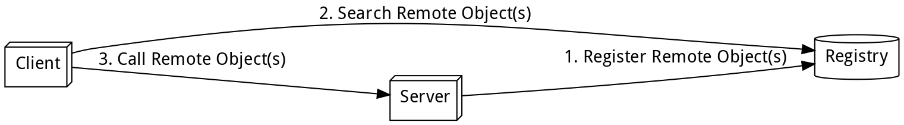
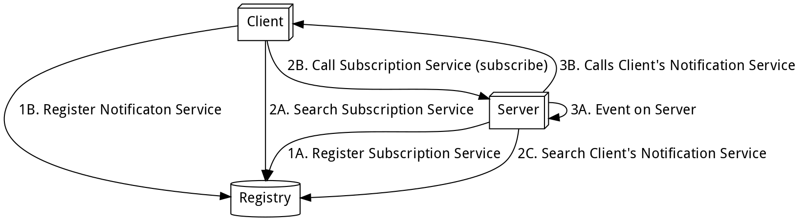

# Verteilte Systeme

## Socket-Kommunikation

- Netzwerkschichten:
    - Applikationsschicht (application layer): HTTP, SMTP, FTP, DNS
    - Transportschicht (transport layer):
        - Transmission Control Protocol (TCP): verbindungsorientiert,
          zuverlässig
        - User Datagram Protocol (UDP): verbindungslos, unzuverlässig
    - Internetschicht (internet layer): Internet Protocol (IP)
    - Netzwerkschickt (network layout): Ethernet, WLAN, DSL, UMTS, LTE
- Begriffe:
    - Host: An ein Netzwerk angeschlossener Computer mit netzwerkweit
      eindeutiger IP-Adresse
    - Socket: Kommunikationsendpunkt, durch IP-Adresse und Port-Nummer
      definiert
    - Server (Diener): Dienstleister, der Daten/Ressourcen zur Verfügung
      stellt; umfasst einen oder mehrere Computer
        - Software: Server-Programm, das einen Dienst implementiert
        - Hardware: Server-Computer, auf dem ein oder mehrere Server-Programme
          laufen
    - Client (Kunde): Dienstnehmer, der Dienste von Servern verwendet

### Java Sockets

Package `java.net.*` mit Klassen:

- `InetAddress`
    - `static InetAddress getByName(String host)`: IP-Adresse von Host anhand
      Namen finden
    - `String getHostName()`: liefern Hostnamen
    - `String getHostAddress()`: liefert IP-Adresse
    - `String getCanonicalHostName()`: liefert voll qualifizierten Hostnamen
      (mit Domäne)
    - `boolean isReachable(int msec)`: prüft, ob ein Host innerhalb eines
      Timeouts antwortet
    - `static InetAddress getLocalHost()`: IP-Adresse des lokalen Hosts finden
    - `boolean isSiteLocalAddress()`: Prüft, ob es sich um den lokalen Host
      handelt
- `Socket`
    - `Socket(String host, int port)`: Socket-Verbindung zu `host:port`
      erstellen
    - `OutputStream getOutputStream()`: zum schreibenden Zugriff
    - `InputStream getInputStream()`: zum lesenden Zugriff
- `ServerSocket`
    - `ServerSocket(int port)`: Socket, der auf `port` hört
    - `ServerSocket(int port, int backlog, InetAddress addr)`: mit Grösse der
      Warteschlange und spezifischer IP-Adresse
    - `Socket accept()`: Verbindung entgegennehmen (blockierend)
- `NetworkInterface`
    - `static Enumeration<NetworkInterface> getNetworkInterfaces()`
    - `String getDisplayName()`
    - `Enumeration<InetAddress> getInetAddresses()`

### Socket-Lebenszyklus

1. Server: Socket erzeugen und an lokalen Port binden
2. Server: Mit `accept` auf eingehende Verbindung warten
3. Client: Verbindung mit Server herstellen (mit IP-Adresse und Port-Nummer)
4. Client/Server: Daten über Socket lesen/schreiben
5. Client: Verbindung schliessen
6. Server: Socket schliessen

## Serialisierung

Serialisierung: Objekte in eine persistente Form bringen, damit der
Objektzustand später wiederhergestellt werden kann

- Anforderungen an Objektpersistenz
    - Transparenz: gleiche Handhabung von persistenten und transienten Objekten
      durch den Entwickler
    - Interoperabilität: Verwendung persistenter Objekte unabhängig von
      Laufzeitumgebung
    - Wiederauffindbarkeit: Auffinden von persistenten Objekten ohne explizite
      Suche (transparent)
- Grundidee: Umwandlung eines  Objekts in Bytestrom zur persistenten
  Abspeicherung

### Serialisierung in Java

- Java-Serialisierungsverfahren: Ablauf und Umfang
    1. Metadaten (voll qualifizierter Klassenname, Signatur, Versionsnummer) in
    den Bytestrom schreiben
    2. Rekursive Serialisierung nicht-statischer, nicht-transienter Attribute
    (`private`, `protected`, `public`) und aus Oberklassen geerbte Attribute
    3. Zusammenfassen der entstandenen Byteströme zu einem bestimmten Format
    - alle verwendeten Klassen müssen vollständig im `CLASSPATH` vorliegen!
- Objektserialisierung in Java
    - Java Object Serialization (JOS): binäres Format
    - Java Bean Persistence (JBP): Abspeicherung von Java Beans als XML
    - Java Architecture for XML Binding (JAXB): Abbilden von Objektstrukturen
      auf XML
- Standard-Serialisierung: Java-Klassen, Interfaces und Methoden
    - Idee: Dekoration eines Input- oder Output-Streams (`FileInputStream`,
      `BufferedOutputStream`, etc.)
    - Interface `java.io.ObjectOutput`
        - `void ObjectOutputStream.writeObject(Object obj)`: rekursives
          Abarbeiten des Objekt-Parameters
    - Interface `java.io.ObjectInput`
        - `Object ObjectInputStream.readObject()`: Aufbauen der
          Objekthierarchie aus Bytestrom (Cast notwendig)
    - Marker-Interface `java.io.Serializable` (keine Methoden): muss
      implementiert werden, damit Objekte der jeweiligen Klasse serialisiert
      werden können
        - dadurch automatische Serialisierbarkeit von erbenden Klassen gegeben
    - spezielle Methoden Auf dem jeweiligen Objekt:
    - `Object readResolve()`: erlaubt Manipulation des deserialisierten Objekts
        - zur Wiederherstellung transienter Objekte
        - zum Garantieren der Eindeutigkeit bei Singleton-Objekten
    - `void writeObject(final ObjectOutputStream oos)`
        - eigens definierte Serialisierung anhand von Bytestrom
        - Aufruf von `oos.defaultWriteObject()` zum Erweitern der
          Serialisierung
    - `void readObject(final ObjectInputStream ois)`
        - eigens definierte Deserialisierung anhand von Bytestrom
        - Aufruf von `ois.defaultReadObject()` zum Erweitern der
          Deserialisierung
- Klonen von beliebigen Objekten per Serialisierung und anschliessender
  Deserialisierung
    - `ByteArrayOutputStream` $\rightarrow$ `ObjectOutputStream` $\rightarrow$
      `ByteArrayInputStream` $\rightarrow$ `ObjectInputStream`
- Transiente Attribute: für «berechnete», zwischengespeicherte Felder
    - Schlüsselwort `transient`: `private transient String fullName;`
    - Deserialisierung: Implementierung der Methode `readResolve()` 
- Serialisierung und Vererbung
    - private Felder nicht-serialisierbarer Oberklassen werden nicht
      serialisiert
    - Deserialisierung: Suche und Aufruf des parameterlosen Konstruktors der
      ersten nicht-serialisierbaren Oberklasse: es muss ein solcher existieren!
    - Implementierung von `readObject()` und `writeObject()` muss sich um
      Zustand der Oberklasse kümmern
    - Verhinderung von Serialisierung bei Unterklassen durch Überschreibung von
      `writeObject()` und `readObject()` möglich
- Versionierung: aufgrund langer Zeitspannen zwischen Serialisierung und
  Deserialisierung mit wechselnden Umgebungen (Laufzeitumgebung,
  Softwareversion) unbedingt nötig
    - Angabe über Attribut: `public static long serialVersionUID = ...`;
    - Andernfalls automatische Berechnung eines Hash-Werts zur Laufzeit anhand
      verschiedener Klassenparameter (nicht empfohlen).
    - Neuerstellung der `serialVersionUID` bei inkompatiblen Änderungen der
      Klasse.
    - Ein Objekt kann nur deserialisiert werden, wenn seine Klasse die gleiche
      Version hat, wie sie die zugrundeliegende Klasse des serialisierten
      Objekts bei der Serialisierung hatte.

## Message Passing

Message Passing: Kommunikationsparadigma zum Versenden einer Nachricht von
einem Sender zu einem oder zu mehreren Empfängern.

- Arten von Nachrichten: (Remote) Method Invocation, Signale, Datenpakete
- Designentscheide bei der Entwicklung eines Message-Passing-Systems:
    1. zuverlässige oder unzuverlässige Nachrichtenübertragung
    2. garantierte oder beliebige Übertragungsreihenfolge der Nachrichten
    3. Sender-Empfänger-Beziehungen:
        - Unicast: ein Sender, ein Empfänger
        - Multicast/Broadcast: ein Sender, mehrere Empfänger
        - Client-Server: mehrere Sender, ein Empfänger
        - All-to-all: mehrer Sender, mehrere Empfänger
    4. synchrone oder asynchrone Kommunikation
        - synchron: Sender blockiert, bis der Empfänger die Nachricht
          entgegengenommen hat (Telefonie, Instant Messaging)
        - asynchron: Sender führt seine Aufgabe nach Versenden einer Nachricht
          fort (E-Mail, Diskussionsforum)
    5. persistente oder transiente Kommunikation
        - persistent: Nachricht bis zur Bereitschaft des Empfängers
          zwischenspeichern (E-Mail)
        - transient: Nachricht während Ausführung von sendender und
          empfangender Applikation zwischengespeichert (Router, Socket)
- Kommunikationsformen: Nachricht $A \rightarrow B$
    - persistent und asynchron: HTTP/REST
        1. A sendet eine Nachricht und wird fortgesetzt
        2. B läuft nicht
        3. B wird gestartet und empfängt die Nachricht
        4. A ist fertig
    - persistent und synchron: E-Mail
        1. A sendet eine Nachricht und wartet, bis diese akzeptiert wurde
        2. B speichert die Nachricht für die spätere Auslieferung ab
        3. B meldet A, dass die Nachricht akzeptiert wurde
        4. B wird gestartet und empfängt die Nachricht
    - transient und asynchron: UDP
        1. A sendet eine Nachricht und wird fortgesetzt
        2. B muss laufen, damit Die Nachricht gesendet werden kann
        3. B empfängt die Nachricht
    - transient und synchron (empfangsbasiert): TCP
        1. A sendet eine Nachricht und wartet auf die Empfangsbestätigung
        2. B läuft, macht aber gerade etwas anderes
        3. B nimmt die Nachricht entgegen und bestätigt dies A
        4. B verarbeitet die Nachricht später
    - transient und synchron (auslieferungsbasiert): asynchroner RPC
        1. A sendet eine Nachricht und wartet, bis diese akzeptiert wurde
        2. B empfängt die Nachricht, macht aber gerade etwas anderes
        3. B bestätigt die Annahme der Nachricht
        4. B verarbeitet die Nachricht später
    - transient und synchron (antwortbasiert): RMI
        1. A sendet eine Nachricht und wartet auf eine Antwort
        2. B läuft, macht aber gerade etwas anderes
        3. B nimmt die Nachricht entgegen
        4. B verarbeitet die Nachricht und sendet eine Antwort
- Message Passing Interface (MPI): Standard für den Nachrichtenaustausch
    - definiert eine API, ist kein konkretes Protokoll und keine Implementierung

### Nachrichtenverarbeitung

- Nachrichten
    - werden über einen Kommunikationskanal gesendet
    - enthalten eine Anzahl Elemente von bestimmten Datentypen
        - ID: Identifikation der Nachricht, nicht immer nötig
        - Argumente: einfache Datentypen (Integer, String) oder mit
          zusätzlichen Informationen/Instruktionen versehen
    - Solche Nachrichten sind Protokollen wie HTTP, RMI etc. vorzuziehen, wenn:
        - die Kommunikation und zu übermittelnden die Datenstrukturen simpel
          sind
        - der Transaktionsdurchsatz kritisch ist (Echtzeit-Anwendungen)
        - die Entwicklungsressourcen limitiert sind (schnelle Entwicklung
          wichtiger als Flexibilität)
        - spezielle Protokolle benötigt werden
        - andere Protokolle (HTTP, RMI etc.) nicht verfügbar sind
    - Können mittels [Factory-Method-Design-Pattern](#sec-factorymethod)
      flexibel und transparent erstellt werden.
- Prinzipien der Nachrichtenverarbeitung
    - Trennung zwischen Kommunikations- und Applikationsdetails
    - Kommunikation scheint auf Applikationsebene vonstatten zu gehen (untere
      Layer transparent)

### Protokollarten

- Fixe Protokolle: Parameter zu Beginn der Sitzung bekannt, keine Änderungen
  während der Kommunikation
    - Menge möglicher Kennungen (IDs)
    - mögliche Argumente (Anzahl und Typ)
- Adaptive Protokolle: Parameter können während einer Sitzung ändern (Länge der
  Argumentliste, Argumenttypen, Nachrichttypen)
    - Änderungen per anpassbarem Message Handler zur Laufzeit bewältigt
    - Kann mit dem [Prototyp-Design-Pattern](#sec-prototype) umgesetzt werden:
      Neue Arten von Nachrichten müssen nicht als Klassen umgesetzt, sondern
      können über die Erweiterung von Prototyp-Objekten erzeugt werden.
    - Die Liste bekannter Nachrichtentypen wird zur Laufzeit erweitert.

## Verteilung & Kommunikation: RMI

Verteiltes System: System, in dem sich Hardware- und Softwarekomponenten auf
vernetzten Computern befinden und miteinander über den Austausch von
Nachrichten kommunizieren.

Verteilte Anwendung: Anwendung, die ein verteiltes System als
Kommunikationsinfrastruktur für ihre verteilten Komponenten nutzt.

### Middleware

Middleware: anwendungsneutrale Vermittlungssofware, die zwischen Anwendungen
vermittelt, und dabei den Anwendungen ihre eigene Komplexität und diejenige der
Infrastruktur verbirgt.

- Arten von Middleware:
    1. kommunikationsorientierte Middleware: abstrahiert Netzwerkprogrammierung
    (RPC, RMI, Web Service)
    2. nachrichtenorientierte Middleware: arbeitet über den Austausch von
    Nachrichten (messages) mithilfe von Warteschlangen (queues): JMS, SOAP
    3. anwendungsorientierte Middleware: unterstützt verteilte Anwendungen:
    JEE, .NET, CORBA
- Eine Middleware schafft Transparenz:
    - Ortstransparenz: Der Benutzer braucht nicht zu wissen, wo sich ein Dienst
      oder eine Ressource befindet.
    - Zugriffstransparenz: Der Zugriff erfolgt immer gleich, egal von welchem
      Netzwerk aus (lokal, remote).
    - Nebenläufigkeitstransparenz: Mehrere Benutzer können gleichzeitig auf die
      Dienste und Ressourcen zugreifen. Das System ermöglicht exklusive
      Zugriffe, Synchronisation und Replikation von Daten.
    - Fehler- und Ausfalltransparenz: Fehler, die durch die Verteilung
      auftreten können (Übertragungsfehler, Komponentenausfall) bleiben der
      Anwendung weitgehend verborgen.
    - Sprachtransparenz: Die Kommunikation zwischen den Komponenten ist nicht
      von deren Implementierungssprache abhängig.
    - Replikationstransparenz: Ressourcen werden bei Bedarf automatisch
      repliziert, um die benötigte Performance bieten zu können.
- Architekturmodelle:
    - Client-Server vs. Peer-to-Peer
        - Client-Server: langlebiger Serverprozess, kurzlebige Client-Prozesse
        - Peer-to-Peer: Austausch zwischen gleichberechtigten Prozessen
    - Fat- vs. Thin-Client
        - Fat-Client: enthält Verarbeitungslogik und Benutzeroberfläche
        - Thin-Client: bezieht Verarbeitungslogik und Benutzeroberfläche von
          einem Server
        - Kombination: Fat-Client & Thin-Server; Thin-Client & Fat-Server
    - 2-, 3-, n-Tier
        - 2-Tier: Datenhaltung von Präsentation/Anwendungslogik getrennt
        - 3-Tier: Je ein Tier für Datenhaltung, Anwendungslogik und
          Präsentation
        - n-Tier: Weitere Verteilung von Datenhaltung und Anwendungslogik

### RMI: Remote Method Invocation

{#rmi}

- Prinzipielle Arbeitsweise (siehe [Arbeitsweise von RMI](#rmi))
    1. Remote-Interface: eine oder mehrere Methoden zur Bereitstellung als
    Dienst
    2. Server-Klasse: implementiert Remote-Interface, $\geq1$ Instanzen
    (Remote-Objekte)
    3. Registry: Registrierung der Remote-Objekte unter eindeutigem Namen
    4. Suche: Client findet Remote-Objekt über dessen Namen
    5. Aufruf: Verteilung für Client (Parameterübergabe) und Server (Rückgabe)
    transparent
- Technische Umsetzung von RMI
    - Client- und Server-Stub: Stellvertreterobjekte, die das Remote-Interface
      implementieren
        - Automatische Erzeugung seit JDK 1.5, zuvor mit speziellem
          RMI-Compiler (`rmic`)
    - Kommunikation über Remote Method Protocol auf Basis von
      TCP/IP-Verbindungen
    - RMI-Transportschicht erfolgt über Stubs (Server-Stub kennt Remote-Objekt)
    - Parameterübergabe: primitive Datentypen und serialisierbare Objekte (call
      by value)
    - Übergaben von Verweisen auf Remote-Objekte ohne Serialisierung (call by
      reference)
- Vorgehen bei der Entwicklung von RMI-Anwendungen
    1. Definition des Remote-Interfaces: grundsätzlich normales Java-Interface
        - muss von Interface `Remote` erben
        - jede Methode soll eine `RemoteException` werfen können
        - Parameter und Rückgabewert: primitive Datentypen oder serialisierbare
          Klassen
    2. Implementierung des Remote-Interfaces
        - Ableitung von `UnicastRemoteObject` oder Export per
          `UnicastRemoteObject.exportObject()`
    3. Aufstarten der RMI-Registry: `rmiregistry`, Standardport 1099
        - per automatisch generierter URL erreichbar
        - programmatischer Zugriff mittels `java.rmi.registry`-Paket
        - Server kann nur eine Registry manipulieren, die auf dem gleichen
          Rechner läuft (Sicherheit)
        - Registry unterstützt keine hierarchiche Namensräume oder dynamische
          Namen
    4. Erzeugung und Registrierung von Remote-Objekten: `Naming.bind(url,
    remoteObject)`
        - URL: `rmi://localhost:1099/calcSum`
        - Dynamisches Laden von Klassen erfordert einen `SecurityManager`
    5. Implementierung des Clients: Remote-Objekt finden und aufrufen
        - `Naming.lookup(url)` mit entsprechendem Cast liefert Referenz auf
          Remote-Objekt
- Codebase: Unter Einsatz eines Security Managers kann Code auf von einem
  entfernten Rechner geladen werden. Die Codebase wird über das JVM-Property
  `java.rmi.codebase` definiert, welches beim Aufstarten der Anwendung oder im
  Code derselben gesetzt werden kann:
    - `java -Djava.rmi.server.codebase=http://localhost:8080 -jar anwendung.jar`
    - `System.setProperty("java.rmi.server.codebase", "http://localhsot:8080");`
    - Der Code muss per HTTP zur Verfügung gestellt werden (`tool.jar` vom JDK).
        - `java -jar tool.jar -port 8080 -dir anwendung/`
- Security Manager: Einschränkungen von Code, der aus dem Netz geladen wird
  (Netzwerkverbindungen, Dateisystemzugriff, Lesen und Schreiben von
  Properties, Ausführen externer Programme, Nachladen externer Libraries etc.).
    - `-Djava.security.manager`: beim Aufstarten der Anwendung 
    - `System.setSecurityManager(new SecurityManager());`: im Code (zuerst mit
      `getSecurityManager()` prüfen, ob dieser bereits aktiviert ist)
    - Definition der Sicherheitsrichtlinie in `policy`-Datei:
        - `-Djava.security.policy=my.policy` per Kommandozeile
        - `System.setProperty("java.security.policy", "my.policy");` im Code
        - `my.policy` muss im akzuellen Arbeitsverzeichnis liegen
        - Gewährung von Berechtigungen per `grant` (siehe Beispiele unten)
    - Zusätzliche Angaben (optional):
        - Codebase: Rechte von Klassen aus bestimmten Quellen
        - Signierung: Rechte werden nur für signierten Code gewährt
        - Principal: Sonderrechte für authentifizierte Benutzer

Security-Policy, die alle Berechtigungen gewährt (zu Testzwecken oder innerhalb
eines Containers):

    grant {
        permission java.security.AllPermission;
    };

Security-Policy für Sockets (ausgehende Verbindungen zu `localhost:1099` und
eingehende Verbindungen auf Port `1024` erlauben):

    grant {
        permission java.net.SocketPermission "localhost:1099", "connect,resolve";
        permission java.net.SocketPermission "*:1024", "accept,resolve";
    };

### RMI: Codebeispiel

Definition des Remote-Interfaces:

```java
public interface RemoteSum extends Remote {
    public int sum(int a, int b) throws RemoteException;
}
```

Implementierung des Remote-Interfaces:

```java
public class RemoteSumImpl extends UnicastRemoteObject extends RemoteSum {
    @Override
    public int sum(int a, int b) throws RemoteException {
        return a + b;
    }
}
```

Erzeugung der Registry:

```java
public class RegistrySetup {
    public static void main(String[] args)
            throws RemoteException, InterruptedException {
        Registry registry = LocateRegistry.createRegistry(
            Registry.REGISTRY_PORT); // 1099
        synchronized (reg) {
            reg.wait(); // inaktiver Wartezustand, nicht terminieren!
        }
    }
}
```

Registrierung des Remote-Objekts:

```java
public class SumServer {
    public static void main(String[] args) throws RemoteException,
            AlreadyBoundException, MalformedURLException
        RemoteSumImpl sum = new RemoteSumImpl();
        String url = "rmi://localhost:1099/sum";
        Naming.bind(url, sum);
    }
}
```

Implementierung des Clients:

```java
public class SumClient {
    public static void main(String[] args) {
        try {
            int a = 65;
            int b = 23;
            String url = "rmi://localhost:1099/sum";
            RemoteSum sum = (RemoteSum) Naming.lookup(url);
            int result = sum.sum(a, b);
            System.out.println(sum); // 88
        } catch (RemoteException | NotBoundException | MalformedURLException e) {
            e.printStackTrace();
        }
    }
}
```

### Push-Prinzip

{#push}

- Umsetzung des Push-Prinzips mittels RMI (siehe [RMI: Push-Prinzip](#push)):
    1. Registrierung der Services
        - A. Der Server bietet einen Dienst an, auf welchem sich Clients für
          Notifikationen registrieren können.
        - B. Der Client bietet einen Dienst an, welchen der Server für die
          Notifikation aufrufen kann. Jeder Client registriert sein
          Remote-Objekt unter einem eindeutigen Namen.
    2. Vorbereiten der Push-Kommunikation
        - A. Der Client findet den serverseitigen Service für die Registrierung.
        - B. Der Client registriert sich beim Server, um Notifikationen zu
          erhalten. Er übergibt dem Server den eindeutigen Namen, unter dem
          sein Remote-Objekt auf der Registry zu finden ist.
        - C. Der Server findet den clientseitigen Service für die Notifikation
          anhand des zuvor übergebenen eindeutigen Namens.
    3. Notifizierung des Clients
        - A. Auf dem Server tritt ein Ereignis ein, das für die Clients von
          Interesse ist.
        - B. Der Server notifiziert alle Clients über deren
          Notifikationsservice.
- Mit dieser Architektur lassen sich verteilte Observer und Callback-Aufrufe
  realisieren.

## Uhrensynchronisation

## Verteilung: Data Grid
